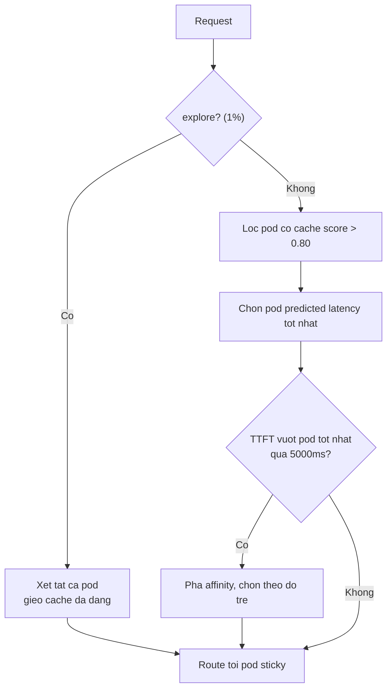

---
tags:
  - ai
date: 2026-05-29
---
# Cache-aware affinity gate (un-verify)

Cache-aware affinity gate là cơ chế bổ sung vào greedy routing theo độ trễ dự đoán để cân bằng giữa khai thác (exploit) và khám phá (explore) prefix cache, nhằm tránh cache fragmentation. Routing greedy thuần túy có thể phản tác dụng: một pod đang rảnh nhưng không có prefix cache có thể cho predicted latency thấp nhất tại thời điểm hiện tại, nhưng route tới đó nghĩa là trả toàn bộ chi phí prefill và bỏ phí cache đã xây trên pod khác. Qua nhiều request, điều này khiến prefix bị rải rác khắp các pod và không pod nào xây được cache reuse sâu. Ngược lại, luôn route tới pod có cache match tốt nhất sẽ dồn các prefix phổ biến vào vài pod khiến chúng sụp dưới memory pressure.

## Cơ chế epsilon-greedy

Để cân bằng hai thái cực trên, scorer dùng một affinity gate theo epsilon-greedy với ba thành phần:

Nhánh exploit (99%) lọc các pod có prefix cache score vượt ngưỡng `affinityGateTau` (mặc định 0.80), rồi chọn pod có predicted latency tốt nhất trong nhóm. Vì model độ trễ đã tính sẵn lợi ích cache, nhánh này chọn pod nơi cache reuse thực sự chuyển hóa thành độ trễ thấp, không chỉ là pod có cache score thô cao nhất.

Nhánh explore (1%) với xác suất `epsilonExploreSticky` (mặc định 0.01) bỏ qua affinity gate và xét toàn bộ pod, gieo cache entry lên các pod non-sticky để giữ đa dạng cache. Theo thời gian, các entry được gieo này lớn dần thành affinity target khả dụng, ngăn hệ thống dồn vào vài pod cache-hot quá tải.

Load gate hoạt động ngay trong nhánh exploit: nếu predicted TTFT của pod sticky tốt nhất vượt pod tốt nhất toàn cục quá `affinityMaxTTFTPenaltyMs` (mặc định 5000ms) thì affinity bị phá. Cơ chế này bắt trường hợp chi phí queue trên pod cache-hot đã lớn tới mức vượt lợi ích cache, và ước lượng độ trễ của predictor cho phép so sánh này mà không cần ngưỡng thủ công trên queue depth hay memory.

## Ngưỡng affinity 0.80

Ngưỡng mặc định 0.80 đến từ quan sát production: prefix cache score có phân phối bimodal, khoảng một nửa số cặp request-pod có cache match rất cao (>0.80) và một nửa có match thấp (<0.80). Điều này phản ánh cách prefix caching hoạt động: trong hội thoại multi-turn, một pod hoặc đã cache lịch sử hội thoại từ các lượt trước hoặc không có; các match một phần từ hội thoại khác đóng góp rất ít vì caching theo block. Ngưỡng 0.80 tách sạch hai nhóm này nên affinity gate route tới pod thực sự có hội thoại của người dùng trong cache thay vì pod chỉ trùng một phần ngẫu nhiên.

# Nguồn tham khảo

- [Predicted-Latency Based Scheduling for LLMs - llm-d.ai](<../../references/llm-d.ai-Predicted-Latency Based Scheduling for LLMs.pdf>)

# Liên kết tri thức

- [Lập lịch dựa trên độ trễ dự đoán cho LLM](./L%E1%BA%ADp%20l%E1%BB%8Bch%20d%E1%BB%B1a%20tr%C3%AAn%20%C4%91%E1%BB%99%20tr%E1%BB%85%20d%E1%BB%B1%20%C4%91o%C3%A1n%20cho%20LLM.md) - Affinity gate là lớp lọc bổ sung vào greedy routing của scheduler này
- [Quá trình inference của Large Language Model](./Qu%C3%A1%20tr%C3%ACnh%20inference%20c%E1%BB%A7a%20Large%20Language%20Model.md) - Prefix cache là phần KV cache tái sử dụng cho prompt trùng lặp
- [LMCache](./LMCache.md) - Prefix caching theo block là cơ chế mà affinity gate khai thác
