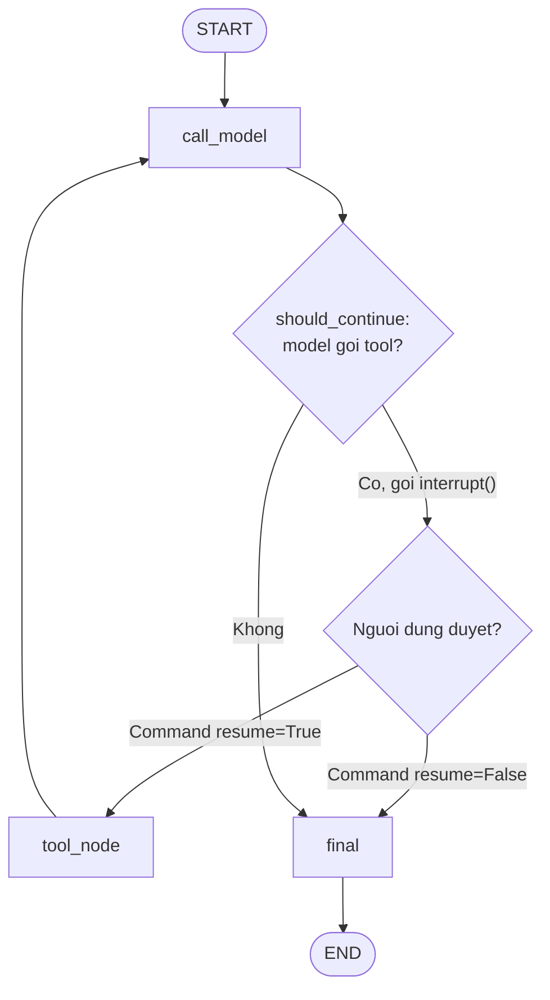

---
tags:
  - ai
date: 2026-05-29
---
# Human-in-the-Loop

Human-in-the-Loop (HITL) là kỹ thuật cho phép con người can thiệp vào các bước xử lý của hệ thống AI — xác nhận, chỉnh sửa hoặc bổ sung thông tin — trước khi hệ thống tiếp tục. Kỹ thuật phù hợp với các tác vụ quan trọng hoặc có độ rủi ro cao, nơi LLM không phải lúc nào cũng đưa ra quyết định chính xác, chẳng hạn việc duyệt trước khi agent thực thi một tool nhạy cảm.

## LangGraph và LangChain

LangChain là framework xây dựng ứng dụng dùng LLM, cung cấp interface tiêu chuẩn cho RAG, Chains, Agents, Memory và tích hợp với nhiều vector store, LLM. LangGraph là thư viện mở rộng trên LangChain để xây dựng AI agent phức tạp theo kiến trúc đồ thị: ứng dụng được mô hình hóa thành các node (gọi LLM, gọi tool, chờ phản hồi) và edge điều hướng dữ liệu, hỗ trợ luồng có trạng thái (stateful), vòng lặp, branching và stream. Tool theo chuẩn MCP có thể được bọc thành Tool của LangChain qua thư viện langchain-mcp-adapters rồi bind vào model để agent gọi trong quá trình reasoning.

## Cơ chế interrupt



LangGraph hiện thực HITL bằng hàm `interrupt()`. Khi một node gọi `interrupt()` với một giá trị JSON-serializable, graph lưu trạng thái qua persistence layer, tạm dừng thực thi và trả quyền điều khiển về cho ứng dụng bên ngoài, chờ vô thời hạn cho tới khi được resume. Ứng dụng hiển thị yêu cầu xác nhận cho người dùng rồi re-invoke graph bằng `Command(resume=...)`; giá trị truyền vào trở thành giá trị trả về của lời gọi `interrupt()` bên trong node, và luồng tiếp tục từ điểm đã dừng.

```python
# bên trong node: tạm dừng graph và chờ người dùng
permit = interrupt(f"Cho phép gọi tool {tool_name}?")

# phía ứng dụng: tiếp tục graph với giá trị người dùng cung cấp
graph.invoke(Command(resume=True), config)
```

Cơ chế này tương tự ngắt (interrupt) trong hệ điều hành: khi tiến trình bị gián đoạn, CPU lưu trạng thái, xử lý sự kiện rồi tiếp tục thực thi sau đó.

Vì khi resume execution bắt đầu lại từ đầu node và việc khớp resume value là theo chỉ số (index-based), các lời gọi `interrupt()` phải xuất hiện theo cùng một thứ tự ở mỗi lần chạy; không nên bỏ qua có điều kiện hoặc lặp `interrupt()` bằng logic không xác định (non-deterministic).

# Nguồn tham khảo

- [Human in Loop với LangGraph](https://www.nkthanh.dev/posts/human-in-loop-with-langchain)
- [LangGraph — Interrupts](https://docs.langchain.com/oss/python/langgraph/interrupts)

# Liên kết tri thức

- [Model Context Protocol](./Model%20Context%20Protocol.md) - Tool MCP được bind vào agent là hành động cần con người duyệt qua interrupt
- [Retrieval-Augmented Generation](./Retrieval-Augmented%20Generation.md) - LangChain cung cấp interface chuẩn cho RAG mà HITL bổ sung lớp kiểm soát
- [Quá trình inference của Large Language Model](./Qu%C3%A1%20tr%C3%ACnh%20inference%20c%E1%BB%A7a%20Large%20Language%20Model.md) - HITL chèn điểm dừng có người giám sát vào luồng sinh phản hồi của LLM
