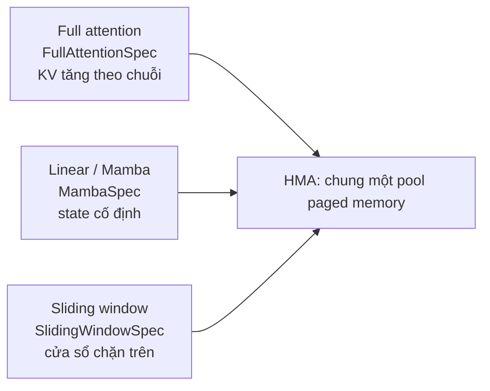

---
tags:
  - ai
date: 2026-05-29
---
# Hybrid KV Cache Manager

Hybrid KV Cache Manager (HMA) là bộ quản lý bộ nhớ KV cache của vLLM cho phép các layer có nhu cầu bộ nhớ khác nhau cùng chia sẻ một pool paged memory. HMA là điều kiện để phục vụ hiệu quả các model hybrid, và chính sự tồn tại của nó hé lộ một ràng buộc thực tế giữa model hybrid và disaggregated serving.

## Model hybrid và nhu cầu bộ nhớ khác nhau theo layer

Model hybrid xen kẽ các loại layer có hành vi bộ nhớ khác nhau về bản chất. Layer full attention giữ KV cache tăng tuyến tính theo độ dài chuỗi, vì mọi token đều phải lưu key và value. Layer linear attention kiểu state-space (Mamba, Gated DeltaNet) giữ một state hồi quy kích thước cố định bất kể độ dài chuỗi. Layer sliding-window attention chỉ cần một cửa sổ token gần nhất, nên footprint bị chặn trên. Qwen3-Next là ví dụ điển hình, kết hợp Gated DeltaNet với full attention theo tỉ lệ ba khối linear cho mỗi khối full attention, cho phép context rất dài.



## Vì sao HMA là bắt buộc

vLLM gán cho mỗi layer một KV cache spec: `FullAttentionSpec`, `SlidingWindowSpec` hoặc `MambaSpec`. Vì mỗi spec ngụ ý kích thước block khác nhau, nếu cấp phát ngây thơ thì mỗi loại cần một pool riêng. HMA tổ chức các layer thành các KV cache group để các loại layer khác nhau dùng chung một pool paged memory, và `unify_hybrid_kv_cache_specs` cố quy các spec về một kiểu chung khi có thể. Tắt HMA buộc mọi layer được cấp phát như full attention, gây lãng phí lớn cho model hybrid. Quan trọng nhất: `MambaSpec` không thể quy về `FullAttentionSpec`, nên model có layer Mamba thực sự bắt buộc cần HMA; thiếu nó dẫn tới lỗi không hợp nhất được các spec thành một kiểu thống nhất.

## Mâu thuẫn giữa model hybrid và disaggregated serving

KV connector dùng cho disaggregated serving (NixlConnector, KVBM, LMCache) phải vật lý chuyển layout KV cache giữa prefill worker và decode worker. Phần lớn connector chỉ hiểu layout full attention đồng nhất nên không biết cách chuyển block hybrid. Vì vậy vLLM tắt HMA mặc định khi có `--kv-transfer-config`, và kiểm tra connector có kế thừa interface `SupportsHMA` hay không; nếu bật HMA mà connector không hỗ trợ thì báo lỗi connector không hỗ trợ HMA. Hệ quả mang tính cấu trúc: phục vụ model hybrid ở chế độ disaggregated hiện bị ràng buộc, phải đánh đổi giữa hiệu quả bộ nhớ (HMA) và disaggregation, cho tới khi connector hỗ trợ `SupportsHMA`. Cách dùng tạm là ép bật lại HMA cho cả prefill và decode khi connector đã hỗ trợ.

## Trải nghiệm thực tế

Khi bật `--kv-transfer-config` cho model hybrid Qwen, prefill và decode crash với `RuntimeError: failed to convert the KV cache specs to one unified type`, vì connector đã tắt HMA mà `MambaSpec` không quy được về full attention. Thêm `--no-disable-hybrid-kv-cache-manager` cho cả hai phía thì gặp tiếp `Connector PdConnector does not support HMA but HMA is enabled`, do MultiConnector chỉ bật HMA khi mọi connector con đều implement `SupportsHMA`. Kết cục là phải chờ image vLLM-Dynamo mới hơn có connector hỗ trợ HMA, hoặc quay về aggregated serving.

```text
# Triệu chứng và hướng xử lý
disagg + model hybrid  --> failed to convert KV cache specs to one unified type
  + --no-disable-hybrid-kv-cache-manager  --> Connector PdConnector does not support HMA
    --> cần connector implement SupportsHMA, hoặc dùng aggregated serving
```

## Nguồn tham khảo

- [vLLM Hybrid KV Cache Manager design](https://docs.vllm.ai/en/stable/design/hybrid_kv_cache_manager/)
- [vLLM KV cache interface (FullAttentionSpec, MambaSpec)](https://docs.vllm.ai/en/stable/api/vllm/v1/kv_cache_interface/)
- [vLLM issue 22292 - make KVConnector HMA-compatible](https://github.com/vllm-project/vllm/issues/22292)
- [vLLM issue 37121 - hybrid KV memory over-estimation khi tắt HMA](https://github.com/vllm-project/vllm/issues/37121)

## Liên kết tri thức

- [Quá trình inference của Large Language Model - KV cache là dữ liệu mà HMA quản lý, prefill/decode là pha sinh và dùng KV](./Qu%C3%A1%20tr%C3%ACnh%20inference%20c%E1%BB%A7a%20Large%20Language%20Model.md)
- [NIXL - connector truyền KV phải hiểu layout hybrid mới hỗ trợ HMA trong disaggregated serving](./NIXL.md)
- [NVIDIA Dynamo - KVBM và connector là nơi ràng buộc HMA xuất hiện khi disaggregated](./NVIDIA%20Dynamo.md)
- [TTFT và TPOT - disaggregated serving tách prefill/decode để tối ưu độ trễ, nhưng vướng ràng buộc HMA với model hybrid](./TTFT%20v%C3%A0%20TPOT.md)
- [Ràng buộc hạ tầng khi triển khai LLM - kiến trúc model hybrid kéo theo yêu cầu phần mềm về HMA](./R%C3%A0ng%20bu%E1%BB%99c%20h%E1%BA%A1%20t%E1%BA%A7ng%20khi%20tri%E1%BB%83n%20khai%20LLM.md)
