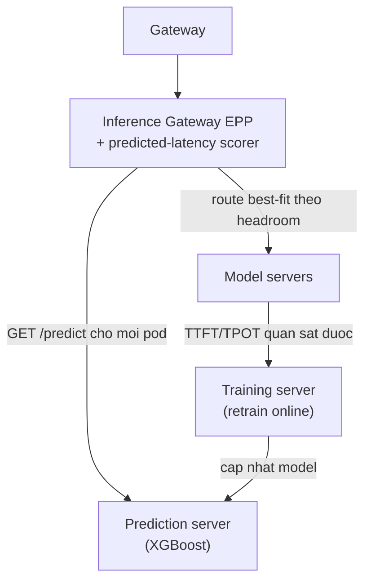

---
tags:
  - ai
date: 2026-05-29
---
# Lập lịch dựa trên độ trễ dự đoán cho LLM

Lập lịch dựa trên độ trễ dự đoán (predicted-latency aware scheduling) là phương pháp định tuyến request LLM bằng cách dự đoán trực tiếp độ trễ của request trên từng server thay vì dựa vào các tín hiệu heuristic được chỉnh trọng số thủ công. Một model machine learning nhẹ được huấn luyện online từ traffic thực để dự đoán TTFT và TPOT, và scheduler chọn server cho kết quả dự đoán tốt nhất.

## Bài toán cân bằng tải

Chi phí mỗi request rất khác nhau: phase prefill scale theo độ dài prompt, còn phase decode scale theo số token sinh. Các load balancer truyền thống dùng tín hiệu như queue depth, memory pressure, cache locality và batch size, nhưng các tín hiệu này thường xung đột — định tuyến để tái sử dụng cache thì dồn tải, còn định tuyến để giảm utilization thì phân tán tải. Việc cân bằng đòi hỏi chỉnh trọng số thủ công (như trong NVIDIA Dynamo hay Inference Gateway), và không có cấu hình cố định nào đúng khi workload biến động. Traffic production có tính bursty và phân phối token heavy-tailed, với prefix cache reuse cao nhưng không ổn định, được ghi nhận trong các nghiên cứu như DynamoLLM và BurstGPT.

## Dự đoán TTFT và TPOT

Phương pháp huấn luyện một model XGBoost regression online, học quan hệ giữa đặc trưng request cùng trạng thái server (độ dài prompt, prefix cache hit rate, số request đang chạy, queue depth, KV cache utilization, input token in flight) và TTFT, TPOT quan sát được của các request đã hoàn thành. Vì hiệu năng accelerator khá tất định theo trạng thái server và đặc trưng request, model đạt sai số MAPE khoảng 5%. Model được retrain liên tục trên một sliding window dữ liệu gần nhất, kết hợp stratify thành các bucket (KV cache theo bước 10%, prefix hit rate theo bước 0.25) để giữ mẫu từ các regime không xuất hiện trong traffic mới nhất, tránh để dữ liệu mới ghi đè toàn bộ.

## Định tuyến best-fit theo SLO

Tại thời điểm lập lịch, scheduler dự đoán TTFT và TPOT của request trên từng candidate server. Khi có SLO, scheduler dùng chiến lược best-fit: tính headroom (predicted latency trừ SLO target), kết hợp TTFT và TPOT theo trọng số mặc định 80% TTFT và 20% TPOT, rồi route tới server có headroom dương nhỏ nhất — dồn request vào server vẫn đáp ứng SLO để giữ các server khác trống cho request nặng hơn về sau. Khi không có SLO, scheduler chọn server có predicted latency thấp nhất. Cách này loại bỏ việc chỉnh trọng số thủ công vì model học trực tiếp các đánh đổi từ dữ liệu độ trễ quan sát được.

## Triển khai và kết quả

Latency predictor chạy như sidecar của Inference Gateway Endpoint Picker (EPP), gồm training server huấn luyện liên tục từ traffic và prediction server serve model; một predicted-latency scorer được thêm vào EPP. Trên production tại Vertex AI, phương pháp giảm tới 40% TTFT và ITL; trên một workload MaaS đại diện, P50 E2E latency giảm 43% và TTFT giảm 70%. Qua năm kịch bản benchmark, phương pháp vượt hoặc ngang với load+prefix-aware routing ở bốn trên năm trường hợp. Hạn chế hiện tại là model giả định pool server đồng nhất về loại GPU và runtime.

# Nguồn tham khảo

- [Predicted-Latency Based Scheduling for LLMs - llm-d.ai](../../references/llm-d.ai-Predicted-Latency%20Based%20Scheduling%20for%20LLMs.pdf)
- [Gateway API Inference Extension — Latency-based predictor](https://gateway-api-inference-extension.sigs.k8s.io/guides/latency-based-predictor/)

# Liên kết tri thức

- [TTFT và TPOT](./TTFT%20v%C3%A0%20TPOT.md) - Hai biến mục tiêu mà model dự đoán cho mỗi server
- [Quá trình inference của Large Language Model](./Qu%C3%A1%20tr%C3%ACnh%20inference%20c%E1%BB%A7a%20Large%20Language%20Model.md) - Chi phí prefill và decode là nguồn gốc của variance độ trễ cần dự đoán
- [Cache-aware affinity gate](./Cache-aware%20affinity%20gate%20%28un-verify%29.md) - Cổng affinity bổ sung vào greedy routing để tránh cache fragmentation
- [NVIDIA Dynamo](./NVIDIA%20Dynamo.md) - Ví dụ load balancer dùng trọng số heuristic thủ công mà phương pháp này thay thế
- [LMCache](./LMCache.md) - Prefix cache reuse là một đặc trưng đầu vào của model dự đoán
