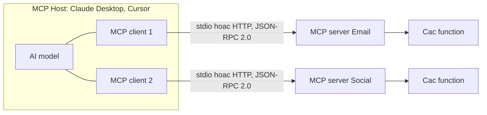

---
tags:
  - ai
date: 2026-05-29
---
# Model Context Protocol

Model Context Protocol (MCP) là một giao thức cho phép các mô hình AI giao tiếp với công cụ hỗ trợ bên ngoài để mở rộng tri thức, truy xuất thông tin và tương tác với môi trường xung quanh. MCP giải quyết hạn chế cố hữu của LLM: mô hình không thể tự cập nhật kiến thức mới sau khi huấn luyện, không có quyền truy cập nguồn dữ liệu cá nhân, và không tự thao tác được với môi trường bên ngoài nếu không có công cụ hỗ trợ. Có thể ánh xạ giao thức này sang con người: ngôn ngữ là giao thức tự nhiên giúp bộ não suy luận và tiếp thu kiến thức mới mà không cần ghi nhớ mọi thứ.

## Kiến trúc

MCP theo kiến trúc client-server. MCP host là ứng dụng AI (ví dụ Claude Desktop hoặc Cursor AI Editor), tạo một MCP client cho mỗi MCP server mà nó kết nối. MCP server là tiến trình cung cấp các công cụ hỗ trợ chuyên biệt — ví dụ server cho email cung cấp chức năng tìm danh sách email theo từ khóa và lấy nội dung email theo id; server cho mạng xã hội truy xuất new feed và lấy chi tiết bài viết. Mỗi MCP server mô tả các function nó cung cấp để mô hình AI biết khi nào và cách nào sử dụng chúng.

## Cơ chế quyết định

Khi người dùng gửi truy vấn, dựa trên mô tả các function, mô hình AI tự quyết định có cần dùng MCP function hay không, function nào phù hợp nhất, và cách gọi function đó. Ví dụ với yêu cầu "tính tổng số tiền giao dịch qua Vietcombank trong tháng này", AI xác định cần function lấy danh sách email, trích xuất khoảng thời gian và lọc email từ Vietcombank, gọi function lấy chi tiết từng email, phân tích số tiền rồi tính tổng và trả kết quả.

## Phương thức giao tiếp

Về bản chất MCP server chỉ là tiến trình thông thường, giao tiếp với MCP host qua một trong hai transport. Với stdio, host khởi chạy server như một tiến trình con và trao đổi dữ liệu qua standard input/output, phù hợp cho triển khai cục bộ và không có network overhead. Với SSE (Server-Sent Events) hay HTTP, host và server là hai tiến trình độc lập giao tiếp qua HTTP, tương tự web backend truyền thống, phù hợp cho triển khai từ xa. MCP dùng JSON-RPC 2.0 làm giao thức RPC nền tảng.

# Nguồn tham khảo

- [Giới thiệu về Model Context Protocol](https://www.nkthanh.dev/posts/model-context-protocol)
- [Model Context Protocol — Architecture overview](https://modelcontextprotocol.io/docs/learn/architecture)

# Liên kết tri thức

- [Retrieval-Augmented Generation](./Retrieval-Augmented%20Generation.md) - MCP chuẩn hóa việc mở rộng tri thức cho AI mà RAG hướng tới
- [Human-in-the-Loop](./Human-in-the-Loop.md) - Agent gọi MCP tool là điểm cần con người duyệt trước khi thực thi
- [Sự tương đồng trong tư duy của trí tuệ nhân tạo và con người](./S%E1%BB%B1%20t%C6%B0%C6%A1ng%20%C4%91%E1%BB%93ng%20trong%20t%C6%B0%20duy%20c%E1%BB%A7a%20tr%C3%AD%20tu%E1%BB%87%20nh%C3%A2n%20t%E1%BA%A1o%20v%C3%A0%20con%20ng%C6%B0%E1%BB%9Di.md) - MCP với AI tương tự ngôn ngữ với bộ não con người
