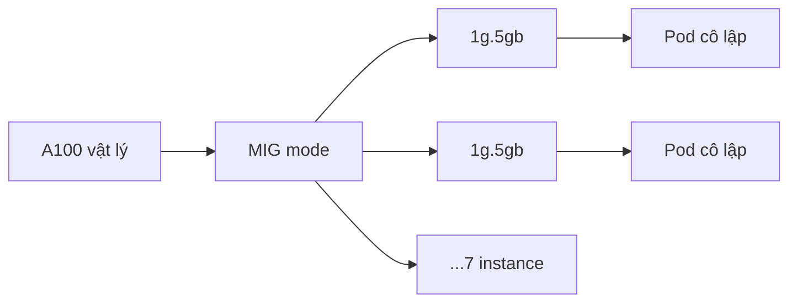

---
tags:
  - infrastructure
  - ai
date: 2026-05-29
---
# Multi-Instance GPU

Multi-Instance GPU (MIG) là cơ chế phân vùng không gian (spatial partitioning) chia một GPU vật lý thành nhiều GPU instance độc lập. Mỗi instance có vùng bộ nhớ, cache và streaming multiprocessor (SM) riêng, cách ly cứng với instance khác. Workload chia sẻ GPU theo kiểu cô lập này thay vì tranh chấp toàn bộ GPU.



## Khác biệt với time-slicing

MIG cách ly cứng: mỗi instance có tài nguyên compute và bộ nhớ riêng, một workload không ảnh hưởng hiệu năng hay bộ nhớ của workload khác. Time-slicing chia sẻ mềm: nhiều workload luân phiên dùng chung toàn bộ GPU theo thời gian, không cách ly bộ nhớ và có thể tranh chấp. MIG đổi một phần dung lượng lấy sự cô lập và đảm bảo chất lượng dịch vụ.

## Profile và overhead bộ nhớ

Mỗi dòng GPU có sẵn một tập profile do nhà sản xuất định nghĩa. Trên A100, profile nhỏ nhất `1g.5gb` cho tối đa bảy instance. Tên profile ghi 5GB nhưng mỗi instance thực dùng được khoảng 4.75GB; phần chênh là overhead dành riêng cho quản lý MIG và cách ly. Vì vậy tổng bộ nhớ lộ ra cho workload luôn nhỏ hơn tổng VRAM vật lý — đặc tính cố hữu của phân vùng cứng, không phải lỗi cấu hình.

## Áp cấu hình MIG

Cấu hình MIG được khai persistently qua file YAML và áp bởi công cụ như `mig-parted` (MIG Partition Editor). Trong cụm Kubernetes có NVIDIA GPU Operator, thành phần `mig-manager` đọc cấu hình từ một ConfigMap; mỗi profile là một entry, ví dụ `all-1g.5gb` bật MIG và tạo bảy device `1g.5gb`.

```yaml
all-1g.5gb:
  - devices: all
    mig-enabled: true
    mig-devices:
      "1g.5gb": 7
```

`mig-manager` theo dõi label `nvidia.com/mig.config` trên node; dán label trỏ tới tên profile sẽ kích hoạt áp lại geometry, thay vì thao tác tay trên từng host.

```bash
kubectl label node <gpu-node> nvidia.com/mig.config=all-1g.5gb --overwrite
```

## Nguồn tham khảo

- [NVIDIA Multi-Instance GPU User Guide](https://docs.nvidia.com/datacenter/tesla/mig-user-guide/index.html)
- [Supported MIG Profiles — NVIDIA docs](https://docs.nvidia.com/datacenter/tesla/mig-user-guide/supported-mig-profiles.html)
- [GPU Operator with MIG — NVIDIA docs](https://docs.nvidia.com/datacenter/cloud-native/gpu-operator/latest/gpu-operator-mig.html)
- [mig-manager ConfigMap mặc định — NVIDIA/gpu-operator GitHub](https://github.com/NVIDIA/gpu-operator/blob/main/assets/state-mig-manager/0400_configmap.yaml)
- [NVIDIA/mig-parted — GitHub](https://github.com/NVIDIA/mig-parted)

## Liên kết

- [Cài đặt operator trên OpenShift air-gapped - MIG là cách chia A100 sau khi GPU Operator giúp container nhận được GPU](../DevOps%20v%C3%A0%20Infrastructure/C%C3%A0i%20%C4%91%E1%BA%B7t%20operator%20tr%C3%AAn%20OpenShift%20air-gapped.md)
- [Quá trình inference của Large Language Model - MIG cấp phát GPU cô lập cho workload inference](./Qu%C3%A1%20tr%C3%ACnh%20inference%20c%E1%BB%A7a%20Large%20Language%20Model.md)
- [Phân tích đánh đổi khi đề xuất giải pháp - MIG (cô lập cứng, hao dung lượng) so với time-slicing (chia sẻ mềm) là một đánh đổi điển hình](../Ph%C3%A1t%20tri%E1%BB%83n%20b%E1%BA%A3n%20th%C3%A2n/Ph%C3%A2n%20t%C3%ADch%20%C4%91%C3%A1nh%20%C4%91%E1%BB%95i%20khi%20%C4%91%E1%BB%81%20xu%E1%BA%A5t%20gi%E1%BA%A3i%20ph%C3%A1p.md)
