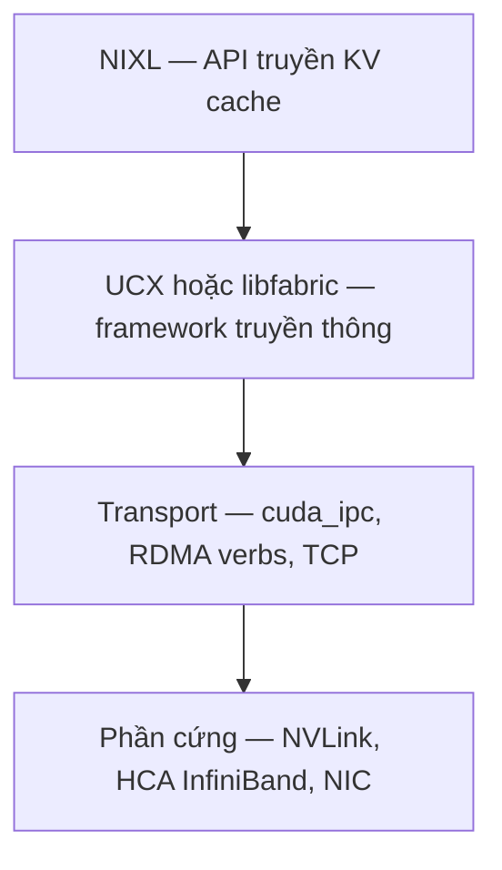

---
tags:
  - ai
  - infrastructure
date: 2026-05-29
---
# NIXL

NIXL (NVIDIA Inference Xfer Library) là thư viện mã nguồn mở, vendor-agnostic, tăng tốc truyền dữ liệu point-to-point cho các framework inference phân tán. NIXL cung cấp một API thống nhất để di chuyển dữ liệu (điển hình là KV cache) qua nhiều loại bộ nhớ và lưu trữ không đồng nhất: VRAM của GPU, DRAM của CPU, file, block, object store. Trong NVIDIA Dynamo, NIXL là thành phần chuyển KV cache từ prefill worker sang decode worker trong disaggregated serving.

## Kiến trúc Transfer Agent và backend plugin

[[Drawing 2026-05-28 09.23.39.excalidraw]]

Thành phần trung tâm của NIXL là Transfer Agent, đối tượng người dùng tương tác qua API. Mỗi agent gồm Memory Section (quản lý các vùng nhớ cục bộ đã đăng ký) và Metadata Handler (thông tin về các agent khác). Bên dưới là các backend dạng plugin cắm-rút; backend mặc định là UCX, ngoài ra có NVIDIA Magnum IO GPUDirect Storage, S3, Azure Blob, LIBFABRIC.

Luồng truyền điển hình: tạo agent, đăng ký vùng nhớ qua descriptor, trao đổi metadata giữa các agent (qua socket hoặc etcd), post một transfer READ hoặc WRITE, rồi kiểm tra trạng thái. Transfer là non-blocking và zero-copy. Agent tự chọn backend tối ưu trừ khi người dùng chỉ định.

NIXL nằm trên cùng của một ngăn xếp truyền thông ba tầng: NIXL là API truyền KV cache cấp cao, UCX hoặc libfabric là framework truyền thông cấp thấp, còn transport là phần di chuyển dữ liệu vật lý ở phần cứng và driver kernel.

## NixlConnector trong vLLM

Trong vLLM, `NixlConnector` là KV connector thực hiện truyền KV cache bất đồng bộ giữa các worker, mặc định dùng UCX làm backend. Trong kiến trúc prefill/decode, transfer là một chiều: prefill worker là producer, decode worker là consumer. Vì transfer dựa trên UCX, lỗi tạo backend (`NIXL_ERR_BACKEND` ngay tại `createBackend`) thường bắt nguồn từ việc UCX thiếu transport CUDA phù hợp hoặc thiếu shared memory, chứ không phải lỗi đăng ký bộ nhớ.

## Trải nghiệm thực tế

Lỗi `NIXL_ERR_BACKEND` xuất hiện ngay tại `createBackend` lúc khởi tạo, không phải lúc `register_memory`. Đọc đúng điểm fail giúp khoanh vùng: fail tại `createBackend` là lỗi tạo transport (UCX thiếu transport CUDA, thiếu shared memory, hoặc pod không có thiết bị RDMA), khác hẳn fail tại `register_memory` (lỗi đăng ký bộ nhớ KV cache). Log khởi tạo tốt sẽ in `Backend UCX was instantiated`, còn khi RDMA không sẵn sàng sẽ thấy `no RDMA transports available` rồi rơi về TCP.

## Nguồn tham khảo

- [Disagg Communication - NVIDIA Dynamo (ngăn xếp NIXL/UCX/transport, NIXL_ERR_BACKEND)](https://docs.nvidia.com/dynamo/dev/kubernetes-deployment/deployment-guide/disagg-communication)
- [NIXL repository](https://github.com/ai-dynamo/nixl)
- [Enhancing Distributed Inference Performance with NIXL - NVIDIA Technical Blog](https://developer.nvidia.com/blog/enhancing-distributed-inference-performance-with-the-nvidia-inference-transfer-library/)
- [Dynamo KV Cache Transfer (TensorRT-LLM)](https://docs.nvidia.com/dynamo/dev/backends/trtllm/kv-cache-transfer.html)
- [vLLM NixlConnector Usage](https://docs.vllm.ai/en/stable/features/nixl_connector_usage/)

## Liên kết tri thức

- [UCX - backend transport mặc định của NIXL, quyết định KV đi qua cuda_ipc, RDMA hay TCP](../System%20level/UCX.md)
- [RDMA - NIXL tận dụng RDMA qua UCX để truyền KV cache liên node](../System%20level/RDMA.md)
- [NVIDIA Dynamo - NIXL là thành phần Storage and Events Plane chuyển KV giữa prefill và decode](./NVIDIA%20Dynamo.md)
- [TTFT và TPOT - tách prefill/decode cần truyền KV nhanh để không phá vỡ TTFT](./TTFT%20v%C3%A0%20TPOT.md)
- [Hybrid KV Cache Manager - connector truyền KV như NIXL phải hiểu layout hybrid mới hỗ trợ HMA](./Hybrid%20KV%20Cache%20Manager.md)
- [Shared memory trong LLM serving - thiếu shared memory làm UCX không tạo được backend cho NIXL](./Shared%20memory%20trong%20LLM%20serving.md)
