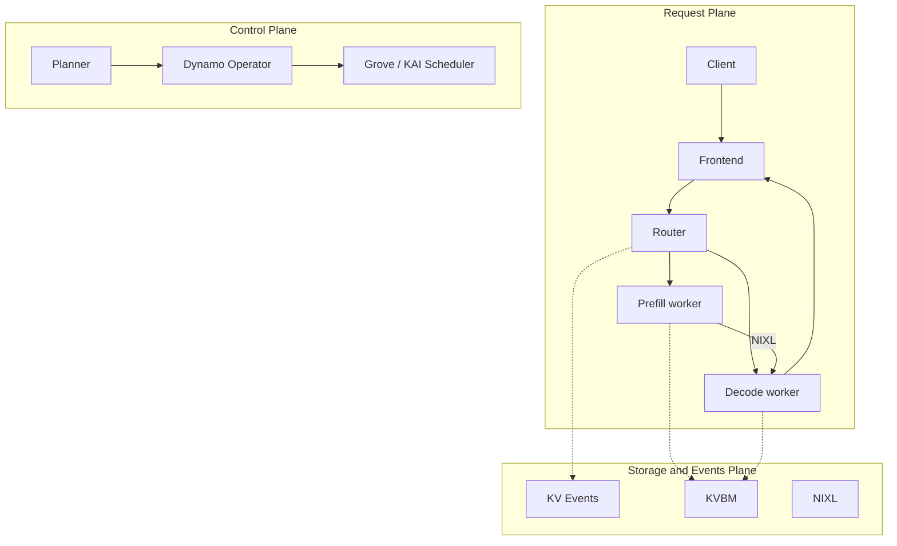
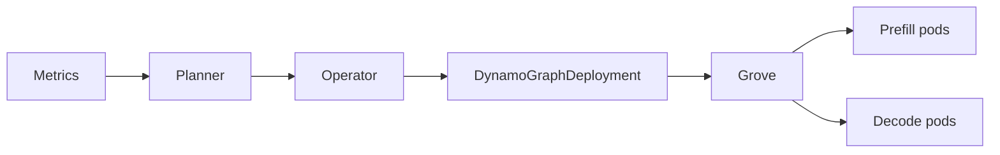

---
tags:
  - ai
  - infrastructure
date: 2026-05-29
---
# NVIDIA Dynamo

NVIDIA Dynamo là runtime inference phân tán ở quy mô datacenter. Dynamo là lớp orchestration nằm trên inference engine (TensorRT-LLM, vLLM, SGLang), không thay thế engine. Trên Kubernetes nhiều node, Dynamo biến cluster GPU thành hệ thống inference thống nhất: routing, disaggregated serving, quản lý KV cache, autoscaling theo SLA.

Nguồn: [Overall Architecture](https://docs.nvidia.com/dynamo/design-docs/overall-architecture), [GitHub ai-dynamo/dynamo](https://github.com/ai-dynamo/dynamo).

## Ba mặt phẳng kiến trúc

Dynamo tách ba concern: request path, control path, state path.

| Plane | Thành phần | Mục tiêu |
|-------|------------|----------|
| Request | Frontend, Router, Prefill worker, Decode worker | Thực thi request, stream token, độ trễ thấp |
| Control | Planner, Dynamo Operator, Grove | Scale, placement, reconcile desired state |
| Storage and Events | KV Events, KVBM, NIXL | Tái sử dụng KV, offload đa tầng, chuyển KV giữa worker |

Mục tiêu thiết kế: TTFT và ITL ổn định; GPU hiệu quả qua tách prefill/decode; giảm recompute KV; chịu pod restart và overload; portable trên Kubernetes.

## Request Plane

**Frontend** nhận request, chuẩn hóa API OpenAI-compatible, chuyển tiếp tới Router.

**Router** chọn worker theo load và KV overlap (KV-aware routing). Với disaggregated serving, Router điều phối PrefillRouter: chọn prefill worker, nhận metadata chuyển KV, chọn decode worker, inject metadata vào decode request.

**Prefill worker** chạy phase prefill, sinh KV cache.

**Decode worker** nhận KV (qua NIXL), chạy phase decode, stream token về Frontend.

Luồng disaggregated ([Disaggregated Serving](https://docs.nvidia.com/dynamo/design-docs/disaggregated-serving)):

1. Client → Frontend → Router.
2. Router chọn Prefill worker (KV-aware hoặc load balancing).
3. Prefill tính KV, trả `disaggregated_params` (metadata backend: SGLang `bootstrap_info`, vLLM `kv_transfer_params`, TensorRT-LLM `opaque_state`).
4. Router chọn Decode worker, inject metadata.
5. NIXL chuyển KV VRAM prefill → VRAM decode (NVLink, InfiniBand/UCX); transfer không block hoàn toàn GPU forward.
6. Decode stream token; KV Events cập nhật index; KVBM offload/recall theo áp lực bộ nhớ.

Prefill (compute-bound) và decode (memory-bound) scale độc lập trên pool worker riêng.

## Control Plane trên Kubernetes

Triển khai production qua Helm chart `dynamo-platform` ([Deployment Guide](https://docs.nvidia.com/dynamo/kubernetes-deployment/deployment-guide)).

**Dynamo Operator** reconcile Custom Resource:

- `DynamoGraphDeploymentRequest` (DGDR): profiling model/hardware, tạo deployment tự cấu hình, trạng thái terminal giống Job.
- `DynamoGraphDeployment` (DGD): resource persist, mô tả graph serving (Frontend, worker, Planner).

**Planner** đọc metrics runtime (TTFT, ITL, load), tính target replica cho pool prefill và decode, áp qua connector layer. Chiến lược throughput-based và load-based.

**Grove** là API Kubernetes cho orchestration workload AI disaggregated, tích hợp Dynamo ([Grove](https://docs.nvidia.com/dynamo/kubernetes-deployment/multinode/grove)):

| CR Grove | Vai trò |
|----------|---------|
| PodCliqueSet | Nhóm component colocated, autoscale, topology spread |
| PodClique | Pod cùng role (leader, worker, frontend) |
| PodCliqueScalingGroup | Nhóm PodClique scale và schedule cùng nhau (vd. prefill leader + worker) |

Grove cung cấp gang scheduling, scale ngang đa cấp theo component, startup dependency, topology constraint. Operator map DGD → PodCliqueSet / PodClique / PodCliqueScalingGroup với `replicas` và `min` riêng cho nhóm Prefill và Decode.

**Topology Aware Scheduling** (opt-in trên DGD): `topologyProfile` tham chiếu `ClusterTopology` CR; `packDomain` (vd. `rack`) đặt replica trong cùng domain mạng để giảm latency prefill↔decode↔router. Cần Grove, KAI Scheduler, ClusterTopology ([TAS](https://docs.nvidia.com/dynamo/kubernetes-deployment/multinode/topology-aware-scheduling)).

## Storage and Events Plane

**KV Events** publish vòng đời KV cache; Router dùng cho routing quyết định sau.

**KVBM** (KV Block Manager) quản lý block reuse, eviction, offload/recall GPU → CPU → SSD → remote storage.

**NIXL** thực hiện transfer KV/data tốc độ cao giữa worker và memory domain.

Dynamo backend-agnostic: TensorRT-LLM, vLLM, SGLang đều hỗ trợ disaggregated serving và KV-aware routing; KVBM đầy đủ trên TensorRT-LLM và vLLM ([Feature Matrix](https://docs.nvidia.com/dynamo/resources/feature-matrix)).

## Service discovery trên Kubernetes

Mặc định discovery backend **Kubernetes**, không bắt buộc etcd ngoài cluster ([Service Discovery](https://docs.nvidia.com/dynamo/kubernetes-deployment/deployment-guide/service-discovery)):

- Mỗi worker pod tạo `DynamoWorkerMetadata` CR (endpoint, model card), owner reference tới Pod.
- EndpointSlices theo Service do Operator tạo; readiness probe khi endpoint `generate` healthy.
- Discovery daemon trong pod chỉ expose worker khi EndpointSlice ready **và** có metadata tương ứng.

KV-aware routing prefix coordination cần **NATS** (JetStream) trong platform Helm.

Legacy: annotation `nvidia.com/dynamo-discovery-backend: etcd` trên DGD.

## Fault tolerance

| Layer | Cơ chế |
|-------|---------|
| Request | Migration, cancellation |
| Worker | Health check, graceful shutdown, drain endpoint |
| System | Load shedding, request rejection |
| Infrastructure | Discovery lease expiry, event-path recovery |

Worker crash được xử lý như sự kiện vận hành thường xuyên, không ngoại lệ.

## Khi nào dùng Dynamo trên Kubernetes multinode

Phù hợp khi: serving nhiều GPU/node; cần KV-aware routing; scale tách prefill/decode; autoscaling theo SLA TTFT/ITL.

Không cần Dynamo khi: một model trên một GPU — inference engine đơn thường đủ.

## Liên kết

- [TensorRT-LLM - backend inference trong worker pod Dynamo](../T%E1%BB%95ng%20quan.md)
- [LMCache - lớp KV cache phân tán bổ sung cho KVBM và NIXL](./LMCache.md)
- [Quá trình inference của Large Language Model - disaggregated serving tách pha prefill và decode dựa trên KV cache](./Qu%C3%A1%20tr%C3%ACnh%20inference%20c%E1%BB%A7a%20Large%20Language%20Model.md)
- [Kết nối vLLM và LMCache server trên Dynamo Kubernetes - các issue khi nối vLLM tới LMCacheMPConnector](../vllm-lmcache-connection-on-dynamo-kubernetes.md)
- [Quá trình inference của Large Language Model - prefill/decode và KV cache cơ bản](./Qu%C3%A1%20tr%C3%ACnh%20inference%20c%E1%BB%A7a%20Large%20Language%20Model.md)
- [Lập lịch dựa trên độ trễ dự đoán cho LLM - thay thế trọng số heuristic thủ công của load balancer bằng dự đoán độ trễ](./L%E1%BA%ADp%20l%E1%BB%8Bch%20d%E1%BB%B1a%20tr%C3%AAn%20%C4%91%E1%BB%99%20tr%E1%BB%85%20d%E1%BB%B1%20%C4%91o%C3%A1n%20cho%20LLM.md)
- [Kubernetes Monitoring - observability cluster inference](../kubernetes-monitoring.md)
- [NIXL - thành phần chuyển KV cache giữa prefill và decode worker trong Dynamo](./NIXL.md)
- [UCX - backend transport bên dưới NIXL quyết định KV đi qua cuda_ipc, RDMA hay TCP](../System%20level/UCX.md)
- [ZeroMQ - KV router subscribe sự kiện KV cache qua ZeroMQ để định tuyến theo cache overlap](../System%20level/ZeroMQ.md)
- [Hybrid KV Cache Manager - KVBM và connector là nơi ràng buộc HMA xuất hiện khi disaggregated](./Hybrid%20KV%20Cache%20Manager.md)
