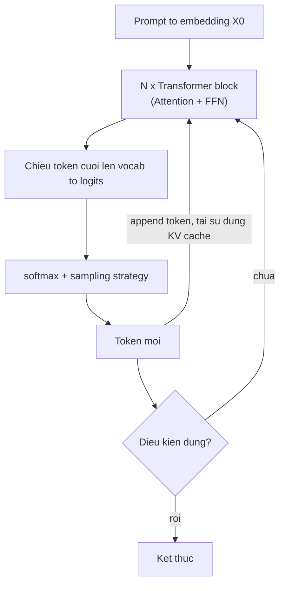

---
tags:
  - ai
date: 2026-05-29
---
# Quá trình inference của Large Language Model

Inference của Large Language Model (LLM) là quá trình mô hình sinh ra token tiếp theo cho một prompt. Đầu vào là chuỗi token của prompt được biểu diễn thành ma trận embedding $X_0 \in \mathbb{R}^{n, d_{model}}$; quá trình forward $X_0$ qua nhiều Transformer block rồi chiếu lên không gian từ vựng để chọn token kế tiếp, lặp lại cho đến khi gặp điều kiện dừng.

## Transformer block

Mỗi Transformer block gồm hai thành phần chính: Attention tính mối quan hệ giữa các token trong prompt, và Feed Forward Network (MLP) thực hiện biến đổi phi tuyến để trích xuất đặc trưng ở mức cao hơn.

Attention được tính bằng công thức $\text{softmax}\left(\frac{Q K^{T}}{\sqrt{d_{head}}}\right) V$, trong đó $Q, K, V$ là các phép chiếu tuyến tính của đầu vào theo từng head. Kết quả các head được nối lại, cộng residual với đầu vào rồi chuẩn hóa (Layer Norm) trước khi đi qua Feed Forward Network. Một LLM thực tế thường chứa từ 12 đến 120 Transformer block xếp chồng tuần tự. Kiến trúc này được giới thiệu trong bài báo "Attention Is All You Need".

## Sinh token

Sau khi đi qua các Transformer block, vector đặc trưng của token cuối cùng được chiếu lên ma trận embedding của bộ từ vựng để tính logits, sau đó chuẩn hóa bằng softmax thành phân phối xác suất trên toàn bộ từ vựng. Token kế tiếp được chọn theo một sampling strategy:

- Greedy: chọn token có xác suất cao nhất ($\arg\max_i p_i$).
- Top-k: giữ lại $k$ token xác suất cao nhất rồi chọn ngẫu nhiên trong nhóm.
- Top-p (nucleus sampling): chọn nhóm token nhỏ nhất có tổng xác suất $\ge p$ rồi lấy ngẫu nhiên.
- Temperature scaling: chia logits cho temperature $T$ trước softmax để điều chỉnh mức độ ngẫu nhiên của đầu ra.

Mỗi token mới sinh ra lại được tính embedding, $Q, K, V$ và Attention với toàn bộ token trước đó, rồi lặp lại quy trình.

## KV cache

Để tính Attention cho token sinh thứ $t$, phép nhân $Q K^{T}$ có kích thước $(n+t, n+t)$, dẫn tới độ phức tạp $O(n^2)$ tăng nhanh theo độ dài prompt. KV cache giải quyết vấn đề này bằng cách dùng một phần bộ nhớ (RAM hoặc VRAM) lưu lại các giá trị $K$ và $V$ của prompt cùng các token đã sinh, nhờ đó tái sử dụng kết quả cũ và tránh tính toán dư thừa ở các bước sau. KV cache là tiền đề cho nhiều kỹ thuật phục vụ inference như offload KV cache ra nhiều tầng bộ nhớ hay tách rời pha prefill và decode.

## Flash Attention

Ma trận trung gian $Q K^{T}$ có kích thước $(n, n)$ nên khi prompt dài, một head có thể chiếm tới vài GiB bộ nhớ và sinh ra I/O lớn. Flash Attention chia $Q, K, V$ thành các khối (block) kích thước cố định (thường $128 \times 128$), tính Attention trên từng khối nhỏ và giữ kết quả trung gian trong SRAM thay vì DRAM. Cách làm này giảm bộ nhớ tạm, tăng khả năng song song trên GPU và tăng tốc tính toán. Việc nhân các khối ma trận nhỏ được tăng tốc bằng Tensor Core — đơn vị phần cứng chuyên thực hiện phép nhân ma trận và hỗ trợ tính toán giữa hai precision khác nhau (ví dụ FP16 × INT8), phù hợp cho các quantization model. Kỹ thuật này được trình bày trong bài báo "FlashAttention".

# Nguồn tham khảo

- [Quá trình inference cho Large Language Model](https://www.nkthanh.dev/posts/llm-basic-part-1)
- [Attention Is All You Need](https://arxiv.org/abs/1706.03762)
- [FlashAttention: Fast and Memory-Efficient Exact Attention with IO-Awareness](https://arxiv.org/abs/2205.14135)

# Liên kết tri thức

- [Bản chất toán học của trí tuệ nhân tạo](./B%E1%BA%A3n%20ch%E1%BA%A5t%20to%C3%A1n%20h%E1%BB%8Dc%20c%E1%BB%A7a%20tr%C3%AD%20tu%E1%BB%87%20nh%C3%A2n%20t%E1%BA%A1o.md) - Inference là hiện thực hóa nền tảng đại số tuyến tính và tối ưu hóa của AI
- [LMCache](./LMCache.md) - LMCache mở rộng KV cache ra nhiều tầng bộ nhớ để tái sử dụng giữa các request
- [NVIDIA Dynamo](./NVIDIA%20Dynamo.md) - Disaggregated serving tách pha prefill và decode dựa trên cơ chế KV cache
- [TensorRT-LLM](../T%E1%BB%95ng%20quan.md) - TensorRT-LLM tối ưu các phép tính của inference trên GPU NVIDIA
- [Retrieval-Augmented Generation](./Retrieval-Augmented%20Generation.md) - RAG dùng LLM làm bộ sinh, bổ sung context vào prompt trước khi inference
- [TTFT và TPOT](./TTFT%20v%C3%A0%20TPOT.md) - Hai metric độ trễ đo riêng phase prefill và phase decode
- [Lập lịch dựa trên độ trễ dự đoán cho LLM](./L%E1%BA%ADp%20l%E1%BB%8Bch%20d%E1%BB%B1a%20tr%C3%AAn%20%C4%91%E1%BB%99%20tr%E1%BB%85%20d%E1%BB%B1%20%C4%91o%C3%A1n%20cho%20LLM.md) - Variance chi phí prefill và decode là nguồn gốc bài toán định tuyến request
