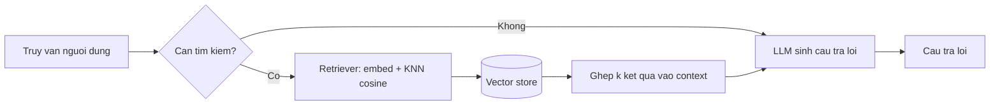

---
tags:
  - ai
date: 2026-05-29
---
# Retrieval-Augmented Generation

Retrieval-Augmented Generation (RAG) là phương pháp giúp LLM truy xuất và sử dụng thông tin từ nguồn dữ liệu bên ngoài thay vì chỉ dựa vào kiến thức có sẵn trong trọng số mô hình. RAG kết hợp parametric memory (kiến thức mã hóa trong trọng số mô hình) với non-parametric memory (chỉ mục dữ liệu ngoài được truy xuất khi cần), nhờ đó nâng cao độ chính xác, tính cập nhật và khả năng truy nguồn của câu trả lời. Phương pháp được giới thiệu trong bài báo "Retrieval-Augmented Generation for Knowledge-Intensive NLP Tasks".

## Kiến trúc

Một hệ thống RAG điển hình gồm hai thành phần: bộ tìm kiếm thông tin (retriever) tìm trong kho dữ liệu và trả về các kết quả liên quan nhất với truy vấn, và bộ xử lý thông tin (generator) phân tích dữ liệu tìm được cùng truy vấn để sinh câu trả lời. Quy trình này phản chiếu cách con người tiếp nhận tri thức: khi gặp khái niệm mới, con người kiểm tra kiến thức hiện có, tìm kiếm, lọc và đọc, phân tích tổng hợp rồi đưa ra câu trả lời.

## Embedding và vector search

Để retriever hoạt động, dữ liệu đầu vào có độ dài biến đổi (variable length) được vector hóa thành embedding có độ dài cố định (fixed length) bằng một embedding model — ví dụ all-MiniLM-L6-v2 sinh vector 384 chiều. Việc tìm các bản ghi liên quan nhất với truy vấn được thực hiện bằng thuật toán KNN (K-Nearest Neighbors), so sánh độ tương đồng giữa các vector qua khoảng cách cosine (cosine similarity). Vector cùng chỉ mục của chúng được lưu trong một vector store hỗ trợ tìm kiếm — ví dụ RediSearch lưu embedding dưới dạng vector field với distance metric cosine.

## Luồng truy vấn

Khi nhận truy vấn, hệ thống hỏi LLM xem có cần tìm kiếm trong kho dữ liệu hay không. Nếu cần, retriever trả về $k$ kết quả phù hợp nhất, các kết quả này được ghép vào context của prompt để LLM phân tích và đưa ra câu trả lời chính xác hơn; nếu không, truy vấn được gửi thẳng tới LLM. Cách tích hợp LLM với vector search thủ công như trên đơn giản nhưng khó mở rộng, nên cộng đồng AI dần chuẩn hóa việc kết nối công cụ qua Model Context Protocol.

# Nguồn tham khảo

- [Xây dựng hệ thống RAG cho AI agent](https://www.nkthanh.dev/posts/build-a-rag-system-for-ai-agent)
- [Retrieval-Augmented Generation for Knowledge-Intensive NLP Tasks](https://arxiv.org/abs/2005.11401)
- [RediSearch — Vector Search](https://redis.io/docs/latest/develop/interact/search-and-query/)

# Liên kết tri thức

- [Quá trình inference của Large Language Model](./Qu%C3%A1%20tr%C3%ACnh%20inference%20c%E1%BB%A7a%20Large%20Language%20Model.md) - RAG dùng LLM làm generator, bổ sung context vào prompt trước khi inference
- [Model Context Protocol](./Model%20Context%20Protocol.md) - MCP là cách chuẩn hóa để AI mở rộng tri thức, kế thừa mục tiêu của RAG
- [Sự tương đồng trong tư duy của trí tuệ nhân tạo và con người](./S%E1%BB%B1%20t%C6%B0%C6%A1ng%20%C4%91%E1%BB%93ng%20trong%20t%C6%B0%20duy%20c%E1%BB%A7a%20tr%C3%AD%20tu%E1%BB%87%20nh%C3%A2n%20t%E1%BA%A1o%20v%C3%A0%20con%20ng%C6%B0%E1%BB%9Di.md) - RAG mô phỏng quy trình tìm kiếm và xử lý thông tin của con người
