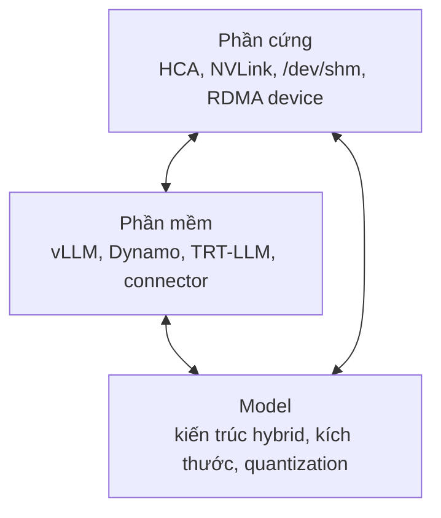

---
tags:
  - mindset
  - ai
date: 2026-05-29
---
# Ràng buộc hạ tầng khi triển khai LLM

Hạ tầng triển khai LLM hiện nay còn ràng buộc rất chặt giữa ba trục phần cứng, phần mềm và model: một thay đổi ở một trục thường làm vỡ hai trục còn lại, vì các trừu tượng giữa chúng chưa đủ tách bạch. Đây là nhận xét rút ra từ thực tế triển khai, được chứng minh bằng nhiều biểu hiện hội tụ chứ không phải cảm tính.

## Ba trục ràng buộc

Trục phần cứng gồm HCA InfiniBand, NVLink, dung lượng `/dev/shm` và việc pod có được cấp thiết bị RDMA hay không. Trục phần mềm gồm phiên bản của vLLM, Dynamo, TensorRT-LLM và các KV connector phải khớp nhau. Trục model gồm kiến trúc model, mà kiến trúc lại quy định yêu cầu lên phần mềm. Ba trục này chưa được trừu tượng hóa độc lập, nên ràng buộc lan từ trục này sang trục khác.

## Các biểu hiện hội tụ

Connector truyền KV chưa hỗ trợ interface HMA khiến model hybrid và disaggregated serving loại trừ lẫn nhau, tức kiến trúc model trực tiếp giới hạn lựa chọn triển khai. KVBM từng lỗi import vì TensorRT-LLM đổi cấu trúc connector API, bản vá có trên nhánh chính nhưng chưa vào tag release, tức phải khớp đúng phiên bản image mới chạy được. NIXL và UCX phụ thuộc UCX được build đúng chuẩn CUDA và `/dev/shm` đủ lớn mới khởi tạo được backend. Quantize đa GPU trong pod vỡ vì pod thiếu `/dev/infiniband`, phải ép Open MPI bỏ đường UCX. Đỉnh bộ nhớ khi quantize on-load buộc phần cứng phải đủ RAM cho bản precision gốc dù kết quả nhỏ hơn. Mỗi sự cố riêng lẻ đều quy về cùng một gốc: ranh giới giữa phần cứng, phần mềm và model còn rò rỉ.

## Hệ quả cho cách làm

Vì ràng buộc còn lớn, hiểu công nghệ ở tầng dưới trước khi áp dụng là điều kiện để gỡ lỗi, bởi một lỗi ở tầng ứng dụng (ví dụ lỗi 404 hay timeout) thường có gốc ở tầng transport hoặc phần cứng. Mỗi lựa chọn cấu hình là một đánh đổi cụ thể giữa hiệu quả bộ nhớ, độ trễ và tính tương thích, chứ hiếm khi có cấu hình tối ưu phổ quát. Và nên ưu tiên các giải pháp đúng đắn dài hạn (khớp phiên bản, image chuẩn) thay vì vá tạm, vì coupling cao làm chi phí của một bản vá sai lan rộng.

## Liên kết tri thức

- [Hiểu công nghệ trước khi áp dụng - lỗi tầng trên thường có gốc ở tầng transport hoặc phần cứng nên cần hiểu tầng dưới](../Ph%C3%A1t%20tri%E1%BB%83n%20b%E1%BA%A3n%20th%C3%A2n/Hi%E1%BB%83u%20c%C3%B4ng%20ngh%E1%BB%87%20tr%C6%B0%E1%BB%9Bc%20khi%20%C3%A1p%20d%E1%BB%A5ng.md)
- [Phân tích đánh đổi khi đề xuất giải pháp - mỗi cấu hình triển khai LLM là một đánh đổi cụ thể, không có tối ưu phổ quát](../Ph%C3%A1t%20tri%E1%BB%83n%20b%E1%BA%A3n%20th%C3%A2n/Ph%C3%A2n%20t%C3%ADch%20%C4%91%C3%A1nh%20%C4%91%E1%BB%95i%20khi%20%C4%91%E1%BB%81%20xu%E1%BA%A5t%20gi%E1%BA%A3i%20ph%C3%A1p.md)
- [Ưu tiên tính đúng đắn dài hạn - coupling cao làm chi phí của bản vá tạm lan rộng](../Ph%C3%A1t%20tri%E1%BB%83n%20b%E1%BA%A3n%20th%C3%A2n/%C6%AFu%20ti%C3%AAn%20t%C3%ADnh%20%C4%91%C3%BAng%20%C4%91%E1%BA%AFn%20d%C3%A0i%20h%E1%BA%A1n.md)
- [Hybrid KV Cache Manager - kiến trúc model hybrid trực tiếp giới hạn lựa chọn disaggregated serving](./Hybrid%20KV%20Cache%20Manager.md)
- [Vòng đời bộ nhớ khi load LLM - đỉnh bộ nhớ khi quantize là ràng buộc model lên phần cứng](./V%C3%B2ng%20%C4%91%E1%BB%9Di%20b%E1%BB%99%20nh%E1%BB%9B%20khi%20load%20LLM.md)
- [Chọn transport trong Open MPI - thiếu thiết bị InfiniBand trong pod buộc cấu hình lại đường truyền MPI](../System%20level/Ch%E1%BB%8Dn%20transport%20trong%20Open%20MPI.md)
