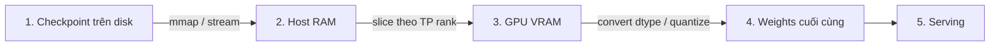

---
tags:
  - ai
  - infrastructure
date: 2026-05-29
---
# Vòng đời bộ nhớ khi load LLM

Khi load một LLM để inference, weights không xuất hiện ngay trong VRAM ở dtype cuối cùng. Chúng đi qua một chuỗi bước có thứ tự: checkpoint nằm trên disk, framework đọc hoặc map checkpoint qua host RAM, weights được chia theo GPU rank, copy lên VRAM, rồi mới convert dtype hoặc quantize.

Vì có thứ tự này, bộ nhớ cần trong lúc load có thể lớn hơn bộ nhớ còn lại sau khi model đã sẵn sàng phục vụ request. Muốn debug lỗi hết bộ nhớ khi load model, cần nhìn vào từng pha thay vì chỉ nhìn kích thước model sau cùng.



## Thứ tự load

### Checkpoint bắt đầu trên disk

Checkpoint là dữ liệu tĩnh nằm trên disk. Ở thời điểm này, model chưa chiếm VRAM. Kích thước checkpoint chỉ nói model lớn bao nhiêu trên storage, chưa nói peak RAM hoặc peak VRAM khi load.

### Framework đọc checkpoint qua host RAM

vLLM mặc định dùng `load_format=auto` và thường ưu tiên safetensors. Với safetensors, file có thể được đọc bằng `mmap()`: hệ điều hành map file vào address space của process, rồi chỉ đưa page thật sự cần vào RAM khi process truy cập.

Điều này làm host RAM tăng theo quá trình truy cập weights, thay vì nhất thiết copy toàn bộ checkpoint ngay từ đầu. Nếu tắt `mmap`, ví dụ qua `disable_mmap`, framework sẽ gần với kiểu đọc nguyên file vào RAM hơn, nên peak host RAM có thể cao hơn.

Nếu checkpoint đã được shard sẵn, các cơ chế như `runai_streamer_sharded` hoặc `sharded_state` cho phép mỗi process đọc trực tiếp shard của nó. Khi đó một rank không cần đọc toàn bộ checkpoint rồi mới bỏ phần không thuộc về mình.

### Weights được chia theo tensor parallel rank

Sau khi đọc được weights, framework chia weights theo tensor parallel rank. Nếu chạy trên nhiều GPU, mỗi GPU thường chỉ nhận phần weights tương ứng với rank của nó.

Đây là bước làm cho host RAM và VRAM có thể cùng tăng: dữ liệu đang được đọc, chia, giữ trong buffer tạm, rồi copy sang GPU.

### Weights được copy lên VRAM

Khi shard của một rank đã sẵn sàng, framework copy shard đó lên GPU. Từ thời điểm này, VRAM bắt đầu bị chiếm bởi weights, nhưng weights chưa chắc đã ở dtype cuối cùng.

Nếu model chạy được sau khi load xong, không có nghĩa peak VRAM trong lúc load cũng nhỏ như trạng thái ổn định. Pha copy có thể cần thêm buffer tạm, CUDA/NCCL context và allocator overhead.

### Sau khi lên VRAM mới convert hoặc quantize

Với vLLM FP8 W8A8, model được load ở precision gốc trước, sau đó mới quantize xuống FP8. Vì vậy quantize on-load không có nghĩa là từ đầu đến cuối chỉ cần bộ nhớ của FP8.

Ví dụ một model 120B được load ở BF16 rồi quantize xuống FP8:

```text
Pha load trước quantize: 120e9 × 2 bytes ≈ 240 GB
Sau khi quantize FP8:    120e9 × 1 byte  ≈ 120 GB
```

Điểm quan trọng nằm ở chữ "sau": bộ nhớ ổn định sau quantize nhỏ hơn, nhưng quá trình load vẫn phải đi qua bản precision gốc. Vì vậy máy có thể fail khi load dù model FP8 cuối cùng trông có vẻ vừa.

TensorRT-LLM tránh phần nào ràng buộc này bằng cách tách quantize thành bước chuẩn bị checkpoint hoặc engine. Có thể dùng `convert_checkpoint.py` để tạo checkpoint đã quantize trước, rồi build engine từ checkpoint đó.

## Ý nghĩa khi debug

Khi gặp lỗi hết bộ nhớ, câu hỏi đầu tiên nên là: lỗi xảy ra ở bước nào trong chuỗi load?

- Nếu lỗi xảy ra khi đọc checkpoint, hãy nhìn host RAM, page cache, `mmap`, định dạng checkpoint và cách shard checkpoint.
- Nếu lỗi xảy ra khi copy lên GPU, hãy nhìn VRAM theo tensor parallel rank và buffer tạm.
- Nếu lỗi xảy ra khi quantize on-load, hãy tính peak theo precision gốc, không tính theo dtype sau quantize.
- Nếu lỗi chỉ xuất hiện sau khi model đã load xong, khi đó mới tập trung hơn vào KV cache, batch size, sequence length và runtime buffer.

Log `No available shared memory broadcast block found in 60 seconds` cũng cần đọc theo thứ tự này. Nó có thể chỉ là triệu chứng EngineCore đang chờ worker còn bận load hoặc quantize. Chỉ nên nghi thiếu `/dev/shm` khi timeout vẫn xảy ra sau khi model đã load xong hoặc khi có dấu hiệu rõ ràng từ cấu hình shared memory.

## Kết luận

Trật tự đúng là: **disk -> host RAM -> VRAM -> convert/quantize -> serving**. Nếu bỏ qua trật tự này, rất dễ kết luận sai rằng model sau FP8 chỉ cần một nửa bộ nhớ nên chắc chắn load được. Thực tế, hệ thống phải sống sót qua peak memory của toàn bộ pipeline load trước khi đạt tới trạng thái ổn định.

## Nguồn tham khảo

- [vLLM FP8 W8A8 - load ở precision gốc trước khi quantize](https://docs.vllm.ai/en/latest/features/quantization/fp8/)
- [vLLM Run:ai Model Streamer / load_format](https://docs.vllm.ai/en/stable/models/extensions/runai_model_streamer/)
- [vLLM Conserving Memory (cpu_offload)](https://docs.vllm.ai/en/latest/configuration/conserving_memory/)
- [HuggingFace Safetensors - mmap, lazy load](https://huggingface.co/docs/safetensors/index)
- [TensorRT-LLM Quantization](https://nvidia.github.io/TensorRT-LLM/features/quantization.html)

## Liên kết tri thức

- [Ngân sách bộ nhớ pod trên Kubernetes - host RAM load model là một thành phần cộng vào cgroup limit](../DevOps%20v%C3%A0%20Infrastructure/Ng%C3%A2n%20s%C3%A1ch%20b%E1%BB%99%20nh%E1%BB%9B%20pod%20tr%C3%AAn%20Kubernetes.md)
- [Shared memory trong LLM serving - tensor parallel dùng shared memory để chia sẻ dữ liệu giữa tiến trình](./Shared%20memory%20trong%20LLM%20serving.md)
- [Quá trình inference của Large Language Model - KV cache là phần bộ nhớ tăng theo runtime, khác với weights ở trạng thái ổn định](./Qu%C3%A1%20tr%C3%ACnh%20inference%20c%E1%BB%A7a%20Large%20Language%20Model.md)
- [Multi-Instance GPU - phân vùng VRAM ảnh hưởng ngân sách để load weights và KV cache](./Multi-Instance%20GPU.md)
- [Ràng buộc hạ tầng khi triển khai LLM - đỉnh bộ nhớ khi quantize là một ràng buộc model lên phần cứng](./R%C3%A0ng%20bu%E1%BB%99c%20h%E1%BA%A1%20t%E1%BA%A7ng%20khi%20tri%E1%BB%83n%20khai%20LLM.md)
