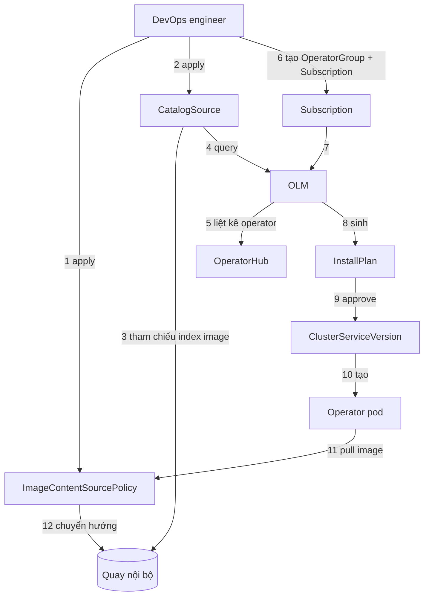

---
tags:
  - infrastructure
date: 2026-05-29
---
# Cài đặt operator trên OpenShift air-gapped

Trong môi trường air-gapped (disconnected, không có đường ra Internet), cluster OpenShift không thể cài operator theo cách thông thường vì OperatorHub mặc định cố gọi tới các registry ngoài như `registry.redhat.io` rồi fail. Operator phải được cài qua Operator Lifecycle Manager (OLM) dựa trên image đã mirror sẵn về một registry nội bộ, với `oc-mirror` làm công cụ trung tâm.

## OLM và CatalogSource thay cho Helm

OpenShift quản lý operator qua OLM, không qua Helm chart. OLM tìm operator khả dụng thông qua `CatalogSource` — một resource trỏ tới một catalog index image. Trong môi trường air-gapped phải mirror cả catalog index image (không chỉ image của bản thân operator), tạo `CatalogSource` trỏ về registry nội bộ, và tắt các default OperatorHub source vì chúng trỏ ra registry ngoài.

## Quy trình hai pha của oc-mirror

`oc-mirror` mirror theo hai pha tách biệt phù hợp với air-gap. Pha mirror-to-disk: một máy có Internet kéo image về thành gói trên đĩa. Pha disk-to-mirror: mang gói vào vùng air-gapped rồi push lên registry nội bộ.

Phạm vi mirror khai trong file `ImageSetConfiguration` — chọn catalog, package (operator) và channel để giới hạn đúng thứ cần. Lọc đúng package và channel giúp giảm dung lượng gói; phạm vi rộng làm gói phình rất to.

```yaml
kind: ImageSetConfiguration
apiVersion: mirror.openshift.io/v2alpha1
mirror:
  operators:
    - catalog: registry.redhat.io/redhat/certified-operator-index:v4.16
      packages:
        - name: gpu-operator-certified
          channels:
            - name: stable
    - catalog: registry.redhat.io/redhat/redhat-operator-index:v4.16
      packages:
        - name: nfd
```

```bash
# Pha mirror-to-disk trên máy có Internet
oc-mirror --v2 -c imageset-config.yaml --workspace file://./workdir file://./mirror
# Pha disk-to-mirror trong vùng air-gapped (push lên Quay nội bộ)
oc-mirror --v2 -c imageset-config.yaml --from file://./mirror docker://quay.internal/operators
```


## ImageContentSourcePolicy chuyển hướng pull

Sau khi push, `oc-mirror` tự sinh sẵn manifest `ImageContentSourcePolicy` (ICSP; bản mới hơn là `ImageDigestMirrorSet`) cùng `CatalogSource` trong thư mục kết quả (`results-xxxx/` ở v1, `cluster-resources/` ở v2). ICSP khai `repositoryDigestMirrors` gắn registry nội bộ với registry nguồn và tự động chuyển hướng mọi lệnh pull từ registry ngoài sang registry nội bộ. Chỉ cần apply cả thư mục manifest đó là cluster nhận chuyển hướng; nếu bỏ qua, cluster vẫn cố pull từ registry ngoài, buộc phải sửa tay trường registry trên từng resource.

```bash
oc apply -f ./workdir/working-dir/cluster-resources/
```

```yaml
apiVersion: operator.openshift.io/v1alpha1
kind: ImageContentSourcePolicy
metadata:
  name: operator-0
spec:
  repositoryDigestMirrors:
    - source: registry.redhat.io
      mirrors:
        - quay.internal/operators
```

## Luồng cài operator qua OLM

Sau khi mirror và chuyển hướng registry xong, việc cài operator diễn ra theo một chuỗi resource OLM. DevOps engineer apply `CatalogSource` (trỏ tới catalog index image trong Quay); OLM query CatalogSource để liệt kê operator lên OperatorHub. Engineer tạo `OperatorGroup` (cấp RBAC và chọn namespace operator sẽ watch) cùng `Subscription` (khai package, channel và CatalogSource nguồn). OLM tự sinh `InstallPlan`; sau khi approve, OLM tạo `ClusterServiceVersion` (CSV) — định nghĩa version, CRD và deployment của operator. Operator pod khi pull image được `ImageContentSourcePolicy` chuyển hướng về Quay.



## Trải nghiệm tại X company

**[Trí nhớ]** Hệ thống ở X company yêu cầu bảo mật nên air-gapped hoàn toàn, toàn bộ là Red Hat on-premise. Cluster OpenShift chạy trên một VM (số node tương đối nhiều) trên vSphere với hypervisor VMware ESXi. Registry nội bộ có sẵn là Quay. Mục tiêu là làm cho container nhận được GPU NVIDIA A100 (chế độ MIG, driver do team khác passthrough vào VM), tức cài `GPU Operator` và `Node Feature Discovery` (NFD).

**[Trí nhớ]** Cú sốc nhận thức là chuyển từ cài operator bằng Helm chart sang cơ chế mirror + OLM hoàn toàn xa lạ. Gói tar mirror rất nặng, tới khoảng 71GiB. `ImageSetConfiguration` từng khai sai vài lần trước khi hiểu cách giới hạn catalog và channel cho đúng hai operator cần.

**[Trí nhớ]** `oc-mirror` rất nhạy với version: chỉ cần binary dùng ở hai pha lệch nhau, kể cả ở mức minor version, hai pha mirror-to-disk và disk-to-mirror có thể không ăn khớp và fail.

**[Bổ sung — nguồn]** Điều này khớp với cách Red Hat tách bạch hai dòng `oc-mirror` v1 và v2 với định dạng không tương thích (có hướng dẫn migrate v1 sang v2 riêng) và yêu cầu push các image set đúng thứ tự sequence. Thực hành chuẩn là dùng cùng một version `oc-mirror` cho cả hai pha.

**[Trí nhớ]** Bài học đắt nhất: do không apply ICSP do `oc-mirror` sinh ra mà apply thẳng các k8s definition, sau đó phải đi sửa tay registry từ `nvcr.io` và `registry.redhat.io` sang Quay trên từng workload — rất cực. Nếu làm lại, điều muốn làm khác nhất là dùng ICSP để khỏi sửa từng workload.

**[Bổ sung — nguồn]** Về vùng từng phân vân là có cần tắt driver hay không: nếu node đã có driver cài sẵn, init container của driver pod tự phát hiện và label node để driver pod bị rút, kể cả khi không khai `driver.enabled=false`. NFD là dependency của GPU Operator, mặc định được Operator tự deploy, và nhận diện node GPU qua label `feature.node.kubernetes.io/pci-10de.present=true` (`0x10de` là PCI vendor ID của NVIDIA).

## Nguồn tham khảo

- [Mirroring images for a disconnected installation using the oc-mirror plugin — Red Hat OpenShift docs](https://docs.redhat.com/en/documentation/openshift_container_platform/4.16/html/disconnected_installation_mirroring/installing-mirroring-disconnected)
- [openshift/oc-mirror — GitHub](https://github.com/openshift/oc-mirror)
- [imageset-config-filter-catalog.yaml — openshift/oc-mirror](https://github.com/openshift/oc-mirror/blob/main/docs/examples/imageset-config-filter-catalog.yaml)
- [Migrating from oc-mirror plugin v1 to v2 — OKD docs](https://docs.okd.io/4.17/disconnected/mirroring/oc-mirror-migration-v1-to-v2.html)
- [Operator Lifecycle Manager concepts and resources — OpenShift docs](https://docs.openshift.com/container-platform/4.7/operators/understanding/olm/olm-understanding-olm.html)
- [How does OLM install operators on a cluster — operatorframework.io](https://olm.operatorframework.io/docs/concepts/operators-on-cluster/)
- [Installing the NVIDIA GPU Operator — NVIDIA docs](https://docs.nvidia.com/datacenter/cloud-native/gpu-operator/latest/getting-started.html)
- Transcript phỏng vấn khai quật (primary source cho phần trải nghiệm): [references/interviews/airgapped-oc-mirror.md](../../references/interviews/airgapped-oc-mirror.md)

## Liên kết

- [Multi-Instance GPU - cơ chế MIG dùng để chia A100 cho workload sau khi container nhận được GPU](../AI%20v%C3%A0%20Machine%20Learning/Multi-Instance%20GPU.md)
- [NVIDIA Dynamo - cùng ngữ cảnh chạy workload AI/GPU trên Kubernetes](../AI%20v%C3%A0%20Machine%20Learning/NVIDIA%20Dynamo.md)
- [Phân tích đánh đổi khi đề xuất giải pháp - bỏ qua ICSP đổi lấy việc sửa tay registry là một đánh đổi ngầm phải trả giá](../Ph%C3%A1t%20tri%E1%BB%83n%20b%E1%BA%A3n%20th%C3%A2n/Ph%C3%A2n%20t%C3%ADch%20%C4%91%C3%A1nh%20%C4%91%E1%BB%95i%20khi%20%C4%91%E1%BB%81%20xu%E1%BA%A5t%20gi%E1%BA%A3i%20ph%C3%A1p.md)
- [Hiểu công nghệ trước khi áp dụng - cú vấp khi mang tư duy Helm sang cơ chế OLM mà chưa hiểu mô hình mới](../Ph%C3%A1t%20tri%E1%BB%83n%20b%E1%BA%A3n%20th%C3%A2n/Hi%E1%BB%83u%20c%C3%B4ng%20ngh%E1%BB%87%20tr%C6%B0%E1%BB%9Bc%20khi%20%C3%A1p%20d%E1%BB%A5ng.md)
