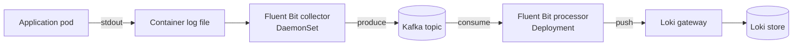

---
tags:
  - infrastructure
date: 2026-05-29
---
# Kafka làm buffer cho log pipeline

Pipeline log đơn giản nhất là collector trên node ghi thẳng vào store (Loki, Elasticsearch). Khi store chậm hoặc down, collector hoặc phải buffer in-memory (mất log nếu pod restart), hoặc apply back-pressure ngược lên container (làm chậm app). Đặt Kafka làm tầng buffer giữa collector và sink phá liên kết này: collector chỉ cần ghi nhanh vào Kafka, một processor riêng đọc Kafka và đẩy vào store, có thể scale, retry, transform độc lập.

Nguồn: [Fluent Bit Kafka output — docs.fluentbit.io](https://docs.fluentbit.io/manual/data-pipeline/outputs/kafka), [Fluent Bit Kafka input — docs.fluentbit.io](https://docs.fluentbit.io/manual/pipeline/inputs/kafka).

## Pattern ba thành phần

**Collector** chạy DaemonSet, một pod trên mỗi node. Chỉ làm hai việc: tail file log trong `/var/log/containers/`, ghi record vào Kafka topic. Không transform phức tạp, không retry phức tạp. Cấu hình hot path tối giản. Khi node bị áp lực, collector vẫn nhẹ.

**Kafka topic** (vd `logging`) giữ record. Replication theo cấu hình broker (thường 3 replica). Retention thời gian (ví dụ 24h) cho phép replay khi processor down.

**Processor** chạy Deployment, replica có thể scale ngang theo lag của consumer group. Đọc record từ Kafka, transform (parse, enrich label, drop field rác), gửi tới sink. Khi sink (Loki) chậm, processor giảm rate consume — Kafka tự buffer phía trước, không ảnh hưởng collector.

## Vì sao tách hot và cold path

Collector cần *cực kỳ nhẹ và ổn định* vì chạy trên mọi node, bao gồm node đang chịu áp lực workload. Nếu collector làm nhiều việc (parse phức tạp, enrich từ external API, retry với exponential backoff dài), nó cạnh tranh CPU/memory với app. Một collector lag không quan trọng — log có thể chậm vài giây — nhưng một collector crash hoặc làm chậm app là vấn đề.

Processor có thể chấp nhận crash và replay từ Kafka offset. Có thể chạy ít replica hơn (vd 2 thay vì 1 per node). Có thể dùng resource cao hơn để xử lý transform tốn CPU. Có thể restart khi cần đổi config mà không đụng node.

Phân chia trách nhiệm này phản ánh nguyên tắc Single Responsibility ở tầng kiến trúc.

## Khi Kafka và sink down

Sink down: processor pause consume (Kafka client tự retry), record dồn lại trong Kafka. Trong window retention của topic (vài giờ tới vài ngày), không mất log. Khi sink lên lại, processor consume tiếp từ offset cuối.

Kafka down toàn cluster: collector không ghi được. Fluent Bit có buffer in-memory và buffer disk tuỳ cấu hình ([Fluent Bit Buffering](https://docs.fluentbit.io/manual/administration/buffering-and-storage)). Đây là failure mode duy nhất gây mất log, nhưng Kafka cluster với 3 broker hiếm khi down toàn bộ cùng lúc.

Processor down: Kafka tiếp tục nhận từ collector. Khi processor lên lại, consume từ offset đã commit.

## Trade-off

Pattern này không miễn phí:

Thêm operational surface: Kafka cluster cần riêng (broker, controller/ZooKeeper hoặc KRaft, AKHQ UI). Tăng tài nguyên cluster.

Tăng độ trễ end-to-end: log đi qua thêm 2 hop (collector → Kafka → processor), thường thêm 1–3 giây trước khi xuất hiện trong Loki.

Phức tạp hơn cho debug: khi log không hiện ra, phải check ba điểm thay vì hai (collector, Kafka offset/lag, processor).

Pattern này đáng giá khi: cluster nhiều node (collector lag trên một node không nên ảnh hưởng node khác), có incident pattern Loki bị overwhelm, hoặc cần transform phức tạp ở processor (re-enrich, route topic khác nhau, batch lại).

## Alternative

Kafka không phải lựa chọn duy nhất. NATS, RabbitMQ, Redis Streams, hoặc một queue lightweight đều có thể đóng vai buffer. Lý do chọn Kafka thường là: cluster đã có sẵn cho mục đích khác (event sourcing, CDC), retention ổn định, ecosystem connector lớn (Kafka Connect có sẵn connector cho Elasticsearch, ClickHouse, S3).

Pattern tương tự áp dụng được cho trace data: collector → Kafka → processor → Jaeger backend. Cùng lý do về HA và scale độc lập.

## Nguồn tham khảo

- [Fluent Bit Kafka Output — docs.fluentbit.io](https://docs.fluentbit.io/manual/data-pipeline/outputs/kafka)
- [Fluent Bit Kafka Input — docs.fluentbit.io](https://docs.fluentbit.io/manual/pipeline/inputs/kafka)
- [Fluent Bit Buffering and Storage — docs.fluentbit.io](https://docs.fluentbit.io/manual/administration/buffering-and-storage)
- [Kafka Consumer Groups — kafka.apache.org](https://kafka.apache.org/documentation/#intro_consumers)
- Repo tham chiếu: [references/repos/k8s-obs-module/obs-log](../../references/repos/k8s-obs-module/obs-log/)
- Transcript khai quật: [k8s-obs-module.md](../../references/interviews/k8s-obs-module.md)

## Liên kết

- [Quan sát hệ thống trong Kubernetes - node neo, log là một trong ba pillar](./Quan%20s%C3%A1t%20h%E1%BB%87%20th%E1%BB%91ng%20trong%20Kubernetes.md)
- [Prometheus hai tầng với Cortex - cùng họ pattern tách hot collector khỏi long-term store](./Prometheus%20hai%20t%E1%BA%A7ng%20v%E1%BB%9Bi%20Cortex.md)
- [Backpressure tầng transport - cùng họ tư duy về cách xử lý khi tốc độ sản xuất vượt tốc độ tiêu thụ](../System%20level/Backpressure%20%E1%BB%9F%20t%E1%BA%A7ng%20transport%20trong%20asyncio.md)
- [Observer pattern - cùng họ tư duy decouple producer khỏi consumer qua một tầng trung gian](../System%20level/Observer%20pattern.md)
