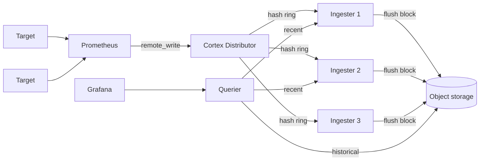

---
tags:
  - infrastructure
date: 2026-05-29
---
# Prometheus hai tầng với Cortex

Prometheus single-binary là scraping engine xuất sắc nhưng yếu ở hai mặt: không HA out-of-the-box (một instance fail là mất khoảng dữ liệu đó), và retention bị giới hạn bởi disk local. Pattern hai tầng giải hai vấn đề này cùng lúc: Prometheus chạy stateless với retention ngắn chỉ để làm scraper, mọi sample được `remote_write` lên Cortex — một system phân tán nhận trách nhiệm long-term storage, multi-tenancy và HA query.

Nguồn: [Cortex Architecture — cortexmetrics.io](https://cortexmetrics.io/docs/architecture/), [Prometheus Remote Write — prometheus.io](https://prometheus.io/docs/practices/remote_write/).

## Vì sao tách hai tầng

Prometheus được thiết kế làm scraping + alerting + ad-hoc query trên window ngắn. Storage TSDB local rất nhanh nhưng nằm trên một node — không replicate, không scale ngang. Nếu muốn giữ metric 30 ngày, 90 ngày, hoặc nhiều năm, disk phải lớn và backup phức tạp. Nếu muốn 2 instance để HA, query gặp vấn đề data inconsistency giữa 2 replica.

Cortex tách concern: Prometheus chỉ làm scrape + buffer ngắn, Cortex chịu trách nhiệm "everything else". Prometheus có thể cấu hình `retention: 1d`, `persistentVolume.enabled: false` — restart mất hết, không vấn đề. Cortex chứa source of truth.



## remote_write là khớp nối

`remote_write` là API Prometheus đẩy mọi sample mới scrape được sang một endpoint HTTP. Body là batched Snappy-compressed Protocol Buffer ([Cortex docs](https://cortexmetrics.io/docs/architecture/)). Cấu hình:

```yaml
prometheus:
  prometheusSpec:
    remoteWrite:
      - url: http://cortex-nginx.obs-metric.svc.cluster.local/api/v1/push
    retention: "1d"
    retentionSize: "2GB"
    persistentVolume:
      enabled: false
```

Prometheus vẫn giữ data 1 ngày trong memory/disk tạm để serve query Grafana nhanh và alerting có window đủ rộng, nhưng không phụ thuộc local storage cho long-term. Mỗi sample đi vào memory đồng thời đi ra `remote_write`.

## Cortex components

Cortex là service-based architecture, các component scale ngang độc lập:

**Distributor** nhận request `remote_write`, validate tenant limit, dùng consistent hashing để route sample tới ingester phù hợp. Stateless.

**Ingester** giữ series in-memory, định kỳ flush block (TSDB format) lên object storage. Là component semi-stateful — dùng hash ring để biết series nào thuộc về mình. Mặc định flush mỗi 2 giờ.

**Querier** thực thi PromQL, lấy sample từ ingester (data gần đây, còn in-memory) và từ object storage (data cũ). Stateless.

**Query Frontend** (tuỳ chọn) cache query result, split query lớn thành range nhỏ song song, fair scheduling giữa tenant. Stateless.

**Store Gateway** đọc block từ object storage và serve cho Querier.

Multi-tenant by design: mỗi request phải có header `X-Scope-OrgID` chỉ tenant ID. Distributor và Ingester tách data theo tenant; storage cũng phân theo prefix tenant.

## Object storage backend

Cortex hỗ trợ S3, GCS, Azure Blob, OpenStack Swift, hoặc filesystem (chỉ single-node). Trên on-prem không có S3 thật, MinIO là lựa chọn phổ biến vì compatible API. Cùng MinIO host có thể chứa bucket riêng cho Cortex (`cortex`), Loki (`loki-chunks`), và các store khác — pattern tiêu chuẩn cho stack observability on-prem.

## Trade-off

Pattern hai tầng đổi đơn giản lấy scale và HA. Cost ngầm:

Vận hành phức tạp hơn: thay vì 1 Prometheus, giờ có distributor, ingester, querier, store-gateway, query-frontend, plus object storage và một consistent hash ring (Cortex dùng memberlist hoặc Consul). Mỗi component cần monitoring riêng.

Độ trễ end-to-end tăng: sample đi qua Prometheus → remote_write → distributor → ingester → block → object storage trước khi query thấy được hết. Recent data vẫn nhanh (đọc thẳng ingester) nhưng historical chậm hơn local TSDB.

Alternative cùng pattern: Thanos (sidecar mode đẩy block từ Prometheus lên object storage trực tiếp, không qua remote_write), Mimir (fork của Cortex do Grafana Labs maintain). Lựa chọn tuỳ scale và team familiarity.

## Nguồn tham khảo

- [Cortex Architecture — cortexmetrics.io](https://cortexmetrics.io/docs/architecture/)
- [Prometheus Remote Write Practices — prometheus.io](https://prometheus.io/docs/practices/remote_write/)
- [Prometheus remote_write tuning — prometheus.io](https://prometheus.io/docs/practices/remote_write/#resource-usage)
- [Comparing Thanos, Cortex, Mimir — promlabs.com](https://promlabs.com/blog/2023/02/09/comparing-thanos-mimir-cortex/)
- Repo tham chiếu: [references/repos/k8s-obs-module/obs-metric](../../references/repos/k8s-obs-module/obs-metric/)
- Transcript khai quật: [k8s-obs-module.md](../../references/interviews/k8s-obs-module.md)

## Liên kết

- [Quan sát hệ thống trong Kubernetes - node neo, Prometheus + Cortex là core của pillar metric](./Quan%20s%C3%A1t%20h%E1%BB%87%20th%E1%BB%91ng%20trong%20Kubernetes.md)
- [Scrape metric kubelet trong Prometheus - là source data đẩy vào Cortex qua remote_write](./Scrape%20metric%20kubelet%20trong%20Prometheus.md)
- [Kafka làm buffer cho log pipeline - cùng họ pattern tách hot path khỏi long-term store](./Kafka%20l%C3%A0m%20buffer%20cho%20log%20pipeline.md)
- [Phân tích đánh đổi khi đề xuất giải pháp - thêm Cortex là đổi simplicity lấy scale, cần cân nhắc](../Ph%C3%A1t%20tri%E1%BB%83n%20b%E1%BA%A3n%20th%C3%A2n/Ph%C3%A2n%20t%C3%ADch%20%C4%91%C3%A1nh%20%C4%91%E1%BB%95i%20khi%20%C4%91%E1%BB%81%20xu%E1%BA%A5t%20gi%E1%BA%A3i%20ph%C3%A1p.md)
