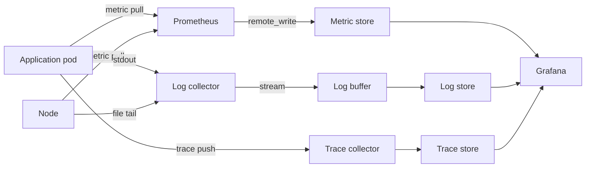

---
tags:
  - infrastructure
date: 2026-05-29
---
# Quan sát hệ thống trong Kubernetes

Quan sát hệ thống (observability) trong Kubernetes được xây dựng quanh ba loại dữ liệu: metric, log và trace. Mỗi loại có pipeline riêng nhưng chia sẻ chung pattern: thu thập trên node hoặc qua sidecar, xử lý/buffer trung gian, lưu trong store chuyên dụng, hợp nhất ở tầng visualize. Cấu trúc này quyết định cách chia namespace, cách scale và cách chịu lỗi của toàn bộ observability stack.

Nguồn: [Monitoring, Logging, and Debugging — Kubernetes docs](https://kubernetes.io/docs/tasks/debug/), [The Three Pillars of Observability — Cindy Sridharan](https://www.oreilly.com/library/view/distributed-systems-observability/9781492033431/ch04.html).

## Ba pillar dữ liệu

**Metric** là số theo thời gian, organize theo timeseries với label. Trong Kubernetes, metric đến từ nhiều layer: kubelet (per-container qua cAdvisor), node (node-exporter), control plane (kube-state-metrics), application (`/metrics` endpoint Prometheus format). Cùng đặc tính: thấp về kích thước per data point, cao về tần suất, query bằng PromQL.

**Log** là text không cấu trúc hoặc semi-structured do container ghi ra `stdout/stderr`. Container runtime ghi log ra file trên host (mặc định `/var/log/containers/`); collector chạy DaemonSet trên mỗi node để tail file đó. Đặc tính: kích thước per record lớn hơn metric nhiều lần, cardinality cao, query bằng label + grep.

**Trace** là cây span thể hiện đường đi của một request qua nhiều service. Khác metric/log ở chỗ phải có context propagation (trace ID + span ID) qua header HTTP/gRPC. Trace data thường được sample (ví dụ 1% request) để giảm áp lực store.

## Kiến trúc layer điển hình

Pipeline mỗi pillar đều có 4 vai trò:

| Vai trò | Metric | Log | Trace |
|---------|--------|-----|-------|
| Collector | Prometheus scrape | Fluent Bit / Promtail / Vector | OTel collector / Jaeger agent |
| Buffer/Processor | (thường không có) | Kafka, Fluent Bit processor | Kafka (tuỳ chọn) |
| Store | Cortex / Mimir / Thanos | Loki / Elasticsearch | Jaeger backend (Cassandra/ES) |
| Visualize | Grafana / Prometheus UI | Grafana / Kibana | Jaeger UI / Grafana |

Tách bốn vai trò cho phép scale từng layer độc lập và đổi component mà không phải đập cả pipeline.

## Chia namespace theo layer

Mô hình triển khai phổ biến là một namespace per layer: `obs-storage` (MinIO, Cassandra), `obs-metric` (Prometheus + Cortex), `obs-log` (Loki + Fluent Bit), `obs-tracing` (Jaeger), `obs-dashboard` (Grafana). Lý do: từng layer có thể redeploy/clean độc lập, RBAC tách bạch, và NetworkPolicy có thể policy-based isolation giữa các layer. Yêu cầu CNI hỗ trợ NetworkPolicy — `kindnet` trong kind không hỗ trợ, phải đổi sang Calico hoặc Cilium.

## Storage backend chia sẻ

Trên on-prem không có S3 thật, một MinIO cluster có thể làm S3-compat backend cho cả Cortex (metric chunk/block) lẫn Loki (log chunk + index). Cassandra thường được Jaeger dùng riêng vì write pattern của trace (heavy write, append-only) khác với object-store cho metric/log. Phân tách backend theo workload thay vì theo team là quyết định kiến trúc quan trọng — nó giúp tối ưu chi phí và operational complexity.

## Vai trò của service mesh

Service mesh (Linkerd, Istio) cung cấp một nguồn metric phụ rất mạnh: golden metrics (RPS, success rate, latency) cho mọi connection HTTP/gRPC giữa pod mà không cần code instrument. Mesh proxy tự scrape được bởi Prometheus. Đây là cách rẻ nhất để có "site reliability dashboard" cho legacy service không export metric. Chi tiết ở [Service mesh làm tầng quan sát](./Service%20mesh%20l%C3%A0m%20t%E1%BA%A7ng%20quan%20s%C3%A1t.md).

## Nguồn tham khảo

- [System Metrics — Kubernetes docs](https://kubernetes.io/docs/concepts/cluster-administration/system-metrics/)
- [Logging Architecture — Kubernetes docs](https://kubernetes.io/docs/concepts/cluster-administration/logging/)
- [OpenTelemetry Concepts — opentelemetry.io](https://opentelemetry.io/docs/concepts/)
- [Cortex Architecture — cortexmetrics.io](https://cortexmetrics.io/docs/architecture/)
- [Loki Architecture — Grafana docs](https://grafana.com/docs/loki/latest/get-started/architecture/)
- [Jaeger Storage Backends — jaegertracing.io](https://www.jaegertracing.io/docs/1.65/deployment/#storage-backends)
- Repo tham chiếu (dự án cá nhân ôn lại kiến thức SRE tại Teko): [references/repos/k8s-obs-module](../../references/repos/k8s-obs-module/)
- Blog song hành (bản giản lược): [Xây dựng hệ thống monitor đơn giản trong Kubernetes](https://www.nkthanh.dev/posts/xay-dung-he-thong-monitor-don-gian-trong-k8s)
- Transcript khai quật: [k8s-obs-module.md](../../references/interviews/k8s-obs-module.md)

## Liên kết

- [Scrape metric kubelet trong Prometheus - chi tiết cách lấy metric tầng kubelet, là phần khó nhất của pillar metric](./Scrape%20metric%20kubelet%20trong%20Prometheus.md)
- [Prometheus hai tầng với Cortex - cách scale store metric ra long-term storage](./Prometheus%20hai%20t%E1%BA%A7ng%20v%E1%BB%9Bi%20Cortex.md)
- [Kafka làm buffer cho log pipeline - cách HA hoá pipeline log bằng cách tách collector khỏi sink](./Kafka%20l%C3%A0m%20buffer%20cho%20log%20pipeline.md)
- [Service mesh làm tầng quan sát - golden metrics tự động qua proxy sidecar](./Service%20mesh%20l%C3%A0m%20t%E1%BA%A7ng%20quan%20s%C3%A1t.md)
- [Cài operator trên OpenShift air-gapped - cùng họ tri thức về vận hành Kubernetes on-prem](./C%C3%A0i%20%C4%91%E1%BA%B7t%20operator%20tr%C3%AAn%20OpenShift%20air-gapped.md)
- [NVIDIA Dynamo - cùng pattern tách layer trên Kubernetes nhưng cho serving AI](../AI%20v%C3%A0%20Machine%20Learning/NVIDIA%20Dynamo.md)
