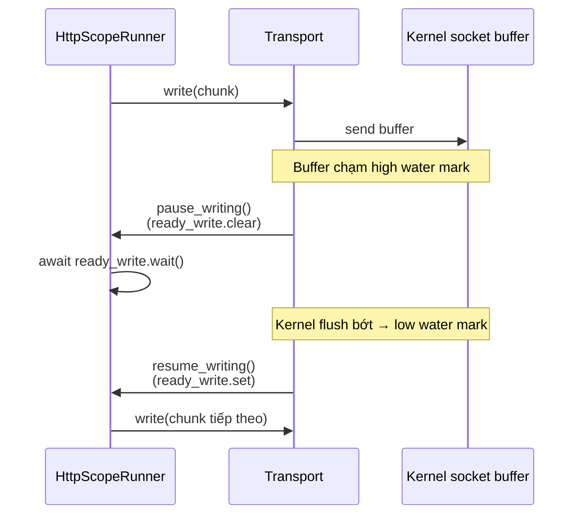

---
tags:
  - web
  - python
date: 2026-05-29
---
# Backpressure ở tầng transport trong asyncio

Backpressure là cơ chế đẩy áp lực ngược về phía producer khi consumer xử lý không kịp, tránh OOM hoặc buffer phình to vô tận. Trong asyncio, mỗi `Transport` (kết nối TCP, pipe...) có high water mark và low water mark cấu hình lượng dữ liệu được đệm chờ ghi. Khi vượt high water mark, transport gọi `pause_writing()` của protocol; khi tụt xuống dưới low water mark, gọi `resume_writing()`. Application phải lắng nghe hai callback này và tự ngừng gửi tạm thời — asyncio không tự block writer của application.

## Hai mức backpressure khác nhau

Cần phân biệt backpressure ở hai tầng:

- tầng application — khi hàng đợi task đầy, server ngừng đọc socket mới, đẩy block về client; xem mục backpressure trong [bài toán C10K](../Web%20development/B%C3%A0i%20to%C3%A1n%20C10K.md)
- tầng transport — khi socket send buffer của OS đầy, transport tự pause writing, application phải đợi trước khi gửi tiếp

Tầng transport đảm bảo bộ nhớ của server không phình theo dữ liệu đang ghi pending; tầng application đảm bảo CPU không bị nuốt bởi task pile-up. Một server hoàn chỉnh xử lý cả hai.

## Cách uASGI áp dụng

`H11Protocol` override hai callback chuẩn của `asyncio.Protocol`:

```python
def pause_writing(self) -> None:
    self.ready_write.clear()

def resume_writing(self) -> None:
    self.ready_write.set()
```

`ready_write` là `asyncio.Event`. Mỗi `HttpScopeRunner` trước khi ghi body lớn (ví dụ trong `sendfile` chunk theo vòng) gọi `await self.ready_write.wait()` để đợi nếu transport đang yêu cầu pause. Tác dụng: trong khi transport bận flush buffer, runner ngủ trên event và không tiêu tốn CPU vô ích cũng không chồng thêm bytes vào buffer.



## Tại sao zero-copy phải tôn trọng backpressure

`sendfile` zero-copy bypass user-space buffer nhưng vẫn ghi vào kernel send buffer của socket — vẫn có thể chạm high water mark. uASGI gọi `await ready_write.wait()` trước mỗi vòng `os.sendfile`, nên zero-copy không phá vỡ cơ chế backpressure. Nếu bỏ qua, server có thể đẩy nhanh bytes vào kernel buffer hơn client đọc, khiến kernel cấp phát buffer động và OOM trong tình huống client chậm.

## Trải nghiệm cá nhân

Wiki này được kết tinh khi viết [uASGI](https://github.com/magiskboy/uasgi) tại Zen8labs (7-8/2025). Phần quản lý coroutine để đảm bảo hiệu năng cao (gồm `ready_write` Event bảo vệ sendfile khỏi phình kernel buffer) thuộc nhóm tự đánh giá *học được nhiều và làm tốt*. Chi tiết bối cảnh trong [transcript phỏng vấn](../../references/interviews/uasgi.md).

## Nguồn tham khảo

- [Source uASGI - pause_writing và sendfile chia chunk](../../references/repos/uasgi/uasgi/uhttp.py)
- [Source uASGI - pause_writing trong H11Protocol](../../references/repos/uasgi/uasgi/protocol.py)
- [asyncio Protocol - flow control callbacks](https://docs.python.org/3/library/asyncio-protocol.html#flow-control-callbacks)
- [asyncio Transport - set_write_buffer_limits](https://docs.python.org/3/library/asyncio-protocol.html#asyncio.WriteTransport.set_write_buffer_limits)

## Liên kết tri thức

- [Bài toán C10K - backpressure ở tầng application là mảnh khác cùng triết lý](../Web%20development/B%C3%A0i%20to%C3%A1n%20C10K.md)
- [Zero-copy và sendfile - sendfile cũng phải tôn trọng cơ chế backpressure ở tầng transport](./Zero-copy%20v%C3%A0%20sendfile.md)
- [Coroutine trong Python - pause/resume tự nhiên dùng cơ chế event của coroutine](./Coroutine%20trong%20Python.md)
- [Event loop trong Python - transport và protocol là thành phần cốt lõi mà event loop điều phối](./Event%20loop%20trong%20Python.md)
- [Protocol và Transport trong asyncio - pause_writing và resume_writing là một mặt của hợp đồng Protocol/Transport](./Protocol%20v%C3%A0%20Transport%20trong%20asyncio.md)
- [Time-based movement thay vì sleep trong game loop - cùng họ "không block producer, schedule lại" áp dụng cho game entity](../Game%20development/Time-based%20movement%20thay%20v%C3%AC%20sleep%20trong%20game%20loop.md)
