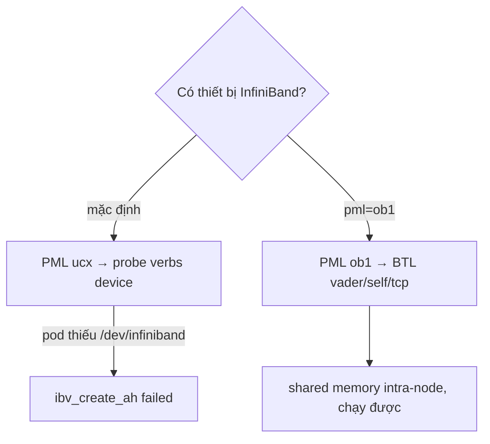

---
tags:
  - infrastructure
date: 2026-05-29
---
# Chọn transport trong Open MPI

Khi chạy tensor parallel qua MPI, một khối cấu hình nhỏ quyết định Open MPI dùng đường truyền nào giữa các rank. Cụ thể bộ ba sau ép Open MPI dùng shared memory cho các rank cùng node và bỏ qua đường InfiniBand, đúng cho tình huống tensor parallel chạy trong một pod trên một node mà pod không được cấp thiết bị InfiniBand.

```yaml
env:
  - { name: OMPI_MCA_pml,  value: "ob1" }            # dùng BTL, không qua UCX
  - { name: OMPI_MCA_btl,  value: "tcp,self,vader" }  # shared memory + loopback + fallback TCP
  - { name: OMPI_MCA_btl_base_warn_component_unused, value: "0" }  # tắt cảnh báo nhiễu
```



## MCA và quy ước biến môi trường

MCA (Modular Component Architecture) là khung cấu hình runtime dạng plugin của Open MPI, phân tầng project, framework, component, module. Mọi biến môi trường dạng `OMPI_MCA_<tên_tham_số>` tương đương với cờ dòng lệnh `--mca <tên> <giá_trị>`. Vậy ba biến trên chính là dạng env của `--mca pml ob1`, `--mca btl tcp,self,vader` và `--mca btl_base_warn_component_unused 0`.

## PML và việc ép bỏ UCX

PML (Point-to-point Messaging Layer) là framework triển khai truyền tin điểm-điểm, có ba component chính. `ob1` dùng các module BTL làm transport và có thể kết hợp nhiều BTL. `cm` dùng module MTL và chỉ một transport. `ucx` đẩy mọi thứ qua thư viện UCX, vốn ưu tiên Verbs InfiniBand và RoCE. Thuật toán mặc định của Open MPI ưu tiên PML `ucx` ngay khi phát hiện có thiết bị InfiniBand. Vì UCX chỉ tiếp cận được qua PML `ucx`, đặt `pml=ob1` cắt hoàn toàn đường UCX, nên Open MPI không probe verbs device nữa. Từ Open MPI 5.0, BTL `openib` cũ đã bị gỡ bỏ, nên trên bản hiện đại "đường InfiniBand" của MPI thực chất là UCX.

## BTL và shared memory intra-node

BTL (Byte Transfer Layer) là các transport mà riêng PML `ob1` dùng. Trong danh sách `tcp,self,vader`: `tcp` là đường socket Ethernet làm fallback hoặc liên node; `self` là loopback cho rank tự gửi cho chính nó và luôn bắt buộc phải có khi chỉ định `btl`; `vader` là BTL shared memory intra-node, transport quyết định hiệu năng khi mọi rank ở cùng node. `vader` đã được đổi tên thành `sm` từ Open MPI 5.0 và chỉ còn là alias, nên cấu hình này chạy được trên cả bản cũ lẫn bản mới. Tham số `btl_base_warn_component_unused=0` chỉ tắt cảnh báo khi một BTL hiệu-năng-cao được nạp nhưng không tìm thấy NIC phù hợp, là nhiễu vô hại trong pod cố ý chỉ dùng shared memory, self và tcp.

## Cơ chế single-copy và ràng buộc container

Shared memory BTL có thể dùng single-copy qua CMA, KNEM hoặc XPMEM để giảm một lần sao chép. CMA phổ biến nhất vì có sẵn trong kernel hiện đại, nhưng dùng `process_vm_readv` cần quyền `PTRACE_MODE_ATTACH`. Seccomp mặc định của Docker chặn syscall này, nên trong container CMA bị chặn thì shared memory âm thầm rơi về chế độ two-copy (vẫn chạy, chỉ chậm hơn); muốn bật single-copy cần thêm `CAP_SYS_PTRACE`.

## Trải nghiệm thực tế

Khi spawn MPI cho TP=2 trong một pod để quantize, UCX cố dùng InfiniBand `mlx5_1` nhưng pod không expose `/dev/infiniband` nên `ibv_create_ah failed: No such device` rồi `MPI_Init_thread failed`. Đặt ba biến trên (kèm `UCX_TLS=cuda_ipc,cuda_copy,self,sm`, `UCX_NET_DEVICES=`) ép Open MPI dùng shared memory nội-node và bỏ hẳn đường InfiniBand, tiến trình quantize chạy được. Lưu ý dễ nhầm: `NCCL_IB_DISABLE=0` thực ra bật InfiniBand cho NCCL chứ không tắt.

## Nguồn tham khảo

- [Open MPI - MCA và quy ước biến môi trường](https://docs.open-mpi.org/en/v5.0.x/mca.html)
- [Open MPI - Network support, PML/BTL/MTL, openib gỡ ở 5.0](https://docs.open-mpi.org/en/v5.0.x/release-notes/networks.html)
- [Open MPI - Shared memory BTL, đổi tên vader sang sm, CMA/KNEM/XPMEM](https://docs.open-mpi.org/en/v5.0.x/tuning-apps/networking/shared-memory.html)
- [Open MPI - text cảnh báo btl_base_warn_component_unused](https://github.com/open-mpi/ompi/blob/main/opal/mca/btl/base/help-mpi-btl-base.txt)

## Liên kết tri thức

- [UCX - đối ngẫu cấu hình, một bên ép framework dùng UCX còn Open MPI ép bỏ UCX để tránh InfiniBand](./UCX.md)
- [RDMA - Open MPI ưu tiên đường UCX/InfiniBand khi phát hiện HCA, đường này hỏng trong pod thiếu thiết bị IB](./RDMA.md)
- [Shared memory trong LLM serving - BTL vader dùng shared memory cho giao tiếp rank intra-node](../AI%20v%C3%A0%20Machine%20Learning/Shared%20memory%20trong%20LLM%20serving.md)
- [Ràng buộc hạ tầng khi triển khai LLM - lỗi ptrace seccomp và thiếu thiết bị IB là biểu hiện coupling container và phần cứng](../AI%20v%C3%A0%20Machine%20Learning/R%C3%A0ng%20bu%E1%BB%99c%20h%E1%BA%A1%20t%E1%BA%A7ng%20khi%20tri%E1%BB%83n%20khai%20LLM.md)
