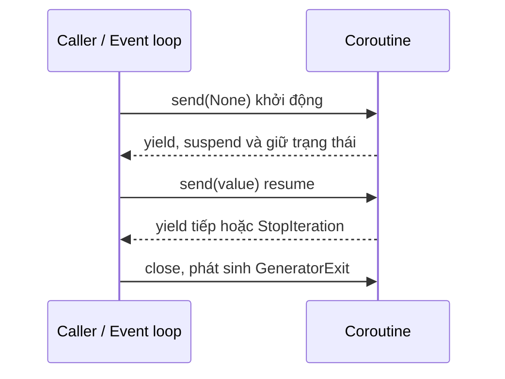
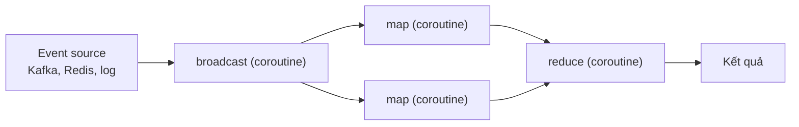

---
tags:
  - python
date: 2026-05-29
---
# Coroutine trong Python

Coroutine là đơn vị thực thi có thể `suspend` và `resume` nhưng vẫn giữ được context của hàm giữa các lần chạy. Theo Donald Knuth, subroutine (hàm thông thường, bị giải phóng context sau khi thoát) chỉ là một trường hợp đặc biệt của coroutine - trường hợp mà coroutine chỉ chạy một lần từ đầu đến cuối. Trong Python, coroutine là cơ chế cốt lõi để mô hình `event loop` xử lý nhiều tác vụ `I/O-bound` trong cùng một process mà không phải tạo nhiều thread hoặc process.

## Vì sao coroutine phù hợp với event loop

Một tác vụ `I/O-bound` chứa nhiều thao tác chờ dữ liệu (đọc socket, đọc file). Tại mỗi điểm chờ, hàm đang thực thi (callee) cần trả lại quyền điều khiển chương trình cho nơi gọi (caller, ở đây là event loop) mà vẫn giữ nguyên context để tiếp tục đúng vị trí khi dữ liệu sẵn sàng. Coroutine đáp ứng yêu cầu này vì:

- trả quyền điều khiển cho caller tại điểm `yield`
- tiếp tục thực thi từ đúng điểm đã `suspend`
- giữ lại trạng thái cục bộ của hàm giữa các lần `resume`
- là cơ chế non-preemptive scheduling, coroutine chủ động nhường quyền chứ không bị OS ngắt

## Coroutine giữ trạng thái như thế nào

Để suspend rồi resume mà không mất context, coroutine cần một vùng nhớ tồn tại lâu hơn một lần gọi hàm. Trong C, vùng nhớ này là các biến `static` cùng một biến đánh dấu điểm khôi phục (thường cài đặt bằng `switch case`); biến đánh dấu lưu vị trí code sẽ chạy tiếp ở lần gọi sau. Trong Python, trạng thái được giữ trong stack frame của coroutine object thay vì bị giải phóng khi hàm trả về.

Trong Python, một hàm có `yield` không trả kết quả cuối cùng ngay khi gọi mà trả về một coroutine hoặc generator object. Vòng đời điển hình:

1. caller tạo object coroutine
2. caller khởi động coroutine bằng `next()` hoặc `send(None)`
3. coroutine chạy đến `yield`, produce dữ liệu hoặc nhường quyền điều khiển
4. caller `resume` coroutine bằng `next()` hoặc `send(value)`, có thể truyền dữ liệu vào
5. caller có thể `close()` để kết thúc, phát sinh `GeneratorExit` bên trong coroutine



```python
def coro_fn():
    val = yield 'Starting'   # khởi động và suspend, trả control cho caller
    print('Consume', val)
    yield 'Hello World'      # produce data

co = coro_fn()
print(co.send(None))         # start coroutine -> 'Starting'
print(co.send('data'))       # resume, truyền 'data' vào -> 'Hello World'
co.close()
```

`yield` vừa là điểm produce dữ liệu, vừa là điểm consume dữ liệu (qua `send`), vừa là điểm lưu trạng thái.

## So sánh các đơn vị thực thi

Coroutine khác biệt rõ với các đơn vị thực thi khác về chi phí bộ nhớ và mô hình lập lịch. Bài tham khảo đưa ra bảng so sánh sau.

| Tiêu chí | Process | Native thread | Green thread | Goroutine | Coroutine |
|---|---|---|---|---|---|
| Bộ nhớ | ≤ 8MB | ≤ Nx2MB | ≥ 64KB | ≥ 8KB | ≥ 0MB |
| Quản lý bởi OS | Có | Có | Không | Không | Không |
| Không gian địa chỉ riêng | Có | Không | Không | Không | Không |
| Pre-emptive scheduling | Có | Có | Có | Không | Không |
| Khả năng song song | Có | Có | Không | Có | Không |

Coroutine nhỏ gọn nhất, không có không gian địa chỉ riêng, không chạy song song và rất an toàn vì chỉ tồn tại trong một process. Đặc tính này giúp coroutine giảm các lỗi đồng bộ thường gặp khi xử lý đa luồng, nên phù hợp cho các tác vụ networking.

## Quan hệ giữa coroutine và generator

Generator là trường hợp đặc biệt của coroutine: nó chủ yếu `produce` dữ liệu, còn coroutine có thể vừa `produce` vừa `consume` qua `send()`. Khi coroutine hoặc generator chạy hết, Python phát sinh `StopIteration`.

`yield from` cho phép một coroutine ủy quyền việc lặp cho coroutine hoặc generator khác, làm gọn code khi ghép nhiều nguồn dữ liệu hoặc duyệt cấu trúc đệ quy như cây nhị phân.

```python
def visit(self):
    for node in self.left_nodes:
        yield from node.visit()
    yield self.value
    for node in self.right_nodes:
        yield from node.visit()
```

## Ứng dụng của coroutine

TCP server bất đồng bộ dùng `selectors.DefaultSelector` làm I/O multiplexer cho file descriptor; mỗi kết nối gắn với một coroutine cho đọc hoặc ghi, khi socket chưa sẵn sàng thì coroutine `yield` để event loop xử lý sự kiện khác. Thư viện `curio` của David Beazley là một cài đặt thực tế của ý tưởng này.

Streaming pipeline ghép các coroutine theo mô hình `broadcast -> map -> reduce`; mỗi coroutine giữ một context nhỏ và truyền dữ liệu cho bước tiếp theo bằng `send()`. Một decorator `@coroutine` thường được dùng để tự động `send(None)` priming coroutine trước khi sử dụng. Mô hình này phù hợp với log processing hoặc event processing với event source như Redis pub/sub, Kafka, RabbitMQ.



Scheduler mô phỏng OS dùng `yield` để minh họa non-preemptive scheduler: task chủ động nhường quyền, scheduler quyết định task nào chạy tiếp. Ví dụ này cho thấy sự tương đồng giữa `trap` trong OS và `yield` trong Python.

## Các lưu ý khi dùng coroutine

- chỉ gọi `send()` trong một single thread để tránh đẩy dữ liệu vào lúc coroutine đang chạy, gây overload và crash
- nếu kết hợp coroutine với thread, cần queue và cơ chế đồng bộ rõ ràng giữa các thread và coroutine đích
- tránh thiết kế pipeline thành đồ thị phức tạp (DAG) khó kiểm soát trạng thái

## Nguồn tham khảo

- [Bất đồng bộ trong Python - Coroutine | Phần 1](https://www.nkthanh.dev/posts/asynchronous-in-python-part-1)
- [PEP 342 – Coroutines via Enhanced Generators](https://peps.python.org/pep-0342/)
- [Coroutine talk của David Beazley](https://www.dabeaz.com/coroutines/Coroutines.pdf)
- [curio kernel - github.com/dabeaz/curio](https://github.com/dabeaz/curio/blob/master/curio/kernel.py)

## Liên kết tri thức

- [Event loop trong Python - event loop lập lịch và duy trì vòng đời của coroutine](./Event%20loop%20trong%20Python.md)
- [async/await trong Python - cú pháp async/await được hiện thực hóa bằng coroutine](./async-await%20trong%20Python.md)
- [Global Interpreter Lock trong Python - coroutine tránh chi phí và rủi ro của đa luồng dưới GIL](./Global%20Interpreter%20Lock%20trong%20Python.md)
- [Closure trong Python - cùng cơ chế giữ trạng thái cục bộ qua nhiều lần gọi](./Closure%20trong%20Python.md)
