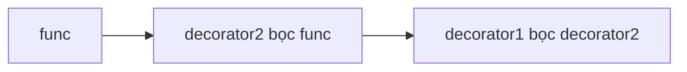

---
tags:
  - python
date: 2026-05-29
---
# Decorator trong Python

Decorator là một design pattern trong đó một hàm (hoặc class) nhận đầu vào là một hàm (hoặc class) khác và trả về một hàm (hoặc class) mới có hành vi được thay đổi hoặc mở rộng. Trong Python, pattern này được hỗ trợ trực tiếp qua cú pháp `@`. Decorator dựa trên closure: hàm wrapper được trả về vẫn truy cập được hàm gốc và các tham số cấu hình nhờ cơ chế variable scope.

## Cấu trúc hoạt động cơ bản

Một decorator cơ bản là một hàm bọc (wrapper function): nhận hàm gốc làm tham số, định nghĩa một nested function thực hiện logic bổ sung (ghi log, đo thời gian, xác thực) rồi gọi lại hàm gốc, và trả về nested function đó thay vì thực thi nó. Cú pháp `@tên_decorator` đặt trên định nghĩa hàm thay cho việc gán biến lồng nhau.

```python
def log(func):
    def func_with_log(*args, **kwargs):
        print("Bắt đầu thực thi hàm...")
        ret = func(*args, **kwargs)
        print("Thực thi xong!")
        return ret
    return func_with_log

@log
def add(a, b):
    return a + b
```

## Nested decorator

Một hàm có thể được áp dụng nhiều decorator cùng lúc tạo thành decorator stack. Các decorator lồng nhau được áp dụng theo thứ tự từ dưới lên trên: decorator gần hàm nhất bọc hàm trước.

```python
@decorator1
@decorator2
def func(msg):
    print('Original func:', msg)

# tương đương với: func = decorator1(decorator2(func))
```



## Decorator có tham số

Để decorator nhận tham số cấu hình, cần kỹ thuật lồng ba tầng: hàm ngoài cùng nhận tham số cấu hình, hàm thứ hai nhận hàm cần decorate, hàm trong cùng thực thi logic và kết hợp các biến cấu hình qua closure. Có thể đặt giá trị mặc định cho tham số để dùng được cả `@decorator` và `@decorator(param=value)`.

```python
def log(show_input=False):
    def config(func):
        def func_with_log(*args, **kwargs):
            if show_input:
                print("Input:", args, kwargs)
            return func(*args, **kwargs)
        return func_with_log
    return config

@log(show_input=True)
def need_log_input(data):
    pass
```

## Ứng dụng phổ biến

Decorator xuất hiện ở nhiều ngữ cảnh thực tế. Một decorator `@measure` đo thời gian thực thi của hàm là cách thông dụng để benchmark các tác vụ CPU-bound và I/O-bound. Một decorator `@coroutine` tự động gọi `send(None)` để priming coroutine trước khi đưa vào pipeline xử lý dữ liệu. Trong web framework Flask, decorator `@app.route()` gắn URL với hàm xử lý, và các extension như Flask-Login, Flask-Cache bổ sung decorator riêng để can thiệp vào tiến trình xử lý request.

## Lợi ích của decorator

Decorator tăng tính tái sử dụng code, tách biệt logic phụ trợ (cross-cutting concern) khỏi logic chính, giúp hệ thống dễ bảo trì và mở rộng, đồng thời cung cấp sự linh hoạt trong việc cấu hình hành vi của các thành phần.

## Nguồn tham khảo

- [Decorator trong Python](https://www.nkthanh.dev/posts/decorator-trong-python)
- [Decorator pattern - Wikipedia](https://en.wikipedia.org/wiki/Decorator_pattern)

## Liên kết tri thức

- [Closure trong Python - decorator dựa trên closure để giữ hàm gốc và tham số cấu hình](./Closure%20trong%20Python.md)
- [Tổng quan về Flask - decorator được Flask dùng làm cơ chế định tuyến](../Web%20development/T%E1%BB%95ng%20quan%20v%E1%BB%81%20Flask.md)
- [Coroutine trong Python - decorator priming coroutine trước khi đưa vào pipeline](./Coroutine%20trong%20Python.md)
