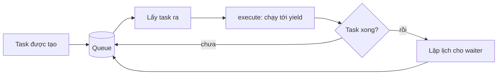

---
tags:
  - python
date: 2026-05-29
---
# Event loop trong Python

Event loop là một vòng lặp (vô hạn hoặc hữu hạn) chịu trách nhiệm duyệt các task, lập lịch thực thi và duy trì hàng đợi các task đang chờ chạy. Khi một task được tạo ra, event loop đưa task đó vào queue để quyết định thời điểm thực thi tiếp theo. Đây là trái tim của lập trình bất đồng bộ trong các ngôn ngữ như Python hay JavaScript.

## Cơ chế hoạt động của event loop

Trong mô hình coroutine, mỗi task chỉ chạy một đoạn code nằm giữa hai lần nhường quyền điều khiển (giữa hai lần `yield`). Sau mỗi lần chạy:

- task trả quyền điều khiển về cho event loop
- trạng thái nội tại của task vẫn được giữ lại trong context của chính nó
- task được đưa lại vào queue nếu chưa hoàn tất

Nhờ cơ chế đó, event loop luân phiên nhiều task dùng chung bộ nhớ mà không cần tạo thread hoặc process riêng cho từng tác vụ. Event loop chỉ dừng khi queue rỗng hoặc bị terminate theo policy mà người lập trình lựa chọn.



## Mô hình `Task` tối giản

Một `Task` có thể được biểu diễn như một wrapper quanh coroutine:

- `execute()` gọi `next()` để tiếp tục coroutine một bước
- nếu coroutine kết thúc, `Task` trả về `waiter` (đối tượng đang chờ task này hoàn tất, để event loop lập lịch tiếp cho nó)
- nếu coroutine chưa kết thúc, `Task` trả về đối tượng cần được event loop lập lịch tiếp

```python
class Task:
    def __init__(self, waiter=None):
        self._task = iter(self)
        self._waiter = waiter

    def __iter__(self):
        yield self

    def execute(self):
        try:
            ret = next(self._task)
        except StopIteration:
            return self._waiter
        else:
            return ret
```

Cấu trúc này biến việc điều phối coroutine thành một giao thức đơn giản giữa task và event loop: chạy một bước, nhận kết quả, rồi quyết định lập lịch cho bước tiếp theo.

## Mô hình `EventLoop` tối giản

Một `EventLoop` tối giản chỉ cần hai thành phần: một queue chứa các task chờ chạy, và một vòng lặp lấy task ra, gọi `execute()`, rồi đưa task tiếp theo vào queue nếu cần.

```python
class EventLoop:
    def __init__(self):
        self._queue = queue.Queue()

    def push_task(self, *tasks):
        for task in tasks:
            self._queue.put(task)

    def _run_by(self, stop_fn):
        while not stop_fn():
            task = self._queue.get()
            next_task = task.execute()
            if next_task:
                self.push_task(next_task)

    def run_until_complete(self):
        self._run_by(self._queue.empty)

    def run_forever(self):
        self._run_by(lambda: False)
```

Mô hình này cho thấy bản chất của event loop không nằm ở cú pháp `async/await` mà nằm ở bộ lập lịch xoay vòng qua các task và quản lý trạng thái của chúng.

## Lập lịch xen kẽ và tương đương với `async/await`

Ví dụ `Ping` chờ 3 giây và `Pong` chờ 2 giây minh họa cách hai task chạy xen kẽ: event loop liên tục đưa lại các task chưa xong vào queue, nên `Pong` hoàn thành trước `Ping` dù cả hai cùng khởi tạo từ đầu. Cách chạy này tương ứng với `asyncio.gather()` kết hợp `await asyncio.sleep(...)`.

Đối chiếu hai cách viết cho thấy: `yield` trong mô hình tối giản đóng vai trò như `await`, và đối tượng `waiter` chính là task gọi `await` đang chờ kết quả. `yield` là điểm task nhường quyền điều khiển và cũng là điểm lưu trạng thái để tiếp tục đúng vị trí cũ - tương tự một điểm trap của task đối với event loop.

## Nguồn tham khảo

- [Bất đồng bộ trong Python - Event loop | Phần 2](https://www.nkthanh.dev/posts/asynchronous-in-python-part-2)
- [asyncio - Asynchronous I/O | Python documentation](https://docs.python.org/3/library/asyncio.html)

## Liên kết tri thức

- [Coroutine trong Python - coroutine là đơn vị thực thi được event loop lập lịch](./Coroutine%20trong%20Python.md)
- [async/await trong Python - async/await là lớp cú pháp đặt trên event loop và coroutine](./async-await%20trong%20Python.md)
- [ASGI và HTTP/2 server - web server bất đồng bộ điều phối request qua event loop](../Web%20development/HTTP-2%20v%C3%A0%20web%20server%20b%E1%BA%A5t%20%C4%91%E1%BB%93ng%20b%E1%BB%99.md)
- [Bài toán C10K - event loop một thread được chọn thay threading để giải bài toán](../Web%20development/B%C3%A0i%20to%C3%A1n%20C10K.md)
- [Game loop cơ bản - cùng nguyên lý vòng lặp trung tâm nhưng cho frame thay vì I/O event](../Game%20development/Game%20loop%20c%C6%A1%20b%E1%BA%A3n.md)
