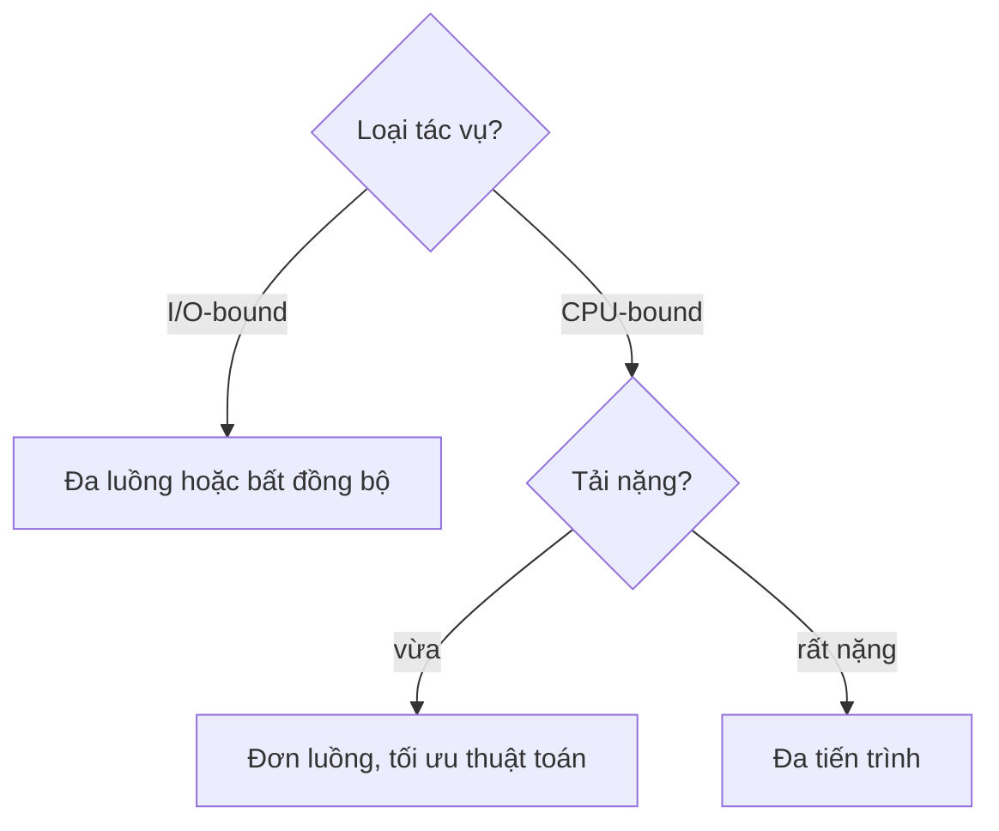

---
tags:
  - python
date: 2026-05-29
---
# Global Interpreter Lock trong Python

Global Interpreter Lock (GIL) là một mutex lock trong CPython đảm bảo tại một thời điểm chỉ có một thread được thực thi Python bytecode, kể cả trên CPU đa nhân. GIL khóa toàn bộ data segment của process đối với các thread khác; chỉ thread đang giữ GIL mới truy cập được data segment đó. Đây là lý do thread trong Python tuy là native thread nhưng không thực sự chạy song song.

## Vì sao CPython dùng một mutex duy nhất

Việc dùng một mutex lock duy nhất cho toàn bộ data của process có hai lý do: tránh deadlock (so với việc quản lý nhiều lock nhỏ), và giảm chi phí cập nhật trạng thái của nhiều lock, tránh overhead. Lý do sâu xa hơn là quản lý bộ nhớ: CPython đếm tham chiếu (reference counting) cho mỗi object, nếu hai thread cùng tăng/giảm reference count của một object mà không có lock thì giá trị đếm có thể sai, gây rò rỉ hoặc giải phóng nhầm bộ nhớ.

## Hệ quả: thread chỉ hữu ích cho tác vụ I/O-bound

Đặc điểm thực thi của thread và process khác nhau ở chi phí khởi tạo. Khi sinh thread mới, code segment và global data segment được chia sẻ giữa các thread nên không tốn thời gian như sinh process. Khi sinh process mới, toàn bộ data và code segment được copy sang process mới nên tốn thời gian hơn.

Tác vụ trong Python chia làm hai loại: tương tác I/O (gọi HTTP API, đọc file - I/O-bound) và tính toán nặng (CPU-bound). Benchmark trên hai loại tác vụ này cho ba quan sát:

- với tác vụ I/O-bound, đa luồng hiệu quả hơn đơn luồng
- với tác vụ CPU-bound, đa tiến trình hiệu quả hơn đa luồng
- với tác vụ CPU-bound, đơn luồng còn hiệu quả hơn đa luồng

Lý do là khi một thread bị block chờ kết quả I/O, nó không cần CPU nên dù bị GIL khóa thì khoảng thời gian bị khóa vẫn overlap với thời gian chờ I/O, các thread khác vẫn tận dụng được CPU - tính song song được đảm bảo một phần. Ngược lại với tác vụ CPU-bound, do chỉ một thread chạy tại một thời điểm nên đa luồng không tạo ra song song, thậm chí còn chậm hơn đơn luồng vì phải gánh thêm chi phí context switching.

## Lời khuyên thực tế

Với tác vụ I/O-bound, nên dùng đa luồng (hoặc bất đồng bộ). Với tác vụ CPU-bound, không nên dùng đa luồng mà nên tối ưu chương trình để chạy đơn luồng; nếu bài toán thực sự nặng thì dùng đa tiến trình để khai thác nhiều nhân CPU.

## Tương lai của GIL

GIL là một lựa chọn thiết kế của CPython chứ không phải bản chất ngôn ngữ Python. PEP 703 (2023) đề xuất thêm cấu hình build `--disable-gil` để CPython chạy không có GIL cùng các thay đổi cần thiết để interpreter an toàn với đa luồng. Python 3.13 (2024) đã có bản build free-threaded thử nghiệm theo cờ này, và Python 3.14 tiếp tục đưa hướng free-threading qua giai đoạn thử nghiệm; bản build chuẩn vẫn dùng GIL cho đến khi hệ sinh thái hỗ trợ đầy đủ.

## Nguồn tham khảo

- [Giới hạn của luồng trong Python](https://www.nkthanh.dev/posts/the-limitation-of-thread-in-python)
- [Những bí mật trong Python có thể bạn chưa biết?](https://www.nkthanh.dev/posts/secret-of-python)
- [ceval_gil.c - CPython source](https://github.com/python/cpython/blob/main/Python/ceval_gil.c)
- [PEP 703 – Making the Global Interpreter Lock Optional in CPython](https://peps.python.org/pep-0703/)
- [Global interpreter lock - Wikipedia](https://en.wikipedia.org/wiki/Global_interpreter_lock)

## Liên kết tri thức

- [Coroutine trong Python - coroutine xử lý I/O-bound trong một thread, tránh chi phí và rủi ro của đa luồng dưới GIL](./Coroutine%20trong%20Python.md)
- [Mô hình đối tượng của Python - GIL bảo vệ reference counting của các PyObject](./M%C3%B4%20h%C3%ACnh%20%C4%91%E1%BB%91i%20t%C6%B0%E1%BB%A3ng%20c%E1%BB%A7a%20Python.md)
- [Vì sao FastAPI nhanh - FastAPI fork thread cho hàm sync I/O-bound dựa trên đặc điểm này của GIL](../Web%20development/V%C3%AC%20sao%20FastAPI%20nhanh.md)
