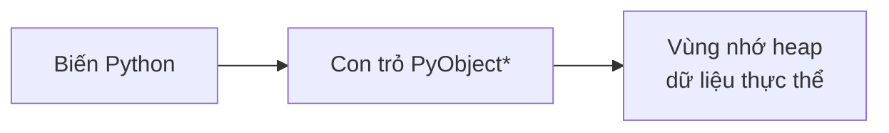
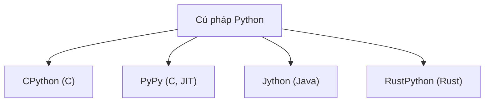

---
tags:
  - python
date: 2026-05-29
---
# Mô hình đối tượng của Python

Python là một script language mà trình thông dịch chuẩn (CPython) được viết bằng C. Một đặc điểm nền tảng định hình cách Python hoạt động là: mọi thứ trong Python đều là object. Khi định nghĩa bất kỳ thực thể nào trong Python, thực chất bên trong core C đang tạo ra một biến `PyObject` - một con trỏ kiểu `PyObject` trỏ tới một vùng nhớ trên heap chứa dữ liệu của thực thể đó.

## Garbage collector chạy khi tạo biến mới

Mỗi lần tạo một biến mới, garbage collector của Python chạy một lần để dọn dẹp bộ nhớ. Quá trình này được core developer tối ưu để chạy thường xuyên: tần suất cao nhưng mỗi lần nhanh và tốn ít tài nguyên. Hệ quả thực tế là có thể tối ưu hiệu năng ứng dụng Python bằng cách hạn chế tạo biến không cần thiết và hạn chế định nghĩa hàm on-fly. Thư viện `redis-py` từng tăng tốc parser bằng đúng cách này - giảm số lần tạo biến trong vòng xử lý protocol.

## Nhiều bản implementation của Python

Bản Python tải từ python.org chỉ là một trong nhiều cài đặt cú pháp Python, có tên là CPython và được viết bằng C. Ngoài ra còn có PyPy (viết bằng C, nổi bật với JIT), Jython (viết bằng Java), RustPython (viết bằng Rust). Cú pháp Python sáng sủa nên nhiều developer muốn cài đặt lại để cải thiện hiệu năng hoặc thêm tính năng mà CPython gốc không có.

## Đánh đổi của ngôn ngữ kiểu động

Python là ngôn ngữ kiểu động: mọi thứ cần được kiểm tra kỹ trước khi thực thi. Đây vừa là điểm mạnh (linh hoạt) vừa là điểm yếu (thời gian xử lý chậm) - một phép tính tốn 20ms trong C có thể cần 200ms trong Python. Vì trình thông dịch chuẩn viết bằng C, Python có thể mở rộng bằng mã C để đạt hiệu năng cao, hoặc dùng Cython để transpile code tựa Python sang C. Đây cũng là lý do nhiều thư viện khoa học và hiệu năng cao chỉ binding interface Python lên phần lõi viết bằng C/C++, Fortran, Rust.

Đổi lại sự sáng sủa và dễ học, code Python dễ sinh ra nhiều black box: dùng hàm có sẵn mà không rõ nó chạy thế nào, không khai báo kiểu biến nên giá trị khó lường. Các cập nhật phiên bản thường xuyên cũng dễ kéo theo breaking change, cần cân nhắc kỹ trước khi nâng cấp.

## Nguồn tham khảo

- [Những bí mật trong Python có thể bạn chưa biết?](https://www.nkthanh.dev/posts/secret-of-python)
- [CPython source code](https://github.com/python/cpython)
- [Speeding up the protocol parsing - redis-py PR #2596](https://github.com/redis/redis-py/pull/2596)

## Liên kết tri thức

- [Global Interpreter Lock trong Python - GIL là một policy trong core CPython quản lý truy cập object giữa các thread](./Global%20Interpreter%20Lock%20trong%20Python.md)
- [Hệ sinh thái Python - cú pháp sáng sủa và khả năng mở rộng bằng C tạo nên hệ sinh thái lớn](./H%E1%BB%87%20sinh%20th%C3%A1i%20Python.md)
- [So sánh Python và JavaScript - cùng là ngôn ngữ thông dịch viết bằng C, khác nhau về tối ưu kiểu](./So%20s%C3%A1nh%20Python%20v%C3%A0%20JavaScript.md)
