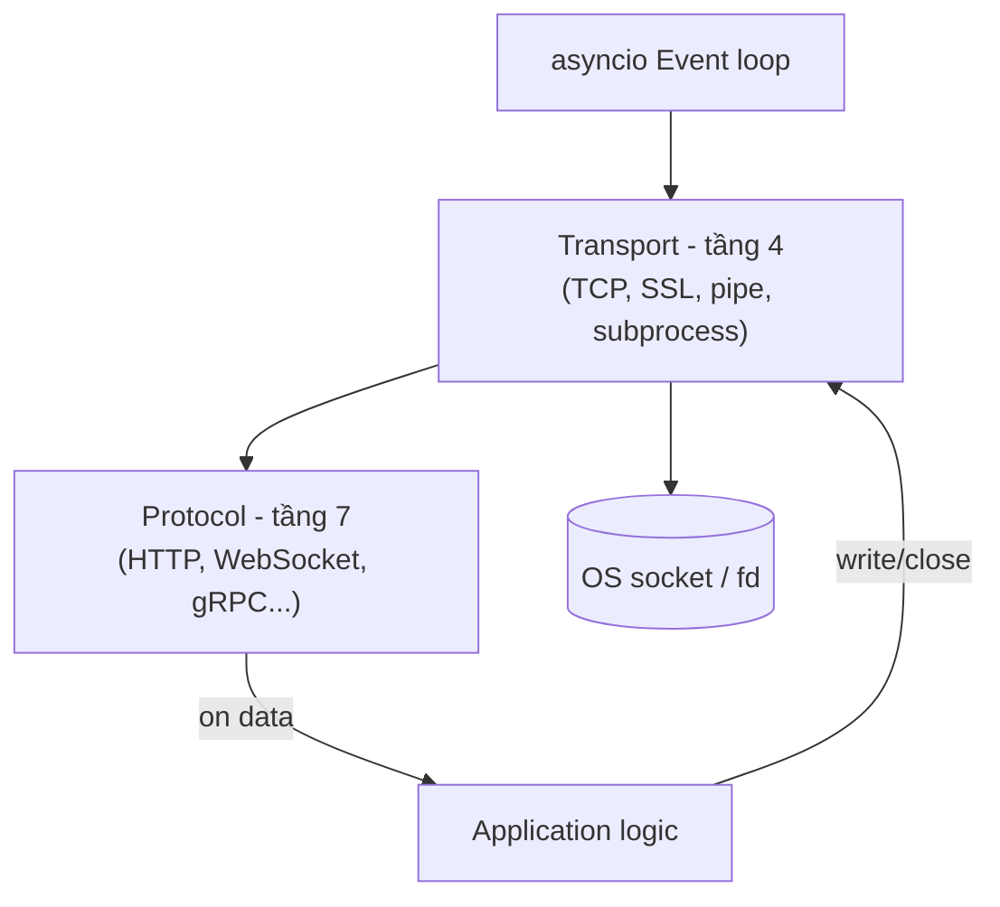

---
tags:
  - python
  - web
date: 2026-05-29
---
# Protocol và Transport trong asyncio

asyncio cung cấp hai API ở hai mức trừu tượng cho lập trình mạng: streams (high-level, async/await thuần) và protocols/transports (low-level, callback-based). Cặp `Protocol`–`Transport` tách rõ trách nhiệm theo mô hình OSI — `Transport` lo việc truyền byte qua socket (tương đương tầng 4), `Protocol` lo ngữ nghĩa giao thức ở tầng ứng dụng (tầng 7). Tách biệt này cho phép cùng một `Protocol` chạy trên nhiều loại transport (TCP, SSL, pipe, subprocess stdio) mà không sửa code, và ngược lại cùng một transport phục vụ nhiều protocol khác nhau.



## Hợp đồng giữa Transport và Protocol

`Transport` đẩy dữ liệu *vào* Protocol qua callback, và nhận lệnh ghi *từ* Protocol qua phương thức. Bốn callback chính của `asyncio.Protocol`:

- `connection_made(transport)` được gọi khi kết nối thiết lập, Protocol lưu tham chiếu Transport
- `data_received(data: bytes)` được gọi mỗi khi Transport có byte mới đọc từ socket
- `connection_lost(exc)` được gọi khi kết nối đóng (do client hoặc lỗi)
- `eof_received()` được gọi khi client gửi EOF half-close mà chưa đóng hẳn

Hai callback bổ sung cho flow control là `pause_writing()` và `resume_writing()` — Transport gọi khi buffer của OS chạm high/low water mark. Application phải tôn trọng để giữ bộ nhớ không phình; chi tiết xem [backpressure ở tầng transport](./Backpressure%20%E1%BB%9F%20t%E1%BA%A7ng%20transport%20trong%20asyncio.md).

Phía Protocol gọi vào Transport bằng `transport.write(data)`, `transport.close()`, `transport.get_extra_info("socket")` để truy cập metadata. Không có ngược lại — Protocol *không* tự đọc từ Transport, mà nhận data qua `data_received`.

```python
class EchoProtocol(asyncio.Protocol):
    def connection_made(self, transport):
        self.transport = transport
    def data_received(self, data):
        self.transport.write(data)  # echo
    def connection_lost(self, exc):
        ...

server = await loop.create_server(
    protocol_factory=EchoProtocol,
    sock=sock,
)
```

`protocol_factory` là một callable trả về Protocol instance mới cho mỗi connection — event loop tự gọi mỗi khi `accept()` thành công. Pattern này tránh state chia sẻ giữa các connection.

## Vì sao tách Protocol và Transport

Trước asyncio, mô hình tương tự xuất hiện ở Twisted (giai đoạn 2002+) — Glyph Lefkowitz coi tách biệt này là một trong những bài học quan trọng nhất về thiết kế thư viện mạng. Lợi ích cụ thể:

- **Reuse**: `H11Protocol` cài đặt một lần, chạy được cả qua plain TCP transport và SSL transport mà không sửa
- **Test**: có thể mock Transport bằng object có `write` ghi vào bytearray, test Protocol mà không cần socket thật
- **Composability**: cùng một protocol đặt sau proxy, tunnel, hay subprocess pipe đều hoạt động
- **Flow control**: tách rõ trách nhiệm — Transport chịu áp lực kernel buffer, Protocol chịu áp lực application logic

## Khi nào dùng streams thay vì Protocol/Transport

asyncio streams (`asyncio.start_server`, `StreamReader`, `StreamWriter`) là wrapper async/await trên Protocol/Transport. Dùng streams khi:

- giao thức đơn giản, đọc theo dòng hoặc theo prefix length
- ưu tiên code straight-line dễ đọc
- không cần kiểm soát fine-grained flow control

Dùng trực tiếp Protocol/Transport khi:

- viết web server hiệu năng cao (uvicorn, hypercorn, uasgi đều dùng cách này)
- cài đặt giao thức nhị phân phức tạp (HTTP/2, gRPC) cần parse stateful
- cần callback dạng push thay vì pull (Protocol nhận data ngay khi đến)
- cần override `pause_writing`/`resume_writing` để custom backpressure

## Dẫn chứng từ uasgi

uasgi cài đặt `H11Protocol` (HTTP/1.1) và `H2Protocol` (HTTP/2) đều là subclass của `asyncio.Protocol`. `data_received` của H11Protocol feed bytes vào `httptools` parser; parser emit callback `on_message_begin`, `on_header`, `on_headers_complete`, `on_body`, `on_message_complete` cho protocol xử lý. Bytes ngược lại được ghi qua `transport.write` đã lưu từ `connection_made`. Đây là minh hoạ trực tiếp pattern hợp đồng giữa Transport và Protocol.

## Nguồn tham khảo

- [asyncio Transports and Protocols - Python documentation](https://docs.python.org/3/library/asyncio-protocol.html)
- [asyncio Streams - Python documentation](https://docs.python.org/3/library/asyncio-stream.html)
- [Twisted Protocol and Transport - lịch sử của mô hình](https://docs.twisted.org/en/stable/core/howto/servers.html)
- [Source uASGI - H11Protocol](../../references/repos/uasgi/uasgi/protocol.py)
- [Source uASGI - Server tạo Protocol qua protocol_factory](../../references/repos/uasgi/uasgi/server.py)
- [Viết HTTP/2 server tương thích ASGI trong Python - blog cá nhân, giải thích Protocol/Transport theo OSI](https://www.nkthanh.dev/posts/implement-an-asgi-compatible-http2-server-in-python)

## Liên kết tri thức

- [Event loop trong Python - event loop là cái điều phối callback của Protocol và quản lý vòng đời Transport](./Event%20loop%20trong%20Python.md)
- [Coroutine trong Python - Protocol callback có thể spawn coroutine để xử lý request bằng async/await](./Coroutine%20trong%20Python.md)
- [Backpressure ở tầng transport trong asyncio - pause_writing và resume_writing là một mặt của hợp đồng Protocol/Transport](./Backpressure%20%E1%BB%9F%20t%E1%BA%A7ng%20transport%20trong%20asyncio.md)
- [Arbiter và worker trong ASGI server - mỗi worker chạy event loop điều phối nhiều Protocol instance qua protocol_factory](../Web%20development/Arbiter%20v%C3%A0%20worker%20trong%20ASGI%20server.md)
- [HTTP parser dạng máy trạng thái - parser được gọi từ Protocol.data_received, tách parsing khỏi I/O](../Web%20development/HTTP%20parser%20d%E1%BA%A1ng%20m%C3%A1y%20tr%E1%BA%A1ng%20th%C3%A1i.md)
- [Hội nhập ecosystem qua interface có sẵn - Protocol/Transport là interface chuẩn của asyncio mà mọi network code Python nên tuân thủ](../Ph%C3%A1t%20tri%E1%BB%83n%20b%E1%BA%A3n%20th%C3%A2n/H%E1%BB%99i%20nh%E1%BA%ADp%20ecosystem%20qua%20interface%20c%C3%B3%20s%E1%BA%B5n.md)
