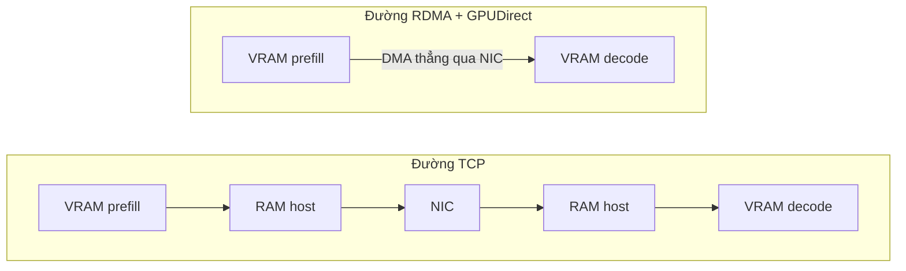

---
tags:
  - infrastructure
  - ai
date: 2026-05-29
---
# RDMA

RDMA (Remote Direct Memory Access) là cơ chế truyền dữ liệu trực tiếp từ bộ nhớ của máy này sang bộ nhớ máy khác mà không cần CPU can thiệp vào từng byte. Ba đặc tính cốt lõi của RDMA là zero-copy (không sao chép trung gian qua buffer kernel và buffer ứng dụng), kernel-bypass (ứng dụng post lệnh truyền thẳng xuống phần cứng ở user space, bỏ qua network stack của kernel) và offload (phần cứng adapter tự lo việc chia gói, kiểm soát luồng, sửa lỗi). Nhờ vậy RDMA đạt latency rất thấp và CPU overhead gần như không đáng kể, là nền tảng truyền KV cache giữa GPU trong disaggregated serving của LLM.

## RDMA so với Ethernet và TCP/UDP truyền thống

Đường TCP/IP truyền thống đi qua nhiều bản sao chép và nhiều lần chuyển ngữ cảnh: dữ liệu copy từ buffer ứng dụng vào socket buffer của kernel, qua protocol stack trong kernel, rồi mới ra network card; mỗi gói tới đều sinh interrupt và tiêu CPU để xử lý. RDMA bỏ toàn bộ chặng đó: ứng dụng đăng ký một vùng nhớ với adapter rồi post một work request, adapter DMA thẳng dữ liệu tới vùng nhớ đích ở máy kia.

| Tiêu chí | RDMA (InfiniBand/RoCE) | Ethernet + TCP/UDP |
|----------|------------------------|--------------------|
| Latency | rất thấp | cao hơn |
| CPU overhead | rất thấp (offload phần cứng) | cao (stack trong kernel) |
| Sao chép dữ liệu | zero-copy | nhiều bản copy |
| Vai trò kernel | bypass (OS-bypass) | đi qua kernel, syscall, interrupt |
| Mô hình lập trình | Verbs / Queue Pair / work request | socket |

Đây là cùng một tư duy "giảm sao chép và giảm context switch" với zero-copy ở tầng file server, nhưng RDMA đẩy nguyên tắc đó ra phạm vi liên-máy và xuống tận phần cứng adapter.

## Băng thông và độ trễ các đường truyền

Số liệu tham khảo của NVIDIA cho disaggregated serving cho thấy khoảng cách rất lớn giữa các đường truyền:

| Đường truyền | Băng thông | Độ trễ | GPUDirect |
|--------------|-----------|--------|-----------|
| NVLink | 450-900 GB/s | ~µs | có (chỉ trong cùng pod) |
| InfiniBand RDMA | 20-50 GB/s | ~1 µs | có |
| RoCE RDMA | 10-25 GB/s | ~2 µs | có |
| TCP | 1-3 GB/s | ~50 µs | không (phải staging qua host) |

NVLink nhanh nhất nhưng không dùng được giữa hai pod Kubernetes khác nhau, vì NVLink cần cả hai GPU nằm trong cùng một tiến trình để gọi `cudaDeviceEnablePeerAccess()`, trong khi mỗi pod chạy ở namespace riêng và device plugin gán GPU riêng cho từng pod. NVLink chỉ dùng được trong cùng một pod cho tensor parallel. Vì vậy chuyển KV cache giữa prefill worker và decode worker (hai pod) bắt buộc dùng RDMA; thiếu RDMA và rơi về TCP làm TTFT tăng từ khoảng 200-500ms lên gần 98 giây trong đo đạc của NVIDIA.

## GPUDirect RDMA

GPUDirect RDMA cho phép một thiết bị PCIe bên thứ ba (NIC ConnectX, DPU BlueField) DMA trực tiếp tới và từ framebuffer của GPU, bỏ qua bước copy qua system memory của host và bỏ qua CPU. Đây là điều kiện để KV cache đi thẳng từ VRAM của prefill worker sang VRAM của decode worker qua mạng. Phía kernel, GPUDirect RDMA hoạt động qua DMA-BUF (khuyến nghị) hoặc module legacy `nvidia-peermem`.

## InfiniBand, RoCE và phần cứng HCA

RDMA chạy được trên hai loại hạ tầng mạng. InfiniBand là interconnect chuyên dụng, độ trễ thấp ngay từ thiết kế. RoCE (RDMA over Converged Ethernet) đưa RDMA lên hạ tầng Ethernet. Cả hai cùng dùng Verbs API, nên ứng dụng viết theo Verbs chạy được trên cả hai.

Phần cứng thực hiện RDMA là HCA (Host Channel Adapter), khác card mạng thông thường ở chỗ HCA cài đặt transport ngay trong phần cứng và expose Queue Pair: một cặp send queue và receive queue mà ứng dụng post work request trực tiếp ở user space, thay vì đi qua socket và kernel. Queue Pair được đưa vào trạng thái hoạt động qua `ibv_modify_qp`. Khi một pod Kubernetes không được cấp thiết bị InfiniBand (không request RDMA device plugin, không có `/dev/infiniband`), thư viện cố mở HCA sẽ báo lỗi dạng `ibv_create_ah failed: No such device`.

## Trải nghiệm thực tế

Khi quantize model đa GPU trong một pod, thư viện cố mở thiết bị InfiniBand `mlx5_1` nhưng pod không được cấp `/dev/infiniband` (không request `rdma/ib`) nên báo `ibv_create_ah failed: No such device`, kéo theo `MPI_Init_thread failed`. Đây là biểu hiện trực tiếp của việc HCA không hiện diện trong pod, không phải lỗi code; cách xử lý là cấp thiết bị RDMA cho pod hoặc ép đường truyền nội-node tránh InfiniBand.

## Nguồn tham khảo

- [Disagg Communication - NVIDIA Dynamo (NVLink không qua pod, bảng so sánh transport)](https://docs.nvidia.com/dynamo/dev/kubernetes-deployment/deployment-guide/disagg-communication)
- [GPUDirect RDMA - CUDA documentation](https://docs.nvidia.com/cuda/gpudirect-rdma/index.html)
- [GPU Operator - GPUDirect RDMA (DMA-BUF, nvidia-peermem)](https://docs.nvidia.com/datacenter/cloud-native/gpu-operator/latest/gpu-operator-rdma.html)
- [RDMA Aware Networks Programming Manual](https://docs.nvidia.com/networking/display/rdmaawareprogrammingv17)
- [RDMA over Converged Ethernet (RoCE)](https://docs.nvidia.com/networking/display/mlnxofedv492240/rdma+over+converged+ethernet+(roce))
- [Queue Pair Bringup (ibv_modify_qp)](https://docs.nvidia.com/networking/display/rdmaawareprogrammingv17/queue+pair+bringup+(ibv_modify_qp))

## Liên kết tri thức

- [UCX - UCX dùng RDMA qua các transport rc/dc/ud verbs khi phát hiện HCA InfiniBand](./UCX.md)
- [NIXL - NIXL truyền KV cache point-to-point, tận dụng RDMA qua backend UCX](../AI%20v%C3%A0%20Machine%20Learning/NIXL.md)
- [Zero-copy và sendfile - cùng tư duy giảm sao chép, RDMA mở rộng nguyên tắc này ra liên-máy và xuống phần cứng](./Zero-copy%20v%C3%A0%20sendfile.md)
- [NVIDIA Dynamo - KV cache chuyển VRAM-to-VRAM qua NVLink hoặc InfiniBand giữa prefill và decode worker](../AI%20v%C3%A0%20Machine%20Learning/NVIDIA%20Dynamo.md)
- [Chọn transport trong Open MPI - Open MPI mặc định ưu tiên đường UCX/InfiniBand khi phát hiện HCA](./Ch%E1%BB%8Dn%20transport%20trong%20Open%20MPI.md)
- [Ràng buộc hạ tầng khi triển khai LLM - thiếu thiết bị InfiniBand trong pod là một biểu hiện của coupling phần cứng](../AI%20v%C3%A0%20Machine%20Learning/R%C3%A0ng%20bu%E1%BB%99c%20h%E1%BA%A1%20t%E1%BA%A7ng%20khi%20tri%E1%BB%83n%20khai%20LLM.md)
