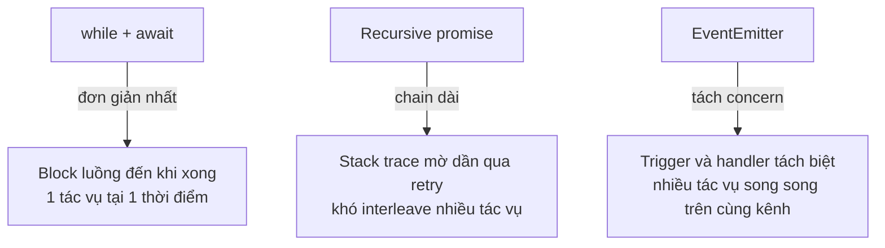

---
tags:
  - web
date: 2026-05-29
---
# Retry có giới hạn bằng EventEmitter

Khi cần retry một tác vụ async không tin cậy (upload file, gọi API, ghi DB) với giới hạn số lần thử, có ba kiểu cài đặt phổ biến: `while` loop với `await`, đệ quy promise, và event-driven dùng `EventEmitter`. Cách event-driven ít quen thuộc nhưng đáng biết — nó tách phần "trigger thử lại" khỏi phần "thực thi", giữ stack phẳng, và tự nhiên hợp với queue nhiều tác vụ song song.

## Pattern

Mỗi tác vụ phát ra một event với payload gồm dữ liệu *và* số lần đã thử. Handler thực hiện tác vụ; nếu fail, re-emit cùng event với retry+1. Nếu retry vượt ngưỡng, kích hoạt callback failure.

```javascript
const event = new EventEmitter();
const MAX_RETRY = 3;

function onUpload(filename, dest, retry = 0) {
  if (retry > MAX_RETRY) {
    onFailed?.();
    return;
  }
  bucket.upload(filename, { destination: dest })
    .catch(reason => {
      event.emit('file', filename, dest, retry + 1);
      console.warn({ filename, reason });
    });
}

event.on('file', onUpload);

// kích hoạt
for (const file of files) {
  event.emit('file', file.name, file.dest);
}
```

Mọi file được phát event một lần; mỗi event chạy handler async; mỗi fail re-emit với retry+1. Không cần queue tự dựng, không cần promise chain dài, không cần `for await`.

## So sánh ba cách



`while + await` đơn giản nhất nhưng tuần tự — không upload file khác trong khi đang chờ retry. Recursive promise (`upload().catch(() => upload())`) giải quyết được tuần tự nhưng stack trace mỗi lần retry càng mờ, và khó tách logic trigger khỏi logic execution. EventEmitter cho cả ba: song song giữa các tác vụ, tách biệt, và mỗi handler chạy với stack phẳng.

## Đánh đổi cần biết

- **Mất stack trace giữa các lần retry**: mỗi re-emit khởi tạo một call stack mới, không nối tiếp lần trước. Debug khó hơn `for await`. Khắc phục bằng cách log retry count rõ ràng.
- **Backpressure không tự có**: nếu emit hàng nghìn event đồng thời, handler chạy song song hết. Cần thêm semaphore (`p-limit`, custom counter) nếu cần giới hạn concurrent.
- **Memory leak nếu quên `removeListener`**: handler nằm trên emitter mãi tới khi emitter bị GC. Trong scope của một task batch (upload xong rồi xong) không vấn đề, nhưng trong server long-running phải cleanup.
- **Không có tổng kết tự nhiên**: không có cách biết "tất cả đã xong" nếu không tự đếm. `while + await` hay `Promise.all` cho biết miễn phí.

Pattern hợp nhất khi: nhiều tác vụ độc lập, mỗi tác vụ có thể fail và retry, không cần biết "tất cả xong" hoặc có thể đếm thủ công.

## Mở rộng: exponential backoff

Pattern trên retry ngay lập tức. Thêm exponential backoff bằng cách wrap re-emit trong `setTimeout`:

```javascript
.catch(reason => {
  const delay = Math.min(1000 * 2 ** retry, 30_000); // capped at 30s
  setTimeout(() => {
    event.emit('file', filename, dest, retry + 1);
  }, delay);
});
```

Giữ nguyên triết lý event-driven nhưng tránh hammer endpoint khi nó đang quá tải.

## Trải nghiệm cá nhân

Pattern này được dùng trong [teko-kit](https://github.com/magiskboy/teko-kit) command `upload-cdn`, đẩy static asset của Teko Web lên Google Cloud Storage. Codebase frontend tạo ra hàng nghìn file mỗi build (chunked bundle, image, font), cần upload song song với retry mềm. Cách dùng `EventEmitter` giữ code gọn hơn quản lý promise chain hoặc tự dựng queue. Tuy đơn giản, đây là một góc thiết kế bản thân thấy hay khi nhìn lại.

## Nguồn tham khảo

- [Source teko-kit - CDNUploader với event-driven retry](https://github.com/magiskboy/teko-kit/blob/master/src/cmd/upload-static-file.js)
- [Node.js EventEmitter API](https://nodejs.org/api/events.html)
- [p-retry - thư viện retry promise có exponential backoff](https://github.com/sindresorhus/p-retry)
- [p-limit - giới hạn concurrent promise](https://github.com/sindresorhus/p-limit)

## Liên kết tri thức

- [Backpressure ở tầng transport trong asyncio - cùng ý đẩy áp lực ngược, áp dụng cho upload pipeline ở tầng app](./Backpressure%20%E1%BB%9F%20t%E1%BA%A7ng%20transport%20trong%20asyncio.md)
- [Observer pattern - EventEmitter là một cài đặt observer pattern trong Node.js](./Observer%20pattern.md)
- [Gom monorepo build vào một Node.js runtime - cùng tool teko-kit chứa pattern này như một command phụ](../Web%20development/Gom%20monorepo%20build%20v%C3%A0o%20m%E1%BB%99t%20Node.js%20runtime.md)
