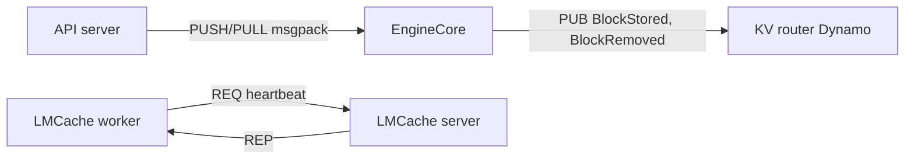

---
tags:
  - infrastructure
  - ai
date: 2026-05-29
---
# ZeroMQ

ZeroMQ (ØMQ, ZMQ) là thư viện messaging bất đồng bộ brokerless, tức không có daemon trung gian như RabbitMQ; chữ "zero" hàm ý zero broker và độ trễ gần bằng không. ZeroMQ cung cấp các socket pattern cấp cao trên nhiều transport, là hạ tầng truyền tin nội bộ phổ biến trong hệ sinh thái phục vụ LLM như vLLM và Dynamo.

## Socket pattern và transport

ZeroMQ trừu tượng hóa giao tiếp thành các pattern: REQ/REP (request-reply đồng bộ, luân phiên gửi-nhận), PUB/SUB (phát tán một-tới-nhiều theo topic), PUSH/PULL (pipeline phân phối tác vụ song song), ROUTER/DEALER (request-reply bất đồng bộ, ROUTER tựa REP bất đồng bộ và DEALER tựa REQ bất đồng bộ). Các transport gồm `tcp` (liên tiến trình qua mạng), `ipc` (liên tiến trình cùng máy) và `inproc` (giữa các thread trong cùng tiến trình). Bản chất ZeroMQ là "socket nâng cấp" chứ không phải message broker.

## Vai trò trong vLLM và Dynamo

Trong kiến trúc vLLM V1 chế độ multiprocess, API server giao tiếp với tiến trình `EngineCore` qua socket ZeroMQ PUSH/PULL với serialization msgpack, tách biệt vòng lặp engine khỏi tiến trình phục vụ HTTP.

Khi bật `--kv-events-config`, vLLM publish các sự kiện vòng đời KV cache (`BlockStored`, `BlockRemoved`, `AllBlocksCleared`) qua socket ZeroMQ PUB để KV router biết worker nào đang cache block nào; Dynamo subscribe các sự kiện này để duy trì view cache đồng bộ phục vụ KV-aware routing. LMCache dùng cổng control ZeroMQ chạy heartbeat REQ/REP định kỳ, đồng thời làm kênh lệnh và kích hoạt đồng bộ lại khi worker khởi động lại; chính cơ chế heartbeat này phát ra các thông điệp ping mà phía server phải có handler xử lý.

## Trải nghiệm thực tế

Server LMCache log liên tục `No handler registered for request type RequestType.PING`. Gốc rễ không phải mismatch phiên bản client/server mà là server-side: bản `blend_server_v2` (chạy với `--engine-type blend`) thiếu đăng ký handler cho PING, trong khi client gửi heartbeat ZeroMQ định kỳ. Hiểu rằng PING là heartbeat REQ/REP của ZeroMQ chứ không phải healthcheck HTTP của Kubernetes giúp tìm đúng chỗ vá thay vì chỉnh probe.

## Nguồn tham khảo

- [ZeroMQ Socket API](https://zeromq.org/socket-api/)
- [ZeroMQ Guide - Chapter 2 (socket patterns)](https://zguide.zeromq.org/docs/chapter2/)
- [vLLM V1 architecture (ZMQ giữa frontend và EngineCore)](https://developers.redhat.com/articles/2025/01/28/vllm-v1-a-major-upgrade-vllms-core-architecture)
- [vLLM KV events config](https://docs.vllm.ai/en/latest/api/vllm/config/kv_events/)
- [Dynamo KV-cache aware routing](https://docs.nvidia.com/dynamo/latest/user-guides/kv-cache-aware-routing)

## Liên kết tri thức

- [NVIDIA Dynamo - KV router subscribe sự kiện KV cache qua ZeroMQ để định tuyến theo cache overlap](../AI%20v%C3%A0%20Machine%20Learning/NVIDIA%20Dynamo.md)
- [LMCache - heartbeat ZeroMQ REQ/REP là kênh control giữa worker và server](../AI%20v%C3%A0%20Machine%20Learning/LMCache.md)
- [Kafka làm buffer cho log pipeline - đối chiếu mô hình brokerless của ZeroMQ với mô hình broker của Kafka](../DevOps%20v%C3%A0%20Infrastructure/Kafka%20l%C3%A0m%20buffer%20cho%20log%20pipeline.md)
- [Protocol và Transport trong asyncio - cùng tư duy tách cơ chế truyền khỏi logic giao tiếp](./Protocol%20v%C3%A0%20Transport%20trong%20asyncio.md)
