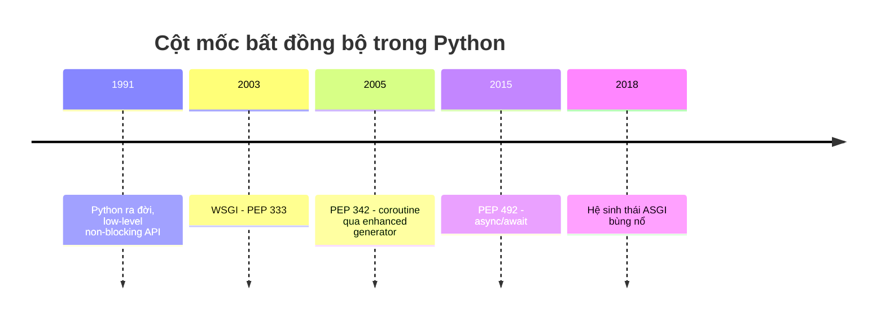

---
tags:
  - python
date: 2026-05-29
---
# async/await trong Python

`async/await` là cặp keyword cú pháp giúp viết code bất đồng bộ trong Python một cách rõ ràng và Pythonic. Bản thân `async/await` chỉ là lớp cú pháp; cơ chế thực sự đằng sau nó là coroutine được điều phối bởi event loop. Cú pháp này biến "kỹ thuật lập trình bất đồng bộ" thành "cú pháp của ngôn ngữ", che giấu các API low-level như non-blocking socket, multiplexer, selector của OS.

## Bất đồng bộ trong Python trước PEP 492

Python luôn có thể xử lý bất đồng bộ vì hỗ trợ các API non-blocking socket của OS (selector, multiplexing), nhưng dùng trực tiếp các API này rất khó. Cộng đồng đã kết hợp các API đó với coroutine để triển khai bất đồng bộ. Coroutine lần đầu được giới thiệu trong Python qua PEP 342 (Guido van Rossum và Phillip J. Eby đề xuất, năm 2005, Python 2.5), bổ sung `send()` cho generator để truyền giá trị vào điểm `yield`. Framework Tornado là một ví dụ nổi tiếng triển khai bất đồng bộ trên coroutine cho TCP/UDP server, HTTP server/client và mail server.

## Sự ra đời của PEP 492

Cú pháp `async/await` được giới thiệu lần đầu bởi C#, sau đó lan sang JavaScript, Python, Java, C++, Rust, Swift. Với Python, PEP 492 do Yury Selivanov đề xuất (tạo ngày 9/4/2015, được Guido van Rossum chấp nhận ngày 5/5/2015, vào Python 3.5). PEP 492 biến coroutine thành một khái niệm độc lập với cú pháp riêng, thay vì phải làm việc với coroutine thuần và low-level API. Mục tiêu mà tác giả nêu là đáp ứng nhu cầu code phản hồi nhanh và scalable khi Internet phát triển, đưa lập trình bất đồng bộ gần với lập trình đồng bộ nhất có thể.

```python
loop = asyncio.get_event_loop()
while True:
    client, addr = await loop.sock_accept(listener)
    loop.create_task(handle_client(client))
```

Vì cơ chế nền là coroutine, không sai khi nói bất đồng bộ của Python được hiện thực hóa bằng coroutine.

## Các cột mốc của hệ sinh thái bất đồng bộ



- 1991: Python ra đời, hỗ trợ low-level API cho non-blocking
- 2003: WSGI (PEP 333) ra đời, mở đầu kỉ nguyên web development trên Python
- 2005: PEP 342 giới thiệu coroutine qua enhanced generator
- 2015: PEP 492 giới thiệu cú pháp `async/await` (kèm PEP 530 cho async comprehension)
- 2018: hệ sinh thái ASGI bùng nổ với uvicorn, starlette, fastapi, quart, sanic

Sau PEP 492 và sự xuất hiện của ASGI, một loạt thư viện bất đồng bộ ra đời: database (`asyncpg`, `databases`, `aiomysql`, `aiopg`), HTTP client (`httpx` với interface giống `requests`), web framework (FastAPI, Sanic, Quart, Starlette), web server (uvicorn, hypercorn). Các nhóm và cá nhân đáng chú ý gồm MagicStack, Encode, aio-libs, cùng Yury Selivanov (tác giả PEP 492), Samuel Colvin (Pydantic), Sebastián Ramírez (FastAPI), Tom Christie (httpx, uvicorn, starlette).

## Nguồn tham khảo

- [Từ PEP 492 tới kỉ nguyên bất đồng bộ](https://www.nkthanh.dev/posts/from-pep-492-to-asynchronous-era-in-python)
- [PEP 342 – Coroutines via Enhanced Generators](https://peps.python.org/pep-0342/)
- [PEP 492 – Coroutines with async and await syntax](https://peps.python.org/pep-0492/)
- [The C10K problem](http://www.kegel.com/c10k.html)

## Liên kết tri thức

- [Coroutine trong Python - cơ chế nền hiện thực hóa cú pháp async/await](./Coroutine%20trong%20Python.md)
- [Event loop trong Python - async/await là lớp cú pháp đặt trên event loop](./Event%20loop%20trong%20Python.md)
- [WSGI và ASGI - async/await tạo tiền đề cho chuẩn ASGI và làn sóng web framework bất đồng bộ](../Web%20development/WSGI%20v%C3%A0%20ASGI.md)
- [Hệ sinh thái Python - PEP 492 là cột mốc đưa Python cạnh tranh ở mảng bất đồng bộ](./H%E1%BB%87%20sinh%20th%C3%A1i%20Python.md)
