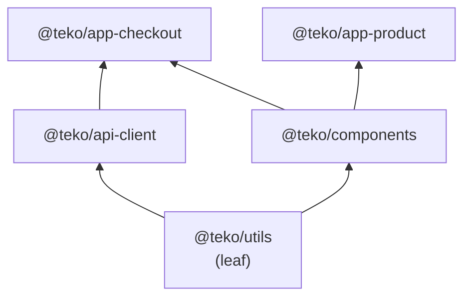

---
tags:
  - web
date: 2026-05-29
---
# Điều phối build qua dependency graph và observer pattern

Trong monorepo, package B import từ package A — A phải build trước B. Khi có hàng chục package với dependency chéo, ai build trước ai build sau là một bài toán topological sort. Cách thường thấy: tính toposort tường minh bằng thuật toán Kahn hoặc DFS, rồi build theo thứ tự. Cách thanh thoát hơn: build dependency graph dưới dạng đồ thị quan sát viên (observer) — leaf package (không depend ai) build trước; mỗi package có dependency tự đăng ký làm observer của dependency đó; khi dependency build xong, package nhận notify và tự kiểm tra "đã hết dependency chưa, nếu rồi thì build". Không cần scheduler trung tâm, không cần lấy thứ tự rõ ràng — kết quả thứ tự đúng *là sản phẩm phụ* của event flow.

## Cấu trúc graph



`@teko/utils` không depend ai → build trước. `@teko/components` và `@teko/api-client` đăng ký observer của `@teko/utils`; khi `utils` xong, cả hai cùng được notify và tự bắt đầu (chạy song song vì độc lập). `@teko/app-checkout` đăng ký observer của *cả hai* — chỉ build khi cả `components` và `api-client` đều notify.

## Cài đặt qua Observable/Observer

Bộ ba primitive đơn giản: `Observable` lưu danh sách observer và `notifyObservers`; `Observer` có `update(observable, arg)`; `Package` *là* Observable mà *cũng implements* Observer.

```javascript
class Observable {
  constructor() { this.observers = []; }
  addObserver(o) { this.observers.push(o); }
  async notifyObservers(arg) {
    await Promise.all(this.observers.map(o => o.update(this, arg)));
  }
}

class Package extends Observable {
  constructor(root) {
    super();
    this.dependencies = new Set();
  }

  addDependency(dep) {
    this.dependencies.add(dep);
    dep.addObserver(this);   // tôi sẽ được notify khi dep xong
  }

  async update(o) {           // bị notify từ một dep
    this.dependencies.delete(o);
    if (this.dependencies.size === 0) {
      await this.build();
    }
  }

  async build() {
    await this.builder.build();
    await this.notifyObservers();  // báo cho package phụ thuộc tôi
  }
}
```

Hai dòng then chốt: `dep.addObserver(this)` ở khi setup graph, và `this.dependencies.delete(o)` + check `size === 0` ở callback. Không có thuật toán toposort tường minh trong code — sự đúng đắn đến từ invariant của graph và monoton giảm của set dependency.

## Bootstrap

```javascript
const leafPackages = packages.filter(pkg => pkg.dependencies.size === 0);
await Promise.all(leafPackages.map(pkg => pkg.build()));
```

Chỉ cần kick off các leaf — đồ thị tự "lan" qua observer chain. `Promise.all` của leaves trả về khi cả đồ thị xong (vì mọi root đường đi đều bắt đầu từ leaf, mọi root đường đi đều kết thúc khi không còn observer được trigger).

## Vì sao pattern này thanh thoát

So với toposort tường minh + queue:

- **Parallelism miễn phí**: không cần manual chia phase. Mọi package có `dependencies.size === 0` *cùng lúc* sẽ build *song song* qua `Promise.all` trong `notifyObservers`.
- **Mở rộng dễ**: thêm hook khi package build xong là thêm observer, không sửa scheduler. Vd thêm observer ghi log, thêm observer push metric → orthogonal với logic core.
- **Không có state trung tâm**: không có "queue đã build" hay "stack đang chờ" — state phân tán trong các Set của mỗi Package. Race condition khó xảy ra hơn (mỗi Set chỉ một owner).
- **Mismatch giữa graph và execution không có**: code chính là graph, không có representation thứ hai cần đồng bộ.

Trade-off: khó debug khi sai. Stack trace từ một build failure có thể đi qua nhiều `notifyObservers` async, mờ dần. Toposort tường minh cho stack rõ "đang ở phase N".

## Khi nào *không* nên dùng pattern này

- Đồ thị có cycle (build A cần B, B cần A) — pattern này sẽ hang vô tận không lỗi. Toposort tường minh detect được cycle. Cần check cycle riêng nếu dùng pattern này.
- Cần priority giữa các package cùng tầng (vd build app trước lib) — observer pattern không có khái niệm priority. Cần thêm queue có ưu tiên.
- Cần báo cáo tiến độ real-time với thứ tự dự đoán — toposort cho phép biết trước "sẽ build N package, đang ở thứ K"; observer pattern khó dự đoán.

## Trải nghiệm cá nhân

Cài đặt này là phần thanh thoát nhất khi viết [teko-kit](https://github.com/magiskboy/teko-kit) (Teko, 5/2025). Khi đọc lại, thấy code chính là graph — không có "scheduler" tách rời. Đây là một ví dụ cho thấy lựa chọn pattern đúng (observer ở đây) làm thuật toán phức tạp (topological build orchestration) tan thành mã ngắn và rõ.

## Nguồn tham khảo

- [Source teko-kit - observer.js (Observable/Observer interface)](https://github.com/magiskboy/teko-kit/blob/master/src/observer.js)
- [Source teko-kit - Package extends Observable, implements Observer](https://github.com/magiskboy/teko-kit/blob/master/src/package.js)
- [Source teko-kit - buildPackages bootstrap từ leaves](https://github.com/magiskboy/teko-kit/blob/master/src/cmd/build-package.js)
- [Topological sorting - Wikipedia](https://en.wikipedia.org/wiki/Topological_sorting)
- [Nx project graph - production-grade dependency-aware build](https://nx.dev/concepts/mental-model#the-project-graph)
- [Design Patterns - GoF Observer pattern](https://en.wikipedia.org/wiki/Observer_pattern)

## Liên kết tri thức

- [Observer pattern - pattern gốc làm nền cho cách điều phối build này](./Observer%20pattern.md)
- [Gom monorepo build vào một Node.js runtime - cùng tool teko-kit; runtime chung là tiền đề để observer chain hoạt động qua promise trong cùng event loop](../Web%20development/Gom%20monorepo%20build%20v%C3%A0o%20m%E1%BB%99t%20Node.js%20runtime.md)
- [Tự động trích xuất i18n key bằng TypeScript Compiler API - cùng tool, command khác; minh hoạ kiến trúc cmd-domain-infra của repo](../Web%20development/T%E1%BB%B1%20%C4%91%E1%BB%99ng%20tr%C3%ADch%20xu%E1%BA%A5t%20i18n%20key%20b%E1%BA%B1ng%20TypeScript%20Compiler%20API.md)
- [Dựng lại để hiểu sâu - cài lại pattern topological build bằng observer thay vì dùng sort tường minh là một dạng dựng lại để thấy cấu trúc khác](../Ph%C3%A1t%20tri%E1%BB%83n%20b%E1%BA%A3n%20th%C3%A2n/D%E1%BB%B1ng%20l%E1%BA%A1i%20%C4%91%E1%BB%83%20hi%E1%BB%83u%20s%C3%A2u.md)
