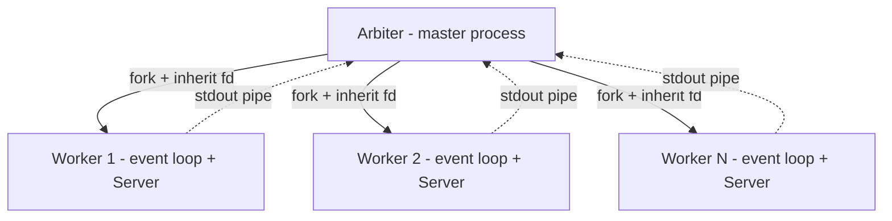

---
tags:
  - web
  - python
date: 2026-05-29
---
# Arbiter và worker trong ASGI server

Một ASGI server hiệu năng cao thường tách quy trình master và quy trình con thành kiến trúc arbiter–worker. Arbiter chịu trách nhiệm khởi tạo môi trường chung (listen socket, SSL context, cấu hình), spawn nhiều worker process rồi giám sát vòng đời của chúng. Mỗi worker chạy event loop riêng và xử lý request độc lập, không chia sẻ trạng thái với worker khác ngoài phần socket lắng nghe. Mô hình này lặp lại ở Gunicorn (WSGI/ASGI), uWSGI, và uvicorn khi cấu hình nhiều worker; uASGI là một cài đặt tham chiếu tối giản để minh họa rõ pattern.

## Trách nhiệm của arbiter

Arbiter tạo listen socket trước khi fork worker. Trong uASGI, `Config.create_socket` mở socket với các cờ `SO_REUSEPORT`, `SO_REUSEADDR`, `TCP_NODELAY`, đặt non-blocking và `set_inheritable(True)`. Khi worker fork qua `multiprocessing.Process`, worker kế thừa file descriptor của socket nên cả N worker cùng `accept()` trên một socket chung. Hai cờ tái sử dụng port cho phép quá trình khởi tạo socket mới trên cùng địa chỉ trong tình huống reload mà không phải chờ trạng thái TIME_WAIT.

Arbiter giữ một `multiprocessing.Event` làm tín hiệu stop và chạy một `asyncio` event loop trong thread daemon riêng để gom log. Khi worker emit ra qua write end của pipe, arbiter đăng ký reader trên read end và dùng `os.sendfile(out_fd, in_fd, 0, 1024)` để copy zero-copy sang stdout của master, tránh đẩy buffer log qua user-space.

## Vòng đời của worker

Worker là một `multiprocessing.Process` không daemon — daemon process sẽ bị parent kill bất ngờ khi thoát, làm rớt request đang xử lý. Trong process con, worker `dup2` write end của pipe lên `sys.stdout.fileno()` và `sys.stderr.fileno()` để mọi log từ ứng dụng chảy về master qua pipe đã thiết lập. Sau đó worker load app từ chuỗi `module:attr`, khởi tạo `Server` rồi gọi `asyncio.run` để vào event loop.

Khi người dùng gửi Ctrl-C, kernel broadcast `SIGINT` cho toàn bộ process group — gồm cả arbiter và worker. Arbiter bắt `KeyboardInterrupt` ở `stop_event.wait()` rồi `join` từng worker. Worker tự bắt `KeyboardInterrupt` trong `server.main()` và gọi `server.stop()` để event loop đóng accept loop. Cơ chế truyền tín hiệu qua process group đảm bảo shutdown đồng bộ mà không cần kênh IPC riêng cho tín hiệu.

## So sánh với SO_REUSEPORT thuần

Pattern phổ biến khác là mỗi worker tự bind socket với `SO_REUSEPORT`, kernel sẽ hash 4-tuple để phân phối kết nối tới một worker cụ thể. Pattern fork và inherit như uASGI ngược lại: một socket duy nhất chia sẻ qua fd cho mọi worker, kernel cho phép nhiều process cùng `accept()` đồng thời trên fd đó. Hai cách đều khai thác đa nhân CPU; pattern inherit không yêu cầu kernel hỗ trợ `SO_REUSEPORT`, đổi lại các worker chia sẻ chung một accept queue thay vì có queue riêng cho mỗi socket.

## Trải nghiệm cá nhân

Wiki này được kết tinh khi viết [uASGI](https://github.com/magiskboy/uasgi) tại Zen8labs (7-8/2025) — practice cá nhân để hiểu cặn kẽ ASGI và cơ chế high-performance web server. Pattern arbiter–worker được học từ đọc source Gunicorn rất lâu trước; tác giả thừa nhận đây là vùng còn cần đào sâu phần *vì sao* chứ không chỉ *cách làm*. Chi tiết bối cảnh trong [transcript phỏng vấn](../../references/interviews/uasgi.md).

## Nguồn tham khảo

- [Source uASGI - arbiter](../../references/repos/uasgi/uasgi/arbiter.py)
- [Source uASGI - config tạo socket inheritable](../../references/repos/uasgi/uasgi/config.py)
- [Source uASGI - worker spawn và lifecycle](../../references/repos/uasgi/uasgi/worker.py)
- [Gunicorn design - master và worker model](https://gunicorn.org/design/)
- [Linux socket(7) - SO_REUSEPORT và SO_REUSEADDR](https://man7.org/linux/man-pages/man7/socket.7.html)
- [multiprocessing - Process-based parallelism | Python documentation](https://docs.python.org/3/library/multiprocessing.html)

## Liên kết tri thức

- [Bài toán C10K - kiến trúc đa nhân là một mảnh giải pháp của bài toán](./B%C3%A0i%20to%C3%A1n%20C10K.md)
- [Global Interpreter Lock trong Python - lý do phải dùng multi-process để khai thác đa nhân](../System%20level/Global%20Interpreter%20Lock%20trong%20Python.md)
- [WSGI và ASGI - kiến trúc arbiter–worker áp dụng cho server tuân thủ cả hai giao diện](./WSGI%20v%C3%A0%20ASGI.md)
- [Zero-copy và sendfile - sendfile được dùng để forward stdout giữa worker và arbiter](../System%20level/Zero-copy%20v%C3%A0%20sendfile.md)
- [Protocol và Transport trong asyncio - mỗi worker chạy event loop tạo Protocol instance qua protocol_factory cho từng connection](../System%20level/Protocol%20v%C3%A0%20Transport%20trong%20asyncio.md)
- [Hội nhập ecosystem qua interface có sẵn - uasgi bám pattern arbiter–worker của Gunicorn để hưởng lợi từ ecosystem trưởng thành](../Ph%C3%A1t%20tri%E1%BB%83n%20b%E1%BA%A3n%20th%C3%A2n/H%E1%BB%99i%20nh%E1%BA%ADp%20ecosystem%20qua%20interface%20c%C3%B3%20s%E1%BA%B5n.md)
- [Dựng lại để hiểu sâu - uasgi là một ví dụ của dựng lại pattern master/worker để internalize cơ chế multi-process](../Ph%C3%A1t%20tri%E1%BB%83n%20b%E1%BA%A3n%20th%C3%A2n/D%E1%BB%B1ng%20l%E1%BA%A1i%20%C4%91%E1%BB%83%20hi%E1%BB%83u%20s%C3%A2u.md)
