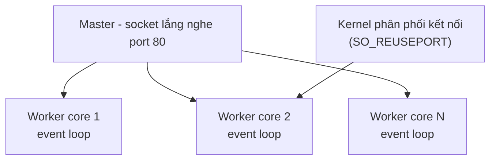
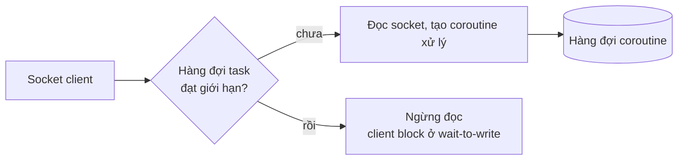

---
tags:
  - web
date: 2026-05-29
---
# Bài toán C10K

C10K là bài toán kinh điển trong xử lý networking: làm sao để một web server phục vụ đồng thời hơn 10.000 kết nối client trên một máy. Dù đã cũ, C10K vẫn là bài học giá trị về thiết kế server hiệu năng cao. Một phát biểu hiện đại của bài toán: thiết kế web server đạt hơn 40.000 rps trên một MacBook Pro M2 (16GB RAM, 8 core), với mỗi response là gói tin 4KB.

## Giả định và nhận định

Bài toán này thiên về truyền tin hơn là xử lý thông tin: công việc chủ yếu của server là nhận request và gửi response, CPU không phải tính toán nhiều - đây là bài toán I/O-bound. Một web server luôn có hai loại áp lực: CPU-bound và I/O-bound.

Nhận định cốt lõi: với sự tiến bộ của hạ tầng mạng và thiết bị lưu trữ (ổ đĩa), áp lực I/O-bound ngày càng được giảm bớt; càng tối ưu I/O thì bottleneck càng dịch sang CPU. Vì vậy một thiết kế server tốt vừa phải tối ưu I/O, vừa phải bảo vệ CPU khỏi quá tải khi I/O không còn là điểm nghẽn.

## Tối ưu I/O bằng event loop và đa nhân

Chọn event loop thay vì threading để xử lý các tác vụ networking bất đồng bộ (đọc/ghi socket): event loop chỉ chạy trên một thread nên rất nhẹ, không tốn thời gian tạo thread, không có chi phí context switching và không tốn bộ nhớ duy trì thread. Python được chọn làm ngôn ngữ cài đặt vì hỗ trợ coroutine giúp đơn giản hóa việc viết code bất đồng bộ.

Để khai thác kiến trúc CPU đa nhân, mỗi core chạy một web server (một process). Việc phân phối request giữa các process tận dụng cơ chế cân bằng tải nội tại của hệ điều hành: các socket trên mỗi process con cùng bind một địa chỉ và port nhờ cờ `SO_REUSEPORT`. Process master tạo socket lắng nghe ở port 80, khi fork process con thì các socket của chúng được đặt cờ `SO_REUSEPORT` để cùng nhận kết nối.

Lưu ý chính xác hóa: trên Linux (từ kernel 3.9), `SO_REUSEPORT` phân phối kết nối bằng cách hash 4-tuple `(src_ip, src_port, dst_ip, dst_port)` rồi chia dư theo số socket, chứ không phải round-robin thuần; hệ quả là các kết nối cùng một client tuple thường tới cùng một worker. Từ kernel 4.5 có thể gắn chương trình eBPF để tùy biến cách chọn socket.

## Bảo vệ CPU bằng backpressure

Khi I/O đã tối ưu, áp lực dồn sang CPU, nên cần cơ chế backpressure để tránh quá tải. Server duy trì một hàng đợi các task (thực chất là các coroutine). Khi hàng đợi đạt tới một giới hạn nhất định, server ngừng đọc socket kết nối từ các client mới; lúc đó socket phía client bị block ở trạng thái chờ ghi (wait to write). Cách này đẩy áp lực ngược về phía client thay vì để server nhận quá nhiều việc rồi sụp.

## Tối ưu phần xử lý HTTP

Vì cài đặt giao thức HTTP/1.1, việc parse gói tin TCP sang HTTP cần càng nhanh càng tốt. Server dùng `httptools` - binding Python của HTTP parser viết bằng C của NodeJS (llhttp, vốn bắt nguồn từ http-parser của Nginx); parser này benchmark khoảng 3 triệu rps. Event loop mặc định của Python viết bằng chính Python nên chậm so với ngôn ngữ kiểu tĩnh; server thay bằng `uvloop` - binding của `libuv` (event loop mà NodeJS dùng).

Cơ chế keep-alive cho phép một connection gửi nhiều request/response để tránh overhead handshake. Mỗi khi parse xong header của HTTP message, server tạo một coroutine để maintain request đó cho đến khi trả response rồi giải phóng - tận dụng đặc tính suspend/resume của coroutine.

## Tương thích ASGI và giới hạn sendfile

Server được cài đặt theo chuẩn ASGI 3.1 nên tương thích với mọi ứng dụng ASGI như FastAPI, Django ASGI. Một hạn chế gặp phải: core spec của ASGI không hỗ trợ `sendfile`. `sendfile` là cơ chế của hệ điều hành cho phép di chuyển dữ liệu giữa các file descriptor ngay dưới tầng kernel mà không phải nạp lên tầng ứng dụng qua RAM, giảm đáng kể thời gian và tài nguyên - cũng chính là kỹ thuật zero-copy giúp Kafka đạt hiệu năng cao. (Cập nhật ngoài tài liệu gốc: ASGI bổ sung sendfile qua các extension tùy chọn `http.response.pathsend` và `http.response.zerocopysend`, nhưng không phải server/ứng dụng nào cũng cài đặt.)

## Bài học về tuning tầng TCP

Có thể tuning tầng TCP của một ứng dụng web. `TCP_NODELAY` tắt thuật toán Nagle: thuật toán Nagle gom nhóm các gói tin nhỏ để gửi theo batch (tốt cho throughput), còn tắt nó để gửi ngay lập tức (tốt cho độ trễ, phù hợp ứng dụng streaming). Lựa chọn giữa gom batch hay gửi ngay là sự đánh đổi giữa throughput và latency tùy đặc thù ứng dụng.

## Nguồn tham khảo

- [Viết HTTP/2 server tương thích ASGI trong Python](https://www.nkthanh.dev/posts/implement-an-asgi-compatible-http2-server-in-python)
- [The C10K problem - Dan Kegel](http://www.kegel.com/c10k.html)
- [Loadbalancing TCP connections in the Linux kernel - SO_REUSEPORT](https://blog.domainmess.org/post/so_portreuse/)
- [httptools - MagicStack](https://github.com/MagicStack/httptools)
- [ASGI Extensions - pathsend, zerocopysend](https://asgi.readthedocs.io/en/latest/extensions.html)

## Liên kết tri thức

- [Event loop trong Python - lý do chọn event loop thay vì threading để tối ưu I/O](../System%20level/Event%20loop%20trong%20Python.md)
- [Coroutine trong Python - mỗi request được maintain bằng một coroutine theo cơ chế keep-alive](../System%20level/Coroutine%20trong%20Python.md)
- [Global Interpreter Lock trong Python - nền tảng cho việc chọn event loop một thread thay vì đa luồng](../System%20level/Global%20Interpreter%20Lock%20trong%20Python.md)
- [WSGI và ASGI - server tuân thủ chuẩn ASGI 3.1 để tương thích FastAPI, Django](./WSGI%20v%C3%A0%20ASGI.md)
- [HTTP/2 và web server bất đồng bộ - cùng dự án cài đặt, mở rộng sang giao thức HTTP/2](./HTTP-2%20v%C3%A0%20web%20server%20b%E1%BA%A5t%20%C4%91%E1%BB%93ng%20b%E1%BB%99.md)
- [Zero-copy và sendfile - giới hạn của ASGI dẫn tới khái niệm zero-copy](../System%20level/Zero-copy%20v%C3%A0%20sendfile.md)
