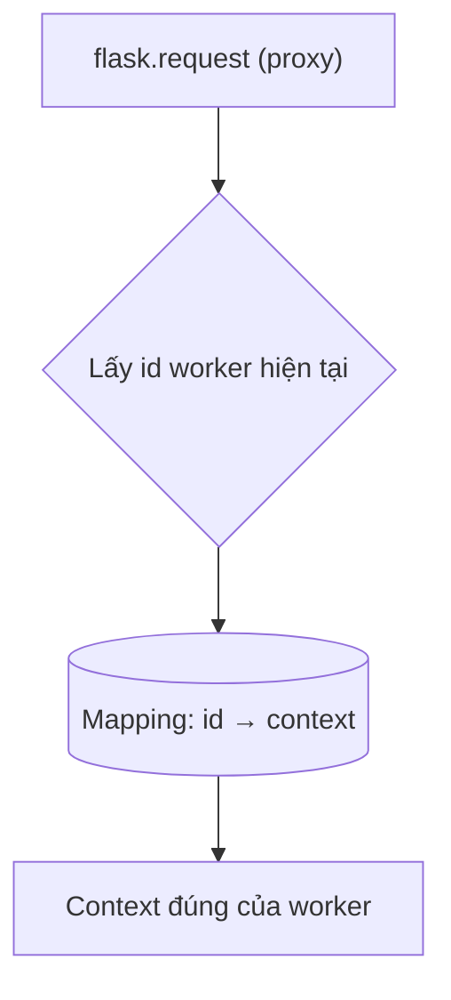

---
tags:
  - web
date: 2026-05-29
---
# Context trong Flask

Context là khái niệm làm nên thương hiệu của Flask giữa các web framework Python: nó cho phép truy cập dữ liệu request (qua `flask.request`) ở bất kỳ hàm nào trong luồng xử lý mà không phải truyền biến `request` qua nhiều tầng gọi hàm. Để hiểu context, cần hiểu cách một ứng dụng web Python nhận request và vấn đề mà context giải quyết.

## environment chính là context

Theo WSGI (PEP 333), một ứng dụng web là một hàm nhận `environment` (dict chứa HTTP request đã parse) và `start_response`. Web server fork một thread và gọi hàm này để xử lý một request, truyền `environment` vào. Vì mọi xử lý phụ thuộc vào `environment`, có thể xem `environment` chính là context của request đó. Trong Flask, `environment` được parse tiếp thành object `flask.request`.

## Vấn đề truyền biến top-down

Ở Django và nhiều framework khác, muốn dùng dữ liệu request thì phải truyền biến `request` top-down xuống từng hàm, kể cả các hàm trung gian không dùng đến nó - làm code rối và khó kiểm soát. Đây là vấn đề thường gặp hơn ở frontend (đặc biệt React), và React giải quyết bằng Context giống cách tiếp cận của Flask.

```python
def nest_function(request):
    # không dùng request nhưng vẫn phải truyền để hàm con dùng
    nest_nest_function(request)

def index(request):
    nest_function(request)
```

## Proxy phân biệt context theo worker

Mỗi request được isolate trong một worker (thread, process hoặc coroutine) riêng với context là `environment`. Trong phạm vi worker, context hoàn toàn có thể trở thành một giá trị global; nhưng trong phạm vi process gồm nhiều worker, các context không được dùng lẫn. Câu hỏi đặt ra: vì sao gọi `flask.request` ở mọi nơi mà không bị nhầm context giữa các worker?

Câu trả lời: `flask.request` không phải object thường mà là một proxy có hành vi nhận biết nó đang được gọi ở worker nào để chọn đúng context. Ý tưởng đơn giản nhất là mỗi thread có một định danh (`threading.get_ident()`), và một `dict` ánh xạ id thread tới context; proxy lookup id của thread hiện tại trong mapping này để lấy giá trị phù hợp.



```python
global_container = {}

def set_context(value):
    global_container[threading.get_ident()] = value

def get_context():
    tid = threading.get_ident()
    if tid not in global_container:
        raise RuntimeError("Working outside of application context.")
    return global_container[tid]
```

## Cài đặt thực tế trong Werkzeug

Trong thực tế, Flask cài đặt context qua các lớp của Werkzeug: `LocalStack`, `Local`, và đặc biệt là `LocalProxy` - lớp chuyển tiếp mọi thao tác tới object đang bind với context, ném `RuntimeError` nếu không có context nào. Ngoài request context, Flask còn có application context truy cập qua `flask.g` và `flask.current_app`.

Lưu ý cập nhật ngoài tài liệu gốc: từ Werkzeug 2.0, `LocalProxy` dùng `contextvars` của Python thay cho mapping theo thread id thủ công. Nhờ `contextvars`, context hoạt động đúng không chỉ với thread mà cả với coroutine và greenlet - phù hợp với worker bất đồng bộ chứ không chỉ đa luồng.

## Ứng dụng

Flask cho phép tự tạo context riêng. `@copy_current_request_context` sao chép request context hiện tại sang một tác vụ chạy ở worker khác (ví dụ `gevent.spawn`). `with app.request_context(environment)` đẩy một context thủ công để xử lý ngoài luồng request thông thường. Các extension như Flask-Login, Flask-Admin, Flask-Celery đều tuân thủ thiết kế này.

## Nguồn tham khảo

- [Flask Context và những điều cần biết](https://www.nkthanh.dev/posts/flask-context-va-nhung-dieu-can-biet)
- [Context Locals - Werkzeug Documentation](https://werkzeug.palletsprojects.com/en/stable/local/)
- [The Request Context - Flask Documentation](https://flask.palletsprojects.com/en/stable/reqcontext/)
- [werkzeug/local.py - source](https://github.com/pallets/werkzeug/blob/main/src/werkzeug/local.py)

## Liên kết tri thức

- [Tổng quan về Flask - context là một trong những đặc điểm cốt lõi của Flask](./T%E1%BB%95ng%20quan%20v%E1%BB%81%20Flask.md)
- [WSGI và ASGI - environment trong WSGI chính là nguồn gốc của request context](./WSGI%20v%C3%A0%20ASGI.md)
- [Global Interpreter Lock trong Python - mô hình một worker xử lý một request liên quan đến cách thread hoạt động dưới GIL](../System%20level/Global%20Interpreter%20Lock%20trong%20Python.md)
