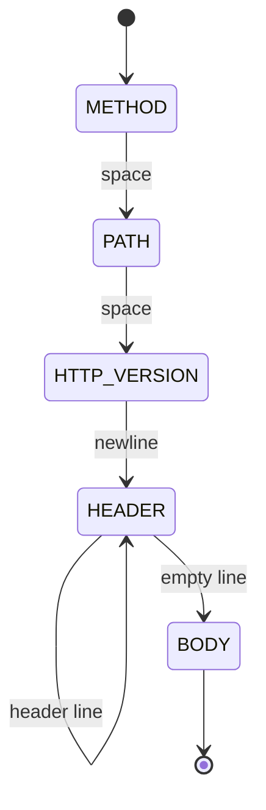

---
tags:
  - web
date: 2026-05-29
---
# HTTP parser dạng máy trạng thái

HTTP/1.1 message là chuỗi byte có cấu trúc dòng theo thứ tự cố định: request-line, các header, dòng trống, body. Khi gói tin đến qua TCP, kernel có thể chia làm nhiều chunk tới ứng dụng vào các thời điểm khác nhau. Parser phải nhận từng chunk, giữ trạng thái giữa các lần nhận, và phát ra sự kiện khi parse xong từng phần. Cấu trúc tự nhiên cho bài toán này là máy trạng thái (state machine).

## Năm trạng thái cơ bản

Một parser HTTP/1.1 tối giản cần năm trạng thái tương ứng với năm phần của message:

- `METHOD` đọc tới khoảng trắng đầu tiên
- `PATH` đọc tới khoảng trắng tiếp theo
- `HTTP_VERSION` đọc tới `\n`
- `HEADER` đọc từng dòng cho tới khi gặp dòng trống (`\r\n`)
- `BODY` đọc phần còn lại tới hết content-length hoặc hết chunk

Mỗi lần `feed_data` được gọi, parser bắt đầu từ trạng thái hiện tại, quét đến token kết thúc của trạng thái đó, emit callback rồi chuyển sang trạng thái kế tiếp. Nếu chunk thiếu dữ liệu (không tìm thấy token kết thúc), parser nối phần đã có vào `current_token` và return; lần `feed_data` sau sẽ tiếp tục từ đúng vị trí.



## Tách parsing và xử lý qua callback

Parser không tự đóng gói kết quả — nó nhận một `protocol` object và gọi các callback `on_method`, `on_path`, `on_http_version`, `on_header`, `on_headers_completed`, `on_body`. Pattern này tách hoàn toàn phần parse (đọc byte → cấu trúc) và phần xử lý (tạo scope, schedule task, gửi vào application). Cùng một parser dùng được cho mọi server: callbacks là điểm tích hợp.

```python
class Parser:
    def feed_data(self, data: bytes):
        idx = 0
        while idx < len(data):
            if self.current_state == STATE_METHOD:
                i = data.find(b" ", idx)
                if i == -1:
                    self.current_token += data[idx:]
                    break
                else:
                    self.protocol.on_method(self.current_token + data[idx:i])
                    self.current_state = STATE_PATH
                    idx = i + 1
            # ...
```

llhttp (parser của Node.js dùng trong `httptools`) cùng kiến trúc nhưng được sinh tự động từ định nghĩa LLParse, tận dụng tối đa branchless coding và inline.

## Hiệu năng giữa các cài đặt

Benchmark cùng một message trên cùng máy:

- parser thuần Python xử lý khoảng 80.000 req/s trên CPython 3.11
- cùng code chạy trên PyPy 3.9 7.3.11 đạt khoảng 1,5 triệu req/s — gấp 18 lần nhờ JIT tối ưu vòng lặp byte
- `httptools` (binding của llhttp) đạt khoảng 3 triệu req/s nhờ parser C tối ưu sâu

Khoảng cách giữa CPython và PyPy minh hoạ chi phí của interpreter khi xử lý byte-level; khoảng cách giữa PyPy và C minh hoạ giới hạn của JIT khi không có inline assembly và branchless tricks như llhttp. Đây là lý do mọi server hiệu năng cao trên Python đều dùng parser viết bằng C qua binding thay vì thuần Python.

## Trải nghiệm cá nhân

Wiki này được kết tinh từ một trong bốn thí nghiệm threading dump lên [gist](https://github.com/magiskboy/gist) ngày 2023-07-12 tại Teko — phần của chuỗi học hai năm `gist → xthread → uASGI` về Python low-level. Cùng pattern parser sau đó được lặp lại bằng C trong repo [http-parser](https://github.com/magiskboy/http-parser) để củng cố thêm. Chi tiết bối cảnh trong [transcript phỏng vấn](../../references/interviews/gist-threading-arc.md).

## Nguồn tham khảo

- [Source gist - simple HTTP parser thuần Python](../../references/repos/gist/simple-http-parser/parser.py)
- [Source gist - benchmark](../../references/repos/gist/simple-http-parser/benchmark.py)
- [Source magiskboy/http-parser - cài đặt cùng pattern bằng C](https://github.com/magiskboy/http-parser)
- [llhttp - LLParse-based HTTP parser của Node.js](https://github.com/nodejs/llhttp)
- [httptools - Python binding cho llhttp](https://github.com/MagicStack/httptools)
- [RFC 9112 - HTTP/1.1 Message Format](https://www.rfc-editor.org/rfc/rfc9112)

## Liên kết tri thức

- [Bài toán C10K - httptools được chọn vì parser C đạt 3 triệu req/s, gấp 37 lần parser thuần Python](./B%C3%A0i%20to%C3%A1n%20C10K.md)
- [Observer pattern - callback pattern của parser là một biến thể của observer](../System%20level/Observer%20pattern.md)
- [WSGI và ASGI - server theo cả hai giao diện đều parse HTTP trước khi đưa lên application](./WSGI%20v%C3%A0%20ASGI.md)
- [Pipelining trong HTTP/1.1 - parser nhận biết nhiều message trên cùng connection nhờ duy trì trạng thái giữa các lần gọi](./Pipelining%20trong%20HTTP-1.1.md)
- [Dựng lại để hiểu sâu - cùng một HTTP parser được dựng lại bằng Python rồi bằng C để internalize ý niệm máy trạng thái](../Ph%C3%A1t%20tri%E1%BB%83n%20b%E1%BA%A3n%20th%C3%A2n/D%E1%BB%B1ng%20l%E1%BA%A1i%20%C4%91%E1%BB%83%20hi%E1%BB%83u%20s%C3%A2u.md)
- [Callback qua function pointer trong C - cùng pattern callback được cài bằng object có method trong Python, và function pointer trong C](../System%20level/Callback%20qua%20function%20pointer%20trong%20C.md)
- [Giới hạn kích thước header để khống chế bộ nhớ - parser cần đệm header tới khi đủ một dòng, là lý do bắt buộc phải giới hạn buffer ở tầng server](./Gi%E1%BB%9Bi%20h%E1%BA%A1n%20k%C3%ADch%20th%C6%B0%E1%BB%9Bc%20header%20%C4%91%E1%BB%83%20kh%E1%BB%91ng%20ch%E1%BA%BF%20b%E1%BB%99%20nh%E1%BB%9B%20server.md)
- [State pattern trong game - cùng họ state machine nhưng transition theo quyết định của state thay vì tự động theo dữ liệu](../Game%20development/State%20pattern%20trong%20game.md)
