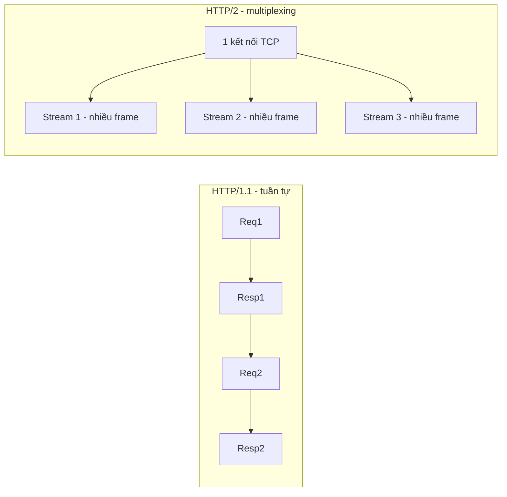
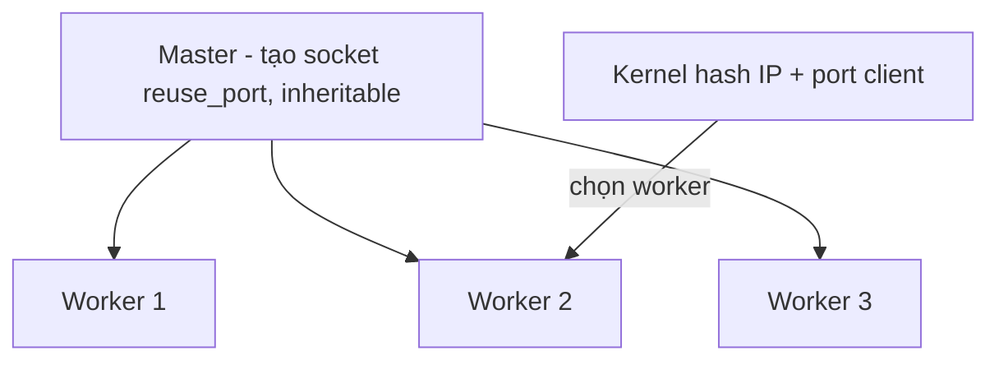

---
tags:
  - web
date: 2026-05-29
---
# HTTP/2 và web server bất đồng bộ

HTTP/2 là phương thức đóng gói, truyền và nhận gói tin HTTP trên nền TCP nhằm cải thiện hiệu suất so với HTTP/1.1. Cùng với chuẩn ASGI và module `asyncio`, HTTP/2 có thể được cài đặt thành một web server bất đồng bộ trong Python. Tri thức này gồm hai phần: cải tiến của giao thức HTTP/2, và cách triển khai server xử lý nó.

## Cải tiến của HTTP/2 so với HTTP/1.1

Trong HTTP/1.1, mỗi transaction (request và response) dùng một kết nối riêng. HTTP Pipelining sau đó cho phép nhiều transaction dùng chung một kết nối để giảm số lần handshake, nhưng kém hiệu quả vì các transaction phải tuân theo thứ tự - một transaction chậm làm các transaction sau phải chờ (head-of-line blocking). HTTP/2 giải quyết bằng ba cải tiến chính:

- Multiplexing qua stream: mỗi transaction là một stream gồm nhiều frame; trên một kết nối duy nhất có thể truyền đồng thời nhiều frame thuộc nhiều stream khác nhau, loại bỏ ràng buộc thứ tự và head-of-line blocking ở mức request.
- Header compression (HPACK): duy trì một table trên cả client và server; header gửi lần đầu được thêm vào table, các request sau chỉ gửi index thay vì lặp lại cặp header. HPACK dùng một bảng động kết hợp mã Huffman cố định, được thiết kế an toàn trước các tấn công kiểu CRIME.
- Server push: server chủ động gửi tài nguyên client sẽ cần để tránh handshake thừa.

Khác biệt nền tảng: HTTP/1.1 truyền gói tin ở định dạng văn bản, còn HTTP/2 dùng định dạng nhị phân - dễ nén hơn. HTTP/2 cũng dùng thêm metadata và nhiều phản hồi xác nhận trong quá trình truyền (các frame `WINDOW_UPDATE`, `SETTINGS`) để hai bên trao đổi chính xác các frame của từng stream. Về hiệu suất truyền tải, HTTP/2 vượt trội, nhưng với ứng dụng nặng xử lý phía server thì khác biệt không lớn; do đó HTTP/2 phù hợp nhất với dịch vụ tập trung truyền tải như lưu trữ tệp hay website tĩnh.

Lưu ý cập nhật ngoài tài liệu gốc: server push tỏ ra khó triển khai đúng và đã bị gỡ khỏi phần lớn trình duyệt - Chrome mặc định không dùng server push từ năm 2022, thay bằng `rel="preload"` và 103 Early Hints.

## Triển khai server bằng asyncio

Server dùng mô hình master-worker để khai thác CPU đa nhân. Process master tạo socket lắng nghe với cờ `reuse_port` (cho phép nhiều socket cùng bind một cổng) và đặt socket `inheritable` để các process worker kế thừa. Khi có gói tin đến, kernel Unix-like tạo hash từ IP và port của client rồi chọn process xử lý, tạo hiệu ứng session sticky tự nhiên.

Mỗi worker xử lý socket theo kiểu bất đồng bộ với event loop thay vì đa luồng. Trong `asyncio`, giao thức mạng được tách thành hai phần: `BaseTransport` đảm nhận việc truyền byte trên mạng (tầng 4 - Transport, gồm TCP, UDP), còn `BaseProtocol` định nghĩa quy tắc giao tiếp ở tầng 7 - Application (HTTP, gRPC, IMAP). Server dùng Transport TCP mặc định và tự viết hai protocol riêng cho HTTP/1.1 và HTTP/2.

`H1Protocol` dùng parser `httptools` (binding Python của HTTP parser viết bằng C của NodeJS - llhttp, vốn bắt nguồn từ http-parser của Nginx), benchmark khoảng 3 triệu rps; khi nhận đủ header thì tạo một `asyncio.Task` chạy vòng đời request (tương đương tạo thread xử lý request trong kiến trúc đa luồng), và giữ kết nối nếu `keep-alive`. `H2Protocol` cần một table ánh xạ `stream_id` tới context vì một kết nối phục vụ nhiều stream; mỗi action trên HTTP/2 đều cần một ACK (kể cả khi tạo kết nối), khác với HTTP/1.1. Dữ liệu nhận được feed vào parser của thư viện `h2` để sinh ra các event như `RequestReceived`, `DataReceived`, `StreamEnded`, `WindowUpdated`.

Một điểm quan trọng của HTTP/2 là flow control: server duy trì một cửa sổ báo cho ứng dụng khi nào được ghi response vào socket và ghi bao nhiêu byte; cài đặt dùng `asyncio.Future` để chờ đến khi cửa sổ mở. Để tăng hiệu suất, server thay event loop mặc định bằng `uvloop` (libuv của NodeJS), và với HTTP/2 bắt buộc dùng SSL.

## Backpressure và tương thích ASGI

Khi tầng I/O đã được tối ưu, áp lực dồn sang CPU nên server cần backpressure để tránh quá tải. Server duy trì một hàng đợi các task (coroutine); khi hàng đợi đạt giới hạn, server ngừng đọc socket kết nối từ client mới, đẩy client vào trạng thái chờ ghi (wait to write) thay vì nhận quá nhiều việc rồi sụp.

Server cài đặt theo chuẩn ASGI 3.1 nên tương thích với mọi ứng dụng ASGI như FastAPI hay Django ASGI. Một hạn chế của core spec ASGI là không hỗ trợ `sendfile` (zero-copy) - dữ liệu file vẫn phải đi qua bộ nhớ Python; khả năng này chỉ có qua các extension tùy chọn như `http.response.pathsend`.

## Benchmark

Với một app FastAPI cơ bản trả về JSON, đo trong 10 giây với 8 connection và 8 client (dùng `wrk` cho HTTP/1.1 và `h2load` cho HTTP/2), hiệu suất truyền tải của HTTP/2 cao hơn khoảng 50% so với HTTP/1.1 trong điều kiện cài đặt cơ bản.

## Nguồn tham khảo

- [Viết HTTP/2 server tương thích ASGI trong Python](https://www.nkthanh.dev/posts/implement-an-asgi-compatible-http2-server-in-python)
- [python-webserver-tutorial - mã nguồn đầy đủ](https://github.com/magiskboy/python-webserver-tutorial)
- [HPACK: the silent killer feature of HTTP/2 - Cloudflare](https://blog.cloudflare.com/hpack-the-silent-killer-feature-of-http-2/)
- [asyncio Transports and Protocols - Python documentation](https://docs.python.org/3/library/asyncio-protocol.html)

## Liên kết tri thức

- [WSGI và ASGI - HTTP/2 server này tuân thủ chuẩn ASGI để chạy ứng dụng như FastAPI](./WSGI%20v%C3%A0%20ASGI.md)
- [Event loop trong Python - mỗi worker xử lý nhiều stream qua một event loop](../System%20level/Event%20loop%20trong%20Python.md)
- [Coroutine trong Python - mỗi request được xử lý bằng một task/coroutine, tương tự server TCP bất đồng bộ](../System%20level/Coroutine%20trong%20Python.md)
- [Vì sao FastAPI nhanh - cùng dùng uvloop và httptools để tăng tốc xử lý HTTP](./V%C3%AC%20sao%20FastAPI%20nhanh.md)
- [Bài toán C10K - cùng dự án, đặt trong khung bài toán kinh điển về server hiệu năng cao](./B%C3%A0i%20to%C3%A1n%20C10K.md)
- [Zero-copy và sendfile - khái niệm đằng sau hạn chế sendfile của ASGI](../System%20level/Zero-copy%20v%C3%A0%20sendfile.md)
