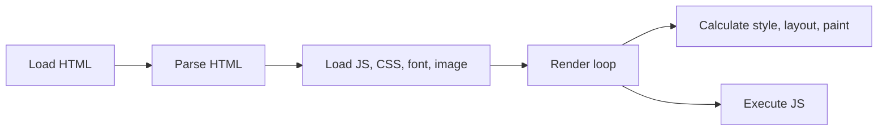

---
tags:
  - web
date: 2026-05-29
---
# Hiệu năng web

Hiệu năng web phản ánh tốc độ một trang web được load và hiển thị tới người dùng. Người dùng cảm nhận trang web nhanh khi toàn bộ quá trình load và render diễn ra nhanh nhất có thể, do đó hiệu năng của mỗi giai đoạn ảnh hưởng trực tiếp tới toàn bộ giai đoạn sau.

## Quá trình hiển thị trang web

Browser hiển thị một trang web qua các giai đoạn nối tiếp, trong đó việc load HTML là blocking còn parsing HTML và load các resource khác là non-blocking.

Vòng lặp render gồm hai tác vụ blocking trên main thread là calculate style/layout/paint cho các element và execute JS. Bất kỳ tác vụ nào chiếm main thread quá lâu đều làm trễ thời điểm nội dung hiển thị tới người dùng.

## Sáu user-centric metric

Google đề xuất sáu chỉ số đo trải nghiệm người dùng (user-centric metric). Các chỉ số này đều là hệ quả của quá trình load và render ở trên, nên việc tối ưu phải bắt đầu từ việc nắm rõ cách trang web được render.

- **Largest Contentful Paint (LCP)**: thời gian phần tử lớn nhất trong viewport được hiển thị trong loading time. LCP thường là phần tử `img` hoặc text element như `p`. LCP càng ngắn, người dùng càng cảm thấy trang web nhanh dù nội dung khác chưa render xong.
- **First Contentful Paint (FCP)**: thời gian browser bắt đầu render nội dung ra màn hình. FCP luôn xảy ra trước LCP, nên FCP nhỏ kéo theo LCP nhỏ. FCP bị ảnh hưởng bởi các blocking resource như CSS và font.
- **Cumulative Layout Shift (CLS)**: mức độ các phần tử thay đổi vị trí và kích thước trong thời gian tải trang. CLS cao gây trải nghiệm UI không ổn định (visual stability).
- **Total Blocking Time (TBT)**: thời gian main thread bị block bởi các tác vụ CPU như JS parsing, HTML parsing, calculate style, layout và JS executing. TBT cao làm giảm frame rate (mỗi frame nên hoàn thành trong khoảng 16.6ms để đạt 60fps) và kéo dài thời gian người dùng có thể tương tác.
- **Time To Interactive (TTI)**: thời gian người dùng có thể tương tác được với trang web. TTI bị ảnh hưởng khi CPU bị các tác vụ khác chiếm dụng, cùng nhóm nguyên nhân với TBT.
- **Speed Index**: thời gian để trang web hiển thị nội dung. Bị ảnh hưởng bởi main thread blocking time và các blocking resource như font, CSS.

## Quan hệ giữa các metric

Các metric không độc lập mà chia sẻ chung nhóm nguyên nhân. Blocking resource (CSS, font) chi phối FCP, LCP và Speed Index; main thread blocking time chi phối TBT, TTI và Speed Index. Vì FCP đứng trước LCP trong pipeline, cải thiện một metric ở giai đoạn sớm thường cải thiện theo các metric ở giai đoạn sau.

# Nguồn tham khảo

- [Optimize web performance](https://www.nkthanh.dev/posts/optimize-web-performance)
- [web.dev — User-centric performance metrics](https://web.dev/articles/user-centric-performance-metrics)

# Liên kết tri thức

- [Tối ưu hiệu năng web](./T%E1%BB%91i%20%C6%B0u%20hi%E1%BB%87u%20n%C4%83ng%20web.md) - Các metric là mục tiêu cần cải thiện của quá trình tối ưu
- [Công cụ đo lường hiệu năng web](./C%C3%B4ng%20c%E1%BB%A5%20%C4%91o%20l%C6%B0%E1%BB%9Dng%20hi%E1%BB%87u%20n%C4%83ng%20web.md) - Công cụ định lượng các user-centric metric
- [Time to First Byte](./Time%20to%20First%20Byte.md) - Chỉ số đứng trước FCP và LCP trong chuỗi loading
