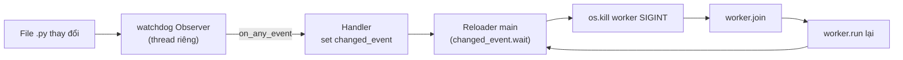

---
tags:
  - web
  - python
date: 2026-05-29
---
# Hot reload server bằng watchdog và signal

Hot reload trong dev server là khả năng tự khởi động lại process khi source code thay đổi, để lập trình viên không phải dừng và chạy lại tay sau mỗi lần lưu file. Pattern phổ biến trong Python kết hợp hai thư viện hệ điều hành: `watchdog` để bắt sự kiện file system cross-platform, và `signal` để truyền tín hiệu dừng cho worker.

## Cấu trúc tổng thể

Reloader giữ tham chiếu tới worker đơn (hot reload chỉ làm việc với một worker để tránh phức tạp), cùng một `Observer` của watchdog đăng ký lắng nghe thư mục làm việc. Khi file thay đổi, Observer gọi handler đã đăng ký; handler set một `threading.Event` rồi reloader main thread thức dậy, kill worker hiện tại và spawn worker mới.

## Lựa chọn của watchdog

`watchdog` cung cấp `Observer` trừu tượng hoá các API native: inotify trên Linux, FSEvents trên macOS, `ReadDirectoryChangesW` trên Windows. Observer chạy trong thread riêng do thư viện quản lý — lập trình viên chỉ cần truyền vào một subclass `FileSystemEventHandler` định nghĩa `on_any_event`. Lựa chọn này tránh phải poll mtime của file thủ công, vốn vừa tốn CPU vừa không bắt được mọi loại sự kiện (di chuyển, rename, xoá).

uASGI lọc event qua `event_filter=CHANGED_EVENT_TYPES` để chỉ nhận create/modify/move/delete, và trong handler còn kiểm tra thêm hai điều kiện: file thay đổi phải kết thúc bằng `.py` và phải cách lần reload trước ít nhất `DELAY_TO_LAST_TIME_RELOAD = 1` giây. Debouncing này quan trọng vì editor thường ghi file theo nhiều bước (write to temp, rename, fsync), tạo ra nhiều event liên tiếp.

## Truyền tín hiệu bằng SIGINT

Khi cần reload, reloader gọi `os.kill(worker.pid, signal.SIGINT)`. Trong worker process, server bắt `KeyboardInterrupt` (Python convert SIGINT thành exception này) và gọi `server.stop()` để event loop đóng accept loop. Sau khi `worker.join(timeout=5)` xong, reloader spawn lại worker bằng `worker.run()` — tạo `multiprocessing.Process` mới chạy lại app từ đầu.

Cách dùng SIGINT thay vì SIGTERM hoặc SIGKILL: SIGINT cho phép xử lý qua exception handler thông thường, không yêu cầu signal handler riêng và đảm bảo cleanup chạy (lifespan shutdown, đóng kết nối...).

## Giới hạn

Pattern này chỉ áp dụng được khi `workers == 1`. Với nhiều worker, mỗi worker có process riêng và socket được share qua fork; nếu kill và spawn lại từng worker thì sẽ có giai đoạn không phục vụ được. Production thay vào đó dùng rolling reload qua một process manager riêng (systemd, supervisor) hoặc reload qua signal SIGHUP của gunicorn — phức tạp hơn nhiều.

## Trải nghiệm cá nhân

Wiki này được kết tinh khi viết [uASGI](https://github.com/magiskboy/uasgi) tại Zen8labs (7-8/2025). Reloader là tooling phụ cho dev server, không phải core feature; cài đặt một lần ổn định, không có vùng vấp đáng nhớ. Chi tiết bối cảnh trong [transcript phỏng vấn](../../references/interviews/uasgi.md).

## Nguồn tham khảo

- [Source uASGI - Reloader](../../references/repos/uasgi/uasgi/reloader.py)
- [Source uASGI - worker.reload qua os.kill SIGINT](../../references/repos/uasgi/uasgi/worker.py)
- [watchdog - Python API documentation](https://python-watchdog.readthedocs.io/en/stable/)
- [signal — Set handlers for asynchronous events | Python documentation](https://docs.python.org/3/library/signal.html)
- [Gunicorn - signal handling](https://docs.gunicorn.org/en/stable/signals.html)

## Liên kết tri thức

- [Arbiter và worker trong ASGI server - reload tái sinh worker theo cùng pattern arbiter dùng để spawn](./Arbiter%20v%C3%A0%20worker%20trong%20ASGI%20server.md)
- [Observer pattern - watchdog là cài đặt observer pattern cho file system event](../System%20level/Observer%20pattern.md)
- [Lifespan protocol trong ASGI - mỗi lần reload chạy lại lifespan startup của ứng dụng](./Lifespan%20protocol%20trong%20ASGI.md)
