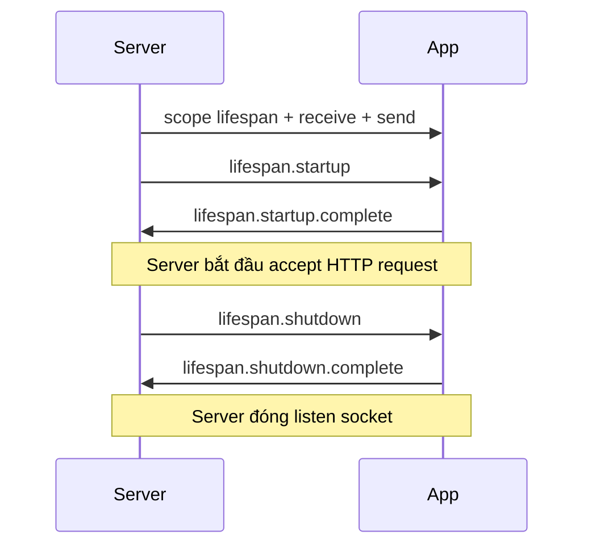

---
tags:
  - web
  - python
date: 2026-05-29
---
# Lifespan protocol trong ASGI

ASGI định nghĩa ba subprotocol: `http` xử lý request HTTP, `websocket` xử lý kết nối WebSocket, và `lifespan` quản lý sự kiện bắt đầu và kết thúc của ứng dụng. Lifespan cho phép ứng dụng chạy các tác vụ một lần khi server khởi động (mở kết nối database, nạp model AI, warm cache) và dọn dẹp khi shutdown, đồng thời chia sẻ tài nguyên này cho các request handler thông qua state object.

## Bốn message của lifespan

Server gọi ứng dụng đúng một lần với `scope["type"] == "lifespan"` và một cặp `receive`/`send` riêng. Bốn loại message luân chuyển qua hai chiều:

- server gửi `lifespan.startup` cho app khi sẵn sàng phục vụ
- app gửi lại `lifespan.startup.complete` (thành công) hoặc `lifespan.startup.failed` kèm `message`
- server gửi `lifespan.shutdown` khi nhận tín hiệu dừng
- app gửi lại `lifespan.shutdown.complete` hoặc `lifespan.shutdown.failed`

Trong uASGI, `Lifespan.main` được spawn thành asyncio task ngay khi server startup, app chạy nền trong suốt vòng đời server. `event_queue` là `asyncio.Queue` giữ message từ server tới app; `startup_done` và `shutdown_done` là hai `asyncio.Event` đồng bộ phía server biết app đã ack.

## Chia sẻ state qua scope

Lifespan scope có trường `state: dict` được tham chiếu chung. Khi app khởi tạo resource (vd `app.state["db"] = create_pool()`), mọi HTTP request sau đó nhận scope có `scope["state"]` trỏ tới chính dict đó, nên handler đọc được pool sẵn sàng. Đây là cách chính thống để vượt qua giới hạn ASGI không có khái niệm "request context" hay "app context" như Flask.

Mẫu hình áp dụng trong FastAPI: dùng `lifespan` context manager để khởi tạo và teardown, gán resource vào `app.state`. Starlette/uASGI hỗ trợ truyền dict qua `scope["state"]` cho từng request, khác với pattern global biến module mà nhiều ứng dụng cũ vẫn dùng.

## Xử lý lỗi startup

Khi app gửi `lifespan.startup.failed`, server không bắt đầu serve và thoát kèm thông báo. Đây là khác biệt quan trọng so với WSGI: WSGI không có chuẩn cho hook startup nên app thường khởi tạo "ngầm" lúc module import, lỗi ở giai đoạn này khó báo cáo rõ ràng. ASGI biến startup thành phần của protocol, giúp orchestrator phân biệt rõ giữa "server không lên được" và "server lên nhưng crash khi nhận request".

## Trải nghiệm cá nhân

Wiki này được kết tinh khi viết [uASGI](https://github.com/magiskboy/uasgi) tại Zen8labs (7-8/2025) — practice cá nhân để hiểu cặn kẽ ASGI và cách Starlette/FastAPI tích hợp lên server. Chi tiết bối cảnh trong [transcript phỏng vấn](../../references/interviews/uasgi.md).

## Nguồn tham khảo

- [Source uASGI - lifespan implementation](../../references/repos/uasgi/uasgi/lifespan.py)
- [ASGI Specification - Lifespan Protocol](https://asgi.readthedocs.io/en/latest/specs/lifespan.html)
- [FastAPI - lifespan events](https://fastapi.tiangolo.com/advanced/events/)
- [Starlette - lifespan và app state](https://www.starlette.io/lifespan/)

## Liên kết tri thức

- [WSGI và ASGI - lifespan là subprotocol thứ ba của ASGI bên cạnh http và websocket](./WSGI%20v%C3%A0%20ASGI.md)
- [Vì sao FastAPI nhanh - FastAPI dùng lifespan để khởi tạo resource một lần và chia sẻ qua state](./V%C3%AC%20sao%20FastAPI%20nhanh.md)
- [Arbiter và worker trong ASGI server - mỗi worker chạy lifespan độc lập trong event loop của mình](./Arbiter%20v%C3%A0%20worker%20trong%20ASGI%20server.md)
