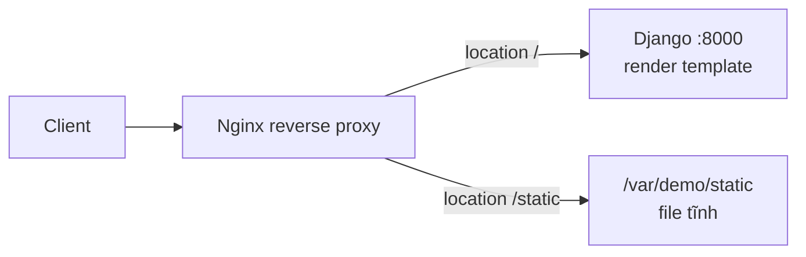

---
tags:
  - web
date: 2026-05-29
---
# Phục vụ static file trong Django

Khi deploy ứng dụng Django server-side rendering lên production, một lỗi thường gặp là HTML vẫn render nhưng các static file (ảnh, CSS, JS) báo 404. Nguyên nhân: ở chế độ production (`DEBUG = False`), Django không chịu trách nhiệm serve static file. Giải pháp là để Django render template, còn Nginx đóng vai trò reverse proxy và serve static file.



## Vì sao tắt DEBUG làm hỏng static file

Trong môi trường development, Django có một số tính năng đặc biệt không nên dùng ở production, trong đó có việc tự serve static file. Khi tắt debug, trình duyệt không tải được các file ảnh, CSS, JS vì Django mặc định không serve chúng ở chế độ này.

```python
DEBUG = False if os.getenv('DEBUG', '0') == '0' else True
```

## Khai báo đường dẫn static

Trong `settings.py`, khai báo URL mà template render ra và thư mục đích trên host machine.

```python
STATIC_URL = '/static/'
STATIC_ROOT = '/var/demo/static'
```

Trong `urls.py`, cấu hình `urlpatterns` để template engine render đúng URL static file.

```python
from django.contrib.staticfiles.urls import static
from django.conf import settings

urlpatterns += static(
    prefix=getattr(settings, 'STATIC_URL'),
    document_root=getattr(settings, 'STATIC_ROOT'),
)
```

## Cấu hình Nginx làm reverse proxy

Nginx proxy các request thường tới Django (chạy ở cổng 8000) và serve trực tiếp các file trong `/var/demo/static`.

```nginx
server {
    listen 80;
    server_name demo;

    location / {
        proxy_pass http://127.0.0.1:8000;
        proxy_http_version 1.1;
        proxy_set_header Host $host;
    }

    location /static {
        alias /var/demo/static;
    }
}
```

## Gom static file bằng collectstatic

Cuối cùng, chạy lệnh sau để gom static file của tất cả app trong project về `STATIC_ROOT`, sau đó Nginx chỉ việc serve các file đó. Cách này cũng áp dụng được cho các file người dùng upload từ client lên server.

```sh
./manage.py collectstatic
```

## Nguồn tham khảo

- [Serve static file in Django](https://www.nkthanh.dev/posts/serve-static-file-in-django)
- [django-app-deployment - repo demo](https://github.com/magiskboy/django-app-deployment)
- [Managing static files - Django documentation](https://docs.djangoproject.com/en/stable/howto/static-files/)

## Liên kết tri thức

- [WSGI và ASGI - Django là framework đồng bộ chạy trên WSGI, đứng sau reverse proxy](./WSGI%20v%C3%A0%20ASGI.md)
- [Hệ sinh thái Python - Django là web framework lâu đời tiêu biểu của Python](../System%20level/H%E1%BB%87%20sinh%20th%C3%A1i%20Python.md)
