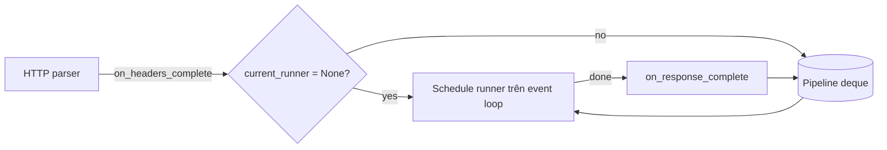

---
tags:
  - web
date: 2026-05-29
---
# Pipelining trong HTTP/1.1

HTTP/1.1 cho phép client gửi nhiều request liên tiếp trên cùng một TCP connection mà không phải chờ response trước trả về — gọi là pipelining. Server bắt buộc trả response đúng thứ tự request đã nhận, vì giao thức không có cơ chế đánh số message để client phân biệt. Đây là nỗ lực giảm latency của HTTP/1.1, nhưng cũng là nguyên nhân của head-of-line blocking ở tầng ứng dụng — phần lớn browser đã tắt pipelining mặc định và HTTP/2 là phương án thay thế đúng nghĩa.

## Hệ quả với server bất đồng bộ

Trong một ASGI server bất đồng bộ, mỗi connection có thể có nhiều request đang được parse đồng thời nếu client pipelining. Server không thể xử lý song song và gửi response ra ngay khi xong, vì client mong nhận theo đúng thứ tự. Giải pháp uASGI dùng trong `H11Protocol`:

- duy trì một `deque` tên `pipeline` chứa các `HttpScopeRunner` chờ
- giữ một `current_runner` duy nhất đang được schedule trên event loop
- khi parser emit `on_headers_complete` mà `current_runner` đã có, runner mới được đẩy vào `pipeline` thay vì schedule ngay
- khi `current_runner` hoàn tất, callback `on_response_complete` pop runner kế tiếp ra khỏi `pipeline` và schedule

Pattern này biến pipelining thành xếp hàng FIFO: server vẫn tận dụng được event loop để xử lý các connection khác nhau song song, nhưng trong cùng một connection thì tuần tự.

## Head-of-line blocking ở tầng ứng dụng

Vì response phải ra đúng thứ tự, một request chậm (truy vấn database nặng, render template phức tạp) sẽ chặn tất cả response phía sau trên cùng connection. Đây là head-of-line blocking — không phải ở tầng TCP mà ở tầng giao thức ứng dụng. Browser bật pipelining có thể trải nghiệm tệ hơn không bật, nên Chrome, Firefox, Safari đều mặc định tắt từ lâu.

HTTP/2 giải quyết vấn đề này bằng multiplexing: mỗi message được gói trong frame có stream ID riêng, response có thể trả về xen kẽ và out-of-order. Đây là một trong những lý do chính HTTP/2 ra đời, dù bản thân HTTP/2 chạy trên một TCP connection nên vẫn có head-of-line blocking ở tầng TCP (vấn đề mà QUIC/HTTP/3 giải quyết).

## Trải nghiệm cá nhân

Wiki này được kết tinh khi viết [uASGI](https://github.com/magiskboy/uasgi) tại Zen8labs (7-8/2025). Pipelining được cài lại bằng cách đọc flow của uvicorn rồi tự reimplement theo cách hiểu cá nhân; chi tiết cơ chế đã mờ một phần và sẽ đào tiếp khi cần. Chi tiết bối cảnh trong [transcript phỏng vấn](../../references/interviews/uasgi.md).

## Nguồn tham khảo

- [Source uASGI - pipeline trong H11Protocol](../../references/repos/uasgi/uasgi/protocol.py)
- [RFC 9112 - HTTP/1.1, mục 9.3.2 Pipelining](https://www.rfc-editor.org/rfc/rfc9112#section-9.3.2)
- [HTTP pipelining - Wikipedia](https://en.wikipedia.org/wiki/HTTP_pipelining)
- [HTTP/2 multiplexing - RFC 9113](https://www.rfc-editor.org/rfc/rfc9113#name-streams-and-multiplexing)

## Liên kết tri thức

- [HTTP/2 và web server bất đồng bộ - multiplexing là phương án thay thế đúng nghĩa cho pipelining](./HTTP-2%20v%C3%A0%20web%20server%20b%E1%BA%A5t%20%C4%91%E1%BB%93ng%20b%E1%BB%99.md)
- [Arbiter và worker trong ASGI server - pipelining hoạt động trong phạm vi một connection mà worker mở](./Arbiter%20v%C3%A0%20worker%20trong%20ASGI%20server.md)
- [WSGI và ASGI - ASGI không tự xử lý pipelining, server phải tự cài đặt logic xếp hàng](./WSGI%20v%C3%A0%20ASGI.md)
