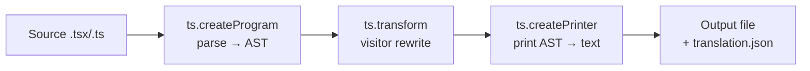

---
tags:
  - web
date: 2026-05-29
---
# Tự động trích xuất i18n key bằng TypeScript Compiler API

Khi codebase đã có hàng nghìn chuỗi văn bản hardcoded và phải bắt đầu i18n, viết tay từng `t("...")` cho mỗi chuỗi là tốn thời gian và dễ bỏ sót. Cách tự động: dùng TypeScript Compiler API để AST-walk source code, phát hiện chuỗi cần dịch theo heuristic (vd regex Unicode tiếng Việt), rồi rewrite chuỗi đó thành lời gọi hàm `t()` với key thích hợp — vừa di chuyển code sang i18n vừa tự sinh file translation. Đây là pattern codemod (code modification) tổng quát, không chỉ áp dụng cho i18n.

## Pipeline ba bước



`ts.createProgram` parse file (và toàn bộ dependency graph nếu cần type info); `ts.transform` chạy visitor để biến đổi AST; `ts.createPrinter` serialize AST đã đổi về source text. Đây cũng là pipeline mà tsc dùng nội bộ — chỉ khác ở phần visitor.

## Detect chuỗi cần dịch

Heuristic của teko-kit cho tiếng Việt: regex Unicode trên tập diacritic.

```javascript
const VN_REGEX = /[àáảãạăằắẳẵặâầấẩẫậèéẻẽẹêềếểễệìíỉĩịùúủũụưừứửữựòóỏõọôồốổỗộơờớởỡợỳýỷỹỵđ...]/;
```

Mọi `StringLiteral`, `TemplateExpression`, `JsxText` chứa diacritic được coi là cần dịch. Tiếng Việt thuần ASCII (không dấu) sẽ lọt — đánh đổi chấp nhận được vì tỷ lệ thấp trong production code Việt Nam. Cho ngôn ngữ khác, regex thay đổi: tiếng Trung dùng `\p{Script=Han}`, tiếng Nhật dùng kết hợp `\p{Script=Hiragana}` + `\p{Script=Katakana}` + Han.

## Hai dạng chuỗi cần xử lý khác nhau

`StringLiteral` đơn thuần được wrap trực tiếp bằng `t(key)`:

```jsx
// trước
const msg = "Xin chào";
// sau
const msg = t("Xin chào");
```

`TemplateExpression` (string template với `${...}`) phức tạp hơn vì phải tách biến và đưa vào syntax interpolation của i18next `{{varName}}`:

```jsx
// trước
const msg = `Có ${count} sản phẩm`;
// sau
const msg = t("Có {{count}} sản phẩm", { count });
```

teko-kit dùng `node.templateSpans` để duyệt biến trong template, normalize tên (vd `user.name` → `UserName` để hợp lệ với i18next), rồi build object `{ count }` argument bằng `ts.factory.createObjectLiteralExpression`.

## Key generation policy

Một quyết định thiết kế: dùng nguyên văn chuỗi làm key, hay sinh key ngắn từ path file? teko-kit chọn hỗn hợp — chuỗi ngắn (< 10 từ) làm key, chuỗi dài dùng path-based key như `components.UserProfile.0`.

```javascript
function getKey(value, isTemplate) {
  return value.split(' ').length > 10 && !isTemplate
    ? `${prefixKey}.${idx++}`  // chuỗi dài → key tổng hợp
    : value;                    // chuỗi ngắn → bản thân chuỗi làm key
}
```

Trade-off: dùng chuỗi làm key đọc dễ trong translation.json, nhưng đổi text bằng tiếng Anh sau này phải update cả key và value ở mọi nơi gọi `t()`. Path-based key gọn nhưng phải mở translation.json để biết key chứa gì.

## Kết hợp JSX context

Khi chuỗi nằm trong JSX (`<div>Xin chào</div>`), output không chỉ là `t("Xin chào")` mà phải là `{t("Xin chào")}` để JSX hợp lệ. teko-kit check parent node:

```javascript
function isJsxExpression(_, parent) {
  return [SyntaxKind.JsxAttribute, SyntaxKind.JsxElement, SyntaxKind.JsxFragment]
    .includes(parent.kind);
}
```

Nếu parent là JSX, wrap thêm `ts.factory.createJsxExpression`. Đây là edge case mà nếu thiếu sẽ tạo output không build được.

## Pattern áp dụng rộng hơn

Cùng pipeline (`createProgram` → `transform` → `printer`) áp dụng cho mọi codemod:

- Rename function tự động (vd `componentDidMount` → `useEffect`)
- Migration API version (vd Angular 1.x → 2.x bằng `ng update`)
- Bóc dead code dựa trên runtime trace
- Auto-add type annotation từ runtime data
- Lint rule custom kèm `--fix`

`jscodeshift` (Facebook) wrap pipeline này thành CLI với API thân thiện hơn `ts` thuần; `ts-morph` cho phép gọn hơn nữa nhờ object-oriented wrapper.

## Trải nghiệm cá nhân

teko-kit (Teko, 5/2025) ra đời chính vì codebase frontend Teko có hàng nghìn chuỗi tiếng Việt hardcoded cần đẩy lên i18next mà không thể làm tay — chi phí cao và dễ bỏ sót. Script `extractTranslation` chạy một lần trên thư mục `src/`, sinh ra cả code đã wrap `t()` và file `translation.json`, biến công việc nhiều tuần thành một câu lệnh.

## Nguồn tham khảo

- [Source teko-kit - i18n-extract.js](https://github.com/magiskboy/teko-kit/blob/master/src/cmd/i18n-extract.js)
- [TypeScript Compiler API - Using the Compiler API wiki](https://github.com/microsoft/TypeScript/wiki/Using-the-Compiler-API)
- [ts.transform documentation](https://github.com/microsoft/TypeScript/wiki/Using-the-Compiler-API#a-minimal-compiler)
- [jscodeshift - codemod toolkit by Facebook](https://github.com/facebook/jscodeshift)
- [ts-morph - higher-level wrapper around TypeScript Compiler API](https://ts-morph.com/)
- [i18next interpolation - {{varName}} syntax](https://www.i18next.com/translation-function/interpolation)

## Liên kết tri thức

- [Gom monorepo build vào một Node.js runtime - teko-kit hợp nhất hai tool (i18n-extract + build) vào cùng kit để chia sẻ runtime tax](./Gom%20monorepo%20build%20v%C3%A0o%20m%E1%BB%99t%20Node.js%20runtime.md)
- [HTTP parser dạng máy trạng thái - cả hai cùng pattern visitor/callback đi qua cấu trúc tuần tự (AST hoặc byte stream) phát ra event](./HTTP%20parser%20d%E1%BA%A1ng%20m%C3%A1y%20tr%E1%BA%A1ng%20th%C3%A1i.md)
- [Dựng lại để hiểu sâu - viết codemod riêng thay vì dùng jscodeshift là một dạng dựng lại để hiểu pipeline ts compile sâu hơn](../Ph%C3%A1t%20tri%E1%BB%83n%20b%E1%BA%A3n%20th%C3%A2n/D%E1%BB%B1ng%20l%E1%BA%A1i%20%C4%91%E1%BB%83%20hi%E1%BB%83u%20s%C3%A2u.md)
