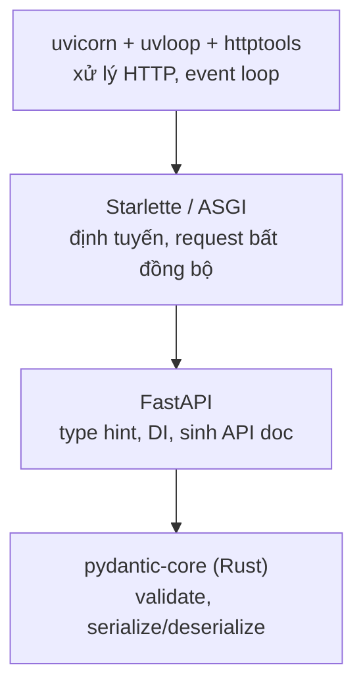

---
tags:
  - web
date: 2026-05-29
---
# Vì sao FastAPI nhanh

FastAPI là web framework Python "nhanh" theo hai nghĩa: nhanh trong quá trình phát triển sản phẩm, và xử lý request hiệu năng cao. Theo lời tác giả, FastAPI đứng trên vai hai thư viện rất tốt: Starlette cho phần web (trên giao diện ASGI) và Pydantic cho phần dữ liệu - tương tự cách Flask được xây trên Werkzeug với giao diện WSGI.

## Nhanh trong phát triển sản phẩm

FastAPI tích hợp hệ thống Dependency Injection (tương tự NestJS) để đơn giản hóa việc phát triển. Framework dùng type hint của Python (PEP 484) cho nhiều mục đích: định nghĩa và validate headers, query string, path param, body của endpoint. Nhờ type hint, IDE hỗ trợ auto-completion và type checking làm giảm lỗi runtime, đồng thời FastAPI tự sinh API doc nên không phải viết tay doc bằng YAML và không lo sai lệch giữa doc và response thực tế. FastAPI được xem như sự kết hợp giữa Flask và các tính năng mới của Python 3.7+.

## Nhanh trong xử lý request

Hiệu năng cao của FastAPI là tương đối, vì xử lý request nhanh còn phụ thuộc thiết kế dữ liệu, thuật toán và kiến trúc hệ thống. Tuy nhiên FastAPI cho nhiều cơ hội tối ưu hơn các framework khác nhờ ngăn xếp công nghệ của nó.



FastAPI dùng chuẩn ASGI nên xử lý request bất đồng bộ trong một thread của web server. Một ASGI server phổ biến là uvicorn, có thể thay event loop mặc định của Python bằng `uvloop` (dựa trên `libuv` mà NodeJS dùng) và parse HTTP message bằng `httptools` (bọc parser của NodeJS) - nhờ đó việc xử lý HTTP ở low-level rất hiệu quả. Lên tầng cao hơn, Pydantic đảm nhận serialize/deserialize và validate dữ liệu; vì lõi `pydantic-core` được viết bằng Rust, các tác vụ CPU-bound như validate và (de)serialize JSON đạt hiệu năng tốt hơn nhiều so với thư viện viết thuần Python. Đây là mẫu hình lặp lại: phần đòi hỏi hiệu năng cao được viết bằng ngôn ngữ kiểu tĩnh (Rust, C), phần interface giữ sự sáng sủa của Python.

## Dùng async và sync đúng cách

FastAPI hỗ trợ cả endpoint sync và async, và dùng sai sẽ làm mất hiệu năng. Logic của FastAPI (qua Starlette): nếu endpoint là hàm sync, nó fork một thread để xử lý hàm đó một cách bất đồng bộ; nếu endpoint là hàm async, nó chạy trong event loop của main thread.

Hệ quả: nếu đặt một hàm chặn đồng bộ (như `time.sleep`) bên trong một endpoint `async`, hàm đó sẽ block event loop của main thread và chặn mọi request khác.

```python
# SAI: block event loop của main thread
@app.get("/")
async def index():
    time.sleep(1)
    return Response("Hello world")

# ĐÚNG: chạy ở thread khác, không chặn main thread
@app.get("/")
def index():
    time.sleep(1)
    return Response("Hello world")
```

Nguyên tắc rút ra từ đặc điểm của GIL: tác vụ I/O-bound đồng bộ vẫn được xử lý tốt nếu chạy trong thread riêng. Vì vậy, hãy đặt tác vụ chặn vào endpoint sync (để FastAPI tự fork thread), và chỉ dùng `async` khi toàn bộ thân hàm thực sự bất đồng bộ.

## Nguồn tham khảo

- [Tại sao FastAPI lại nhanh?](https://www.nkthanh.dev/posts/why-fastapi-fast)
- [FastAPI documentation](https://fastapi.tiangolo.com)
- [pydantic-core - Rust core của Pydantic](https://github.com/pydantic/pydantic-core)
- [Starlette routing - cách phân biệt sync/async endpoint](https://github.com/encode/starlette/blob/master/starlette/routing.py)

## Liên kết tri thức

- [WSGI và ASGI - FastAPI dựa trên ASGI để xử lý request bất đồng bộ](./WSGI%20v%C3%A0%20ASGI.md)
- [Global Interpreter Lock trong Python - cơ sở cho việc fork thread xử lý hàm sync I/O-bound](../System%20level/Global%20Interpreter%20Lock%20trong%20Python.md)
- [Tổng quan về Flask - FastAPI được xem là người kế nhiệm Flask trên chuẩn ASGI](./T%E1%BB%95ng%20quan%20v%E1%BB%81%20Flask.md)
- [HTTP/2 và web server bất đồng bộ - cùng dùng uvloop và httptools để tăng tốc xử lý HTTP](./HTTP-2%20v%C3%A0%20web%20server%20b%E1%BA%A5t%20%C4%91%E1%BB%93ng%20b%E1%BB%99.md)
- [Mô hình đối tượng của Python - mẫu hình lõi viết bằng ngôn ngữ kiểu tĩnh, interface giữ cú pháp Python](../System%20level/M%C3%B4%20h%C3%ACnh%20%C4%91%E1%BB%91i%20t%C6%B0%E1%BB%A3ng%20c%E1%BB%A7a%20Python.md)
