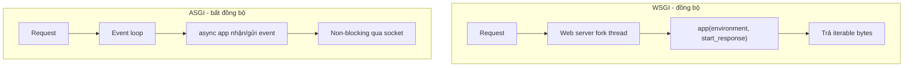

---
tags:
  - web
date: 2026-05-29
---
# WSGI và ASGI

WSGI và ASGI là hai tiêu chuẩn giao diện (interface) cho phép web server giao tiếp với ứng dụng web Python, tách biệt phần server và phần ứng dụng. Khác biệt cốt lõi nằm ở mô hình xử lý request: WSGI là đồng bộ (blocking, scale bằng đa luồng), còn ASGI là bất đồng bộ (non-blocking, scale bằng event loop).



## WSGI: giao diện đồng bộ

WSGI (Web Server Gateway Interface) được giới thiệu bởi PEP 333 cuối năm 2003, cập nhật cho Python 3 bằng PEP 3333 (2010). Một ứng dụng WSGI về cơ bản là một hàm nhận hai tham số:

- `environment`: một `dict` chứa toàn bộ dữ liệu client gửi đến, chính là gói tin HTTP request đã được parse
- `start_response`: một hàm nhận status code và danh sách header để ghi vào phần đầu HTTP response

Hàm trả về một iterable các byte để ghi vào body của response.

```python
def app(environment, start_response):
    start_response('200 OK', [('Content-Type', 'text/plain')])
    return [b'Hello world']
```

Web server WSGI (Gunicorn, uWSGI, `mod_wsgi` của Apache) fork một thread và dùng hàm này để xử lý một request. Vì mô hình là blocking, để scale phải kết hợp đa luồng - tương tự cách Apache HTTP Server hoạt động. Các framework đồng bộ tiêu biểu: Django, Flask, Bottle.

## ASGI: giao diện bất đồng bộ

ASGI (Asynchronous Server Gateway Interface) là kế thừa tinh thần của WSGI nhưng hỗ trợ ứng dụng bất đồng bộ. Ứng dụng ASGI là một async callable, giao tiếp với server bằng cách nhận và gửi các event message bất đồng bộ thay vì nhận một input stream và trả về một iterable. Khi server nhận gói tin đến, nó emit một event tới ứng dụng; khi ứng dụng cần gửi response (kể cả streaming), nó emit một event để server truyền đi qua socket. Về cơ bản, ASGI dùng coroutine để xử lý từng request và điều phối qua event loop, các thao tác socket được xử lý non-blocking.

ASGI bắt nguồn từ dự án Django Channels (khoảng 2016) để khắc phục giới hạn của WSGI với kết nối real-time và lâu dài như WebSocket; spec tiếp tục tiến hóa (phiên bản 2.0 cuối 2017, phiên bản 3.0 đầu 2019, các bản 3.x sau bổ sung thêm extension). Từ khoảng 2018, hệ sinh thái ASGI bùng nổ với web server (uvicorn, hypercorn), framework (FastAPI, Starlette, Quart, Sanic, Django 3+).

Core spec ASGI gửi response body dưới dạng message bytes ở tầng ứng dụng nên không hỗ trợ `sendfile` (zero-copy); khả năng này được bổ sung qua các extension tùy chọn như `http.response.pathsend` và `http.response.zerocopysend` mà không phải server nào cũng cài đặt.

## Vì sao ASGI hiệu quả hơn cho I/O

Dùng đa luồng để giải quyết các tác vụ I/O không thực sự hiệu quả - đây chính là vấn đề C10K. Một framework WSGI mỗi worker xử lý một request tại một thời điểm; framework ASGI có thể xử lý hàng nghìn kết nối đồng thời trong một process bằng event loop. Ví dụ điển hình cho hướng tiếp cận hiệu quả là Nginx dùng mô hình bất đồng bộ, so với Apache dùng đa luồng truyền thống.

## Nguồn tham khảo

- [Viết HTTP/2 server tương thích ASGI trong Python](https://www.nkthanh.dev/posts/implement-an-asgi-compatible-http2-server-in-python)
- [Từ PEP 492 tới kỉ nguyên bất đồng bộ](https://www.nkthanh.dev/posts/from-pep-492-to-asynchronous-era-in-python)
- [PEP 3333 – Python Web Server Gateway Interface v1.0.1](https://peps.python.org/pep-3333/)
- [ASGI Specification](https://asgi.readthedocs.io/en/latest/specs/main.html)
- [Asynchronous Server Gateway Interface - Wikipedia](https://en.wikipedia.org/wiki/Asynchronous_Server_Gateway_Interface)

## Liên kết tri thức

- [async/await trong Python - async/await tạo tiền đề cho chuẩn ASGI](../System%20level/async-await%20trong%20Python.md)
- [Event loop trong Python - ASGI điều phối request qua event loop](../System%20level/Event%20loop%20trong%20Python.md)
- [Tổng quan về Flask - Flask là framework đồng bộ tuân thủ WSGI](./T%E1%BB%95ng%20quan%20v%E1%BB%81%20Flask.md)
- [Vì sao FastAPI nhanh - FastAPI dựa trên ASGI để xử lý request bất đồng bộ](./V%C3%AC%20sao%20FastAPI%20nhanh.md)
- [ASGI và HTTP/2 server - cài đặt một web server ASGI cụ thể cho HTTP/2](./HTTP-2%20v%C3%A0%20web%20server%20b%E1%BA%A5t%20%C4%91%E1%BB%93ng%20b%E1%BB%99.md)
- [Global Interpreter Lock trong Python - lý do đa luồng không hiệu quả khiến mô hình event loop hấp dẫn](../System%20level/Global%20Interpreter%20Lock%20trong%20Python.md)
- [Bài toán C10K - ASGI là chuẩn để xây web server bất đồng bộ giải bài toán này](./B%C3%A0i%20to%C3%A1n%20C10K.md)
- [Zero-copy và sendfile - sendfile là khả năng nằm ngoài core spec ASGI](../System%20level/Zero-copy%20v%C3%A0%20sendfile.md)
